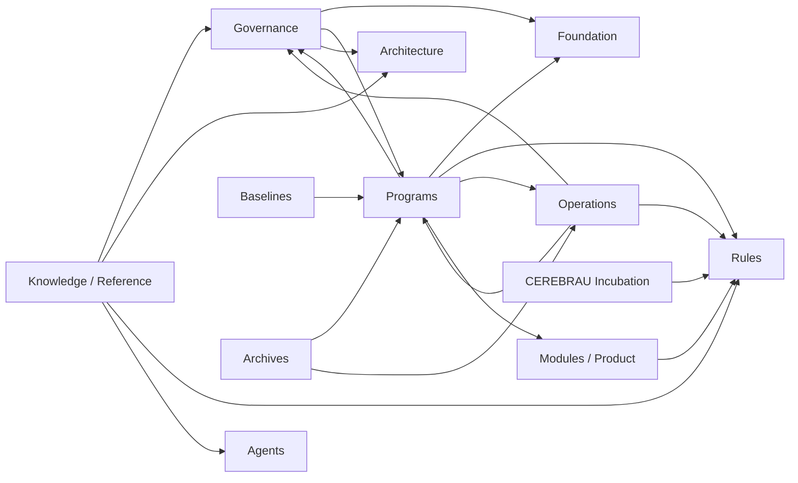

# NOVA Knowledge Compression Report — SW-002

**Priorité absolue : exploiter le patrimoine existant. Ne jamais produire un document si une source canonique existe déjà.**

**Date :** 2026-07-29  
**Mode :** inventaire, traçabilité et compression documentaire sans mutation des sources  
**Verdict :** NO GO

## 1. Objectif mesurable

L'objectif SW-002 est de réduire de 50 à 80 % le nombre de documents à maintenir, hors archives et historiques, sans perte de connaissance ni régression.

Toute transformation proposée doit être généralisable à l'ensemble du dépôt. Aucun traitement ponctuel n'est considéré comme une preuve suffisante de compressibilité.

## 2. Périmètre réel

Le périmètre physique traité est l'intégralité des fichiers Markdown sous `Docs/`. Les noms logiques fournis dans la mission ont été rapprochés de l'arborescence existante sans déplacement ni renommage :

| Domaine logique demandé | Chemin demandé | Patrimoine physique observé |
|---|---|---|
| Fondation | `00_FOUNDATION` | `00_FOUNDATION`, `00_NOVA_FOUNDATION` |
| Gouvernance | `00_GOVERNANCE` | `00_GOVERNANCE`, `02_PROJECT_MANAGEMENT`, `20_NOVA_PORTFOLIO` |
| Architecture | `01_ARCHITECTURE` | Chemin absent ; actifs dans `01_CORE`, `02_PRODUCT_ARCHITECTURE`, `03_DOMAIN_MODEL` |
| Project Management | `02_PROJECT_MANAGEMENT` | Chemin présent |
| Programs | `03_PROGRAMS` | Chemin absent ; actifs dans `00_PROGRAMS`, `19_PROGRAMS`, `PROGRAM` |
| Modules | `04_MODULES` | Chemin absent ; actifs dans `10_NOVA`, `24_MODULES` |
| Rules | `05_RULES` | Chemin présent |
| Reference | `06_REFERENCE` | `06_REFERENCE`, `00_PROJECT_KNOWLEDGE_LIBRARY` |
| Agents | `07_AGENTS` | Chemin présent |
| CEREBRAU | `09_CEREBRAU*` | Aucun chemin correspondant ; actifs répartis entre `00_FOUNDATION`, `09_COLLABORATION` et `99_INCUBATION` |

Tous les autres domaines existants sous `Docs/` ont également été catalogués afin d'éviter un traitement partiel.

## 3. Production

Le registre global est [NOVA_DOCUMENT_CATALOG.md](NOVA_DOCUMENT_CATALOG.md).

Il contient pour chaque document :

- un identifiant stable dérivé du chemin ;
- le chemin complet relatif au dépôt ;
- une et une seule catégorie ;
- le propriétaire explicitement déclaré ou `UNDECLARED` ;
- le statut explicitement déclaré ou `UNDECLARED` ;
- le domaine physique rapproché ;
- la source canonique uniquement lorsqu'elle est prouvée ;
- les documents référencés ;
- les documents dépendants ;
- l'état d'utilisation par référence entrante ;
- le cycle de vie ;
- l'action proposée ;
- la preuve ou le motif de conservation.

Le catalogue et le présent rapport sont eux-mêmes catalogués. Aucun catalogue équivalent n'existait : [NOVA_DOCUMENT_ASSET_REGISTER.md](../00_FOUNDATION/NOVA_DOCUMENT_ASSET_REGISTER.md) couvre seulement les actifs de migration VEEDDA identifiés par son propre périmètre.

## 4. Exhaustivité et classification

| Contrôle | Résultat | Preuve |
|---|---|---|
| Documents finaux sous `Docs/` | 1 269 | 1 269 lignes documentaires dans le catalogue |
| Chemins uniques | 1 269 | PASS |
| Identifiants uniques | 1 269 | PASS |
| Documents absents du catalogue | 0 | PASS |
| Documents avec plusieurs catégories | 0 | PASS |
| Catégories hors nomenclature | 0 | PASS |
| Propriétaires explicitement déclarés | 250 | Information extraite des 80 premières lignes des sources |
| Propriétaires `UNDECLARED` | 1 019 | Aucun propriétaire inventé |
| Statuts explicitement déclarés | 678 | Information extraite des sources |
| Statuts `UNDECLARED` | 591 | Aucun statut inventé |

La règle de classification est déterministe et généralisable. La première condition applicable dans l'ordre suivant gagne : emplacement ARCHIVED, emplacement HISTORICAL, statut DEPRECATED, statut GENERATED, nom MANIFEST, nom REGISTRY/CATALOG, nom INDEX, nom TEMPLATE, nom REPORT/AUDIT, statut WORKING, statut CANONICAL, puis REFERENCE par défaut. Cette précédence garantit l'unicité sans jugement ponctuel document par document.

### Répartition par catégorie

| Catégorie | Nombre |
|---|---:|
| CANONICAL | 250 |
| INDEX | 40 |
| REGISTRY | 35 |
| MANIFEST | 5 |
| REFERENCE | 438 |
| GENERATED | 3 |
| REPORT | 400 |
| TEMPLATE | 5 |
| WORKING | 47 |
| HISTORICAL | 35 |
| DEPRECATED | 0 |
| ARCHIVED | 11 |
| **Total** | **1 269** |

La catégorie `CANONICAL` est attribuée uniquement lorsqu'un statut d'autorité positif est détecté ou lorsqu'une Rule non-draft porte explicitement sa propre autorité. Elle ne signifie pas qu'une source unique existe pour tout le domaine.

## 5. Contrôles chiffrés obligatoires

| Mesure | Résultat |
|---|---:|
| Nombre total de documents | 1 269 |
| Sources classées CANONICAL | 250 |
| Index | 40 |
| Registres | 35 |
| Groupes de doublons exacts | 8 |
| Copies surnuméraires exactes | 25 |
| Documents historiques | 35 |
| Documents archivés | 11 |
| Documents objectivement dépréciables avec source canonique prouvée | 0 |
| Documents sans référence entrante détectée | 479 |
| Documents avec au moins une référence entrante | 790 |

Une absence de référence entrante ne prouve pas qu'un document est inutilisé : il peut être un point d'entrée humain, une preuve terminale ou un actif appelé par un outil non Markdown. Ces 479 documents restent donc `KEEP`.

## 6. Sources canoniques par domaine

| Domaine | Source ou point d'entrée observé | État |
|---|---|---|
| Fondation | [NOVA_CEREBRAU_MANIFEST](../00_FOUNDATION/NOVA_CEREBRAU_MANIFEST.md) et sources FOUNDATION | IDENTIFIÉ, mais plusieurs routes historiques du manifeste ne correspondent plus à l'arborescence |
| Gouvernance | [NOVA_GOVERNANCE_MANIFEST](NOVA_GOVERNANCE_MANIFEST.md) | IDENTIFIÉ |
| Architecture | [NOVA_MASTER_PLAN](../00_NOVA_FOUNDATION/NOVA_MASTER_PLAN.md), `NOVA-002_PRODUCT_ARCHITECTURE.md` encore draft | PARTIEL ; aucune source d'architecture unique prouvée |
| Project Management | Decision, Program, Lot et Epic Registers | PARTIEL ; registres distincts et couverture Program non unifiée |
| Programs | Master Plan, Portfolio Index et index locaux | PARTIEL ; autorité distribuée entre les Programs |
| Modules / produit | Navigation Map dérivée d'une architecture encore en attente de validation | NON IDENTIFIÉ comme source globale certifiée |
| Rules | Douze Rules portant leur statut propre | PARTIEL ; aucun manifeste de Rules unique |
| Knowledge / Reference | `KNOWLEDGE_INDEX.md` et vues associées | NON VALIDÉ ; l'index contient des chemins historiques inexistants |
| Agents | Deux README de bibliothèques distinctes | PARTIEL ; aucune autorité de convergence explicite |
| CEREBRAU | Manifest de fondation et patrimoine d'incubation | NON IDENTIFIÉ dans le chemin logique demandé ; usages distribués |
| Operations / certification | Master Plan, Execution Model et preuves | PARTIEL ; responsabilités réparties |
| Baselines / archives | Manifestes locaux | IDENTIFIÉ par baseline ou archive, sans autorité globale active |

**Contrôle “chaque domaine possède une source canonique clairement identifiée” : FAIL.**

## 7. Doublons et propositions d'action

Le contrôle SHA-256 détecte huit groupes et 25 copies surnuméraires :

- dix fichiers vides ;
- sept rapports de certification génériques identiques ;
- six rapports de vérification génériques identiques ;
- deux paires active/incubation (`NOVA-003`, `NOVA-015`) ;
- une paire Reference Architecture/baseline ;
- deux paires de preuves PROGRAM-017/baseline.

Aucun groupe ne possède une source canonique unique prouvée par les statuts détectés et compatible avec toutes ses références. En conséquence :

| Action | Nombre | Traçabilité |
|---|---:|---|
| KEEP | 1 269 | Motif individuel dans le catalogue |
| MERGE | 0 | Aucune source canonique unique prouvée |
| ARCHIVE proposé | 0 | Aucun transfert d'autorité autorisé |
| DEPRECATE proposé | 0 | Aucun remplacement canonique prouvé |

Toutes les propositions non-KEEP sont donc absentes, conformément au critère renforcé qui interdit une fusion, un archivage ou une dépréciation sans preuve de traçabilité.

## 8. Graphe des dépendances documentaires

Le graphe détaillé est matérialisé dans les colonnes `Documents référencés` et `Documents dépendants` du catalogue.

Le catalogue généré est exclu de ses propres arêtes afin de ne pas créer 1 269 dépendances réflexives artificielles. Le présent rapport et ses références sont inclus.

### Mesures

| Mesure | Résultat |
|---|---:|
| Arêtes internes résolues | 4 589 |
| Symétries référence/dépendant invalides | 0 |
| Références vers des Markdown hors `Docs/` résolues | 43 |
| Références non résolues ou ambiguës | 547 |
| Arêtes de retour détectées par parcours DFS | 358 |

Les 358 arêtes de retour signalent la présence de cycles documentaires ; elles ne représentent pas 358 cycles indépendants.

### Vue de domaine

Les dépendances les plus concentrées sont internes aux Programs (2 960 arêtes), aux Modules/Product (408) et à l'incubation CEREBRAU (105). Le graphe prouve l'interconnexion du patrimoine, mais les cycles et références non résolues interdisent une réduction mécanique.

## 9. Objectif de réduction

Le périmètre de maintenance mesuré, hors 11 documents archivés et 35 historiques, est de 1 223 documents.

| Objectif | Documents à sortir de la maintenance active | Résultat prouvé |
|---|---:|---:|
| Réduction minimale de 50 % | 612 | 0 |
| Réduction maximale visée de 80 % | 978 | 0 |

**Réduction certifiable obtenue : 0 %.**

Le catalogue réduit le coût de découverte et rend la dette mesurable, mais il ne suffit pas à retirer des sources de la maintenance active sans décisions d'autorité supplémentaires.

## 10. Absence de régression

- aucun document existant supprimé ;
- aucun document existant déplacé ;
- aucun document existant renommé ;
- aucune doctrine modifiée ;
- aucun Runtime modifié ;
- aucun Program modifié ;
- aucun Module modifié ;
- aucun Agent modifié ;
- aucune Rule modifiée ;
- aucun contenu existant fusionné ou déprécié ;
- aucun statut ou propriétaire absent complété par hypothèse.

Les seuls livrables SW-002 sont le catalogue et le présent rapport.

## 11. GO / NO GO

### Contrôles de réussite

| Critère | Résultat |
|---|---|
| Aucune connaissance perdue | PASS |
| Chaque document classifié | PASS |
| Classification unique | PASS |
| Graphe bidirectionnel produit | PASS |
| Chaque domaine possède une source canonique clairement identifiée | FAIL |
| Chaque proposition non-KEEP possède une preuve canonique | PASS, aucune proposition non-KEEP émise |
| Réduction certifiable de 50 à 80 % | FAIL — 0 % |
| Références documentaires toutes résolues | FAIL — 547 références non résolues ou ambiguës |

## Décision finale

**NO GO — NOVA KNOWLEDGE COMPRESSION SW-002**

Le registre global et le graphe sont complets, sans perte de connaissance. La compression du patrimoine n'est cependant pas certifiable : plusieurs domaines n'ont pas de source canonique unique prouvée, 547 références restent non résolues ou ambiguës, 1 019 propriétaires et 591 statuts ne sont pas déclarés, et aucune réduction de 50 à 80 % ne peut être justifiée sans créer une autorité documentaire nouvelle ou altérer le patrimoine existant.
