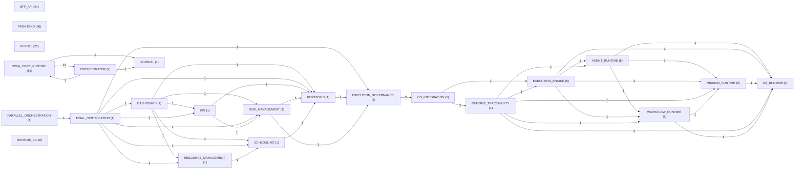

# NOVA Runtime Dependency Graph

**Statut :** GENERATED_CURRENT  
**Date :** 2026-07-29  
**Source :** imports, exports et chargements statiques résolus dans le dépôt

## 1. Résumé

| Mesure | Valeur |
|---|---:|
| Nœuds exécutables | 247 |
| Arêtes internes directes | 594 |
| Composants avec dépendance interne non résolue | 0 |
| Références internes non résolues | 0 |
| Groupes cycliques détectés | 3 |

Les dépendances tierces sont préfixées `EXT:`. Les fichiers résolus mais non exécutables (types purs, JSON, styles) sont des supports et ne sont pas transformés en composants. Une absence de dépendance dans cette matrice signifie « aucun import statique détecté », pas « aucune interaction dynamique possible ».

## 2. Graphe inter-domaines

Le nombre porté par une arête est le nombre d'imports directs entre deux domaines. La représentation canonique détaillée reste la table par identifiant ci-dessous.

## 3. Dépendances détaillées

| Source | Dépendances internes | Composants dépendants | Dépendances externes | Supports non exécutables | Non résolues |
|---|---|---|---|---|---|
| CMP-793CBB2259B6 | CMP-69D76280C6A7 CMP-79A4CE3001E8 CMP-82F2CD999BCC CMP-9393BE8C9E3B CMP-BF46CE472ABD | CMP-8C1882795502 | NONE | NONE | NONE |
| CMP-789486596E0E | CMP-492E2B5328BB CMP-D908C3883BF8 | NONE | NONE | NONE | NONE |
| CMP-5B869B748451 | NONE | CMP-0CE6B4615597 CMP-89D964DE9C1D CMP-9E95FFE15797 CMP-E416FBFA12DE | EXT:react EXT:react-dom | [Drawer.module.css](../../apps/nova-web/src/components/drawer/Drawer.module.css) | NONE |
| CMP-0CE6B4615597 | CMP-5B869B748451 | CMP-EC0391056AC4 | NONE | NONE | NONE |
| CMP-9393BE8C9E3B | CMP-0438D5D260A7 CMP-08D729729879 CMP-0F95A28B3FD2 CMP-1BF709D31D93 CMP-1FB7387C725B CMP-21CF3332C04E CMP-32F8A66A5343 CMP-360773B920DD +7 | CMP-793CBB2259B6 | NONE | [NOVAUIPlayground.module.css](../../apps/nova-web/src/components/lab/NOVAUIPlayground.module.css) | NONE |
| CMP-C957A3CF7CFF | CMP-360773B920DD CMP-4D7542D479D1 CMP-9E6DC561A7DC CMP-B58F23DFA9B6 | CMP-1BF709D31D93 | EXT:react | [GlobalRoutes.module.css](../../apps/nova-web/src/components/routes/GlobalRoutes.module.css) | NONE |
| CMP-52D707F186C2 | CMP-32F8A66A5343 CMP-9E6DC561A7DC CMP-B58F23DFA9B6 | CMP-1BF709D31D93 | EXT:react | [GlobalRoutes.module.css](../../apps/nova-web/src/components/routes/GlobalRoutes.module.css) | NONE |
| CMP-9E6DC561A7DC | NONE | CMP-52D707F186C2 CMP-C957A3CF7CFF | EXT:react | [GlobalRoutes.module.css](../../apps/nova-web/src/components/routes/GlobalRoutes.module.css) | NONE |
| CMP-B58F23DFA9B6 | CMP-6805C13E519F CMP-C53D84AF2B68 | CMP-52D707F186C2 CMP-C957A3CF7CFF | NONE | NONE | NONE |
| CMP-3EA63E459486 | CMP-0F95A28B3FD2 CMP-445B776DA744 CMP-5B8E897462EE CMP-A91B03D495D0 | CMP-1BF709D31D93 | NONE | NONE | NONE |
| CMP-5B8E897462EE | NONE | CMP-3EA63E459486 | EXT:react | [RouteDescription.module.css](../../apps/nova-web/src/components/routes/RouteDescription.module.css) | NONE |
| CMP-A91B03D495D0 | CMP-08D729729879 CMP-32F8A66A5343 CMP-360773B920DD CMP-50BA39986991 CMP-594261CB470D | CMP-3EA63E459486 | NONE | [RoutePlaceholder.module.css](../../apps/nova-web/src/components/routes/RoutePlaceholder.module.css) | NONE |
| CMP-1BF709D31D93 | CMP-3EA63E459486 CMP-52D707F186C2 CMP-896C72A1D005 CMP-BF46CE472ABD CMP-C957A3CF7CFF CMP-DAA73CBBE7E8 | CMP-79A4CE3001E8 CMP-9393BE8C9E3B | NONE | NONE | NONE |
| CMP-445B776DA744 | NONE | CMP-3EA63E459486 | EXT:react | [RouteTitle.module.css](../../apps/nova-web/src/components/routes/RouteTitle.module.css) | NONE |
| CMP-DAA73CBBE7E8 | CMP-0FFADCA30320 CMP-28516F2ED4C6 CMP-40ED31F2541C CMP-486C81031BA6 CMP-53679762B23A CMP-5C2E3F274DFD CMP-6805C13E519F CMP-6A90C751E515 +7 | CMP-1BF709D31D93 | NONE | NONE | NONE |
| CMP-360773B920DD | NONE | CMP-124109667CE4 CMP-486C81031BA6 CMP-53679762B23A CMP-82F2CD999BCC CMP-89D964DE9C1D CMP-8AA7820AE0DB CMP-9393BE8C9E3B CMP-9E95FFE15797 +6 | EXT:react | [Badge.module.css](../../apps/nova-web/src/components/shared/Badge.module.css) | NONE |
| CMP-32F8A66A5343 | CMP-0438D5D260A7 | CMP-05FFE277FE75 CMP-2AFBE4352AE8 CMP-486C81031BA6 CMP-52D707F186C2 CMP-594261CB470D CMP-82F2CD999BCC CMP-89D964DE9C1D CMP-9393BE8C9E3B +8 | EXT:react | [Button.module.css](../../apps/nova-web/src/components/shared/Button.module.css) | NONE |
| CMP-7729304E9191 | NONE | CMP-05FFE277FE75 CMP-9393BE8C9E3B CMP-D1D392F372C6 CMP-E416FBFA12DE | EXT:react | [Progress.module.css](../../apps/nova-web/src/components/shared/Progress.module.css) | NONE |
| CMP-1FB7387C725B | NONE | CMP-486C81031BA6 CMP-53679762B23A CMP-89D964DE9C1D CMP-9393BE8C9E3B CMP-9E95FFE15797 CMP-D1D392F372C6 CMP-D3AF29273C44 CMP-E416FBFA12DE +1 | EXT:react | [Skeleton.module.css](../../apps/nova-web/src/components/shared/Skeleton.module.css) | NONE |
| CMP-0438D5D260A7 | NONE | CMP-32F8A66A5343 CMP-486C81031BA6 CMP-53679762B23A CMP-89D964DE9C1D CMP-9393BE8C9E3B CMP-9E95FFE15797 CMP-D1D392F372C6 CMP-E416FBFA12DE +1 | EXT:react | [Spinner.module.css](../../apps/nova-web/src/components/shared/Spinner.module.css) | NONE |
| CMP-9F2B8A93D50A | NONE | CMP-9393BE8C9E3B | EXT:react | [Status.module.css](../../apps/nova-web/src/components/shared/Status.module.css) | NONE |
| CMP-62040208BDD9 | NONE | CMP-79A4CE3001E8 CMP-82F2CD999BCC | EXT:react | [AppShell.module.css](../../apps/nova-web/src/components/shell/AppShell.module.css) | NONE |
| CMP-126AE6B56AF1 | NONE | CMP-79A4CE3001E8 CMP-82F2CD999BCC | EXT:react | [ContentArea.module.css](../../apps/nova-web/src/components/shell/ContentArea.module.css) | NONE |
| CMP-97D69DAF9557 | NONE | CMP-79A4CE3001E8 CMP-82F2CD999BCC | EXT:react | [ContentViewport.module.css](../../apps/nova-web/src/components/shell/ContentViewport.module.css) | NONE |
| CMP-77A623DAE19A | NONE | CMP-79A4CE3001E8 CMP-82F2CD999BCC | EXT:react | [NavigationItem.module.css](../../apps/nova-web/src/components/shell/NavigationItem.module.css) | NONE |
| CMP-30ECD0589120 | NONE | CMP-79A4CE3001E8 CMP-82F2CD999BCC | EXT:react | [NavigationSection.module.css](../../apps/nova-web/src/components/shell/NavigationSection.module.css) | NONE |
| CMP-79A4CE3001E8 | CMP-126AE6B56AF1 CMP-1BF709D31D93 CMP-30ECD0589120 CMP-492E2B5328BB CMP-4D7542D479D1 CMP-568230D14B32 CMP-62040208BDD9 CMP-77A623DAE19A +8 | CMP-793CBB2259B6 | NONE | [NavigationShell.module.css](../../apps/nova-web/src/components/shell/NavigationShell.module.css) | NONE |
| CMP-7BB2524AAFF5 | NONE | CMP-82F2CD999BCC | NONE | [ShellDivider.module.css](../../apps/nova-web/src/components/shell/ShellDivider.module.css) | NONE |
| CMP-8FDDF9D935D4 | NONE | CMP-82F2CD999BCC | EXT:react | [ShellFooter.module.css](../../apps/nova-web/src/components/shell/ShellFooter.module.css) | NONE |
| CMP-F29CAF095F4F | NONE | CMP-79A4CE3001E8 CMP-82F2CD999BCC | NONE | [ShellLogo.module.css](../../apps/nova-web/src/components/shell/ShellLogo.module.css) | NONE |
| CMP-82F2CD999BCC | CMP-0F95A28B3FD2 CMP-126AE6B56AF1 CMP-30ECD0589120 CMP-32F8A66A5343 CMP-360773B920DD CMP-568230D14B32 CMP-62040208BDD9 CMP-77A623DAE19A +6 | CMP-793CBB2259B6 | NONE | [ShellPlayground.module.css](../../apps/nova-web/src/components/shell/ShellPlayground.module.css) | NONE |
| CMP-82A5A4DB0EE3 | NONE | CMP-79A4CE3001E8 CMP-82F2CD999BCC | EXT:react | [SideNavigation.module.css](../../apps/nova-web/src/components/shell/SideNavigation.module.css) | NONE |
| CMP-568230D14B32 | NONE | CMP-79A4CE3001E8 CMP-82F2CD999BCC | EXT:react | [TopBar.module.css](../../apps/nova-web/src/components/shell/TopBar.module.css) | NONE |
| CMP-0F95A28B3FD2 | CMP-21CF3332C04E | CMP-05FFE277FE75 CMP-3EA63E459486 CMP-82F2CD999BCC CMP-9393BE8C9E3B CMP-CC2F55C9438C CMP-ED60D5512180 CMP-F7E4FA3BB9A5 | EXT:react | [Card.module.css](../../apps/nova-web/src/components/surfaces/Card.module.css) | NONE |
| CMP-594261CB470D | CMP-21CF3332C04E CMP-32F8A66A5343 | CMP-486C81031BA6 CMP-53679762B23A CMP-89D964DE9C1D CMP-9393BE8C9E3B CMP-9E95FFE15797 CMP-A91B03D495D0 CMP-D1D392F372C6 CMP-D3AF29273C44 +2 | EXT:react | [EmptyState.module.css](../../apps/nova-web/src/components/surfaces/EmptyState.module.css) | NONE |
| CMP-C18BAE8E3BB9 | NONE | CMP-05FFE277FE75 CMP-486C81031BA6 CMP-53679762B23A CMP-82F2CD999BCC CMP-89D964DE9C1D CMP-9393BE8C9E3B CMP-9E95FFE15797 CMP-CC2F55C9438C +5 | EXT:react | [PageContainer.module.css](../../apps/nova-web/src/components/surfaces/PageContainer.module.css) | NONE |
| CMP-50BA39986991 | CMP-21CF3332C04E | CMP-9393BE8C9E3B CMP-A91B03D495D0 | EXT:react | [Panel.module.css](../../apps/nova-web/src/components/surfaces/Panel.module.css) | NONE |
| CMP-08D729729879 | NONE | CMP-9393BE8C9E3B CMP-A91B03D495D0 CMP-CC2F55C9438C CMP-ED60D5512180 | EXT:react | [Section.module.css](../../apps/nova-web/src/components/surfaces/Section.module.css) | NONE |
| CMP-21CF3332C04E | NONE | CMP-0F95A28B3FD2 CMP-486C81031BA6 CMP-50BA39986991 CMP-53679762B23A CMP-594261CB470D CMP-89D964DE9C1D CMP-9393BE8C9E3B CMP-9E95FFE15797 +3 | EXT:react | [Surface.module.css](../../apps/nova-web/src/components/surfaces/Surface.module.css) | NONE |
| CMP-8AA7820AE0DB | CMP-360773B920DD | CMP-6B9410C9E672 | NONE | [HomePage.module.css](../../apps/nova-web/src/features/home/HomePage.module.css) | NONE |
| CMP-6B9410C9E672 | CMP-8AA7820AE0DB CMP-EF6B3B6C3BF0 | CMP-D3AF29273C44 | NONE | [HomePage.module.css](../../apps/nova-web/src/features/home/HomePage.module.css) | NONE |
| CMP-0A2ACA7ABC02 | NONE | NONE | NONE | [HomePage.module.css](../../apps/nova-web/src/features/home/HomePage.module.css) | NONE |
| CMP-876AB69D1D77 | CMP-CD55EA26D82D CMP-EF6B3B6C3BF0 | CMP-D3AF29273C44 | NONE | [HomePage.module.css](../../apps/nova-web/src/features/home/HomePage.module.css) | NONE |
| CMP-EF6B3B6C3BF0 | NONE | CMP-124109667CE4 CMP-22ECF7F24369 CMP-5CF8566809E9 CMP-6B9410C9E672 CMP-79A4CE3001E8 CMP-876AB69D1D77 CMP-D3AF29273C44 CMP-D4EA4CFFC27F +1 | NONE | NONE | NONE |
| CMP-22ECF7F24369 | CMP-EF6B3B6C3BF0 | CMP-D3AF29273C44 | NONE | [HomePage.module.css](../../apps/nova-web/src/features/home/HomePage.module.css) | NONE |
| CMP-D3AF29273C44 | CMP-124109667CE4 CMP-1FB7387C725B CMP-22ECF7F24369 CMP-4D7542D479D1 CMP-594261CB470D CMP-5CF8566809E9 CMP-6B9410C9E672 CMP-876AB69D1D77 +3 | CMP-79A4CE3001E8 | EXT:react | [HomePage.module.css](../../apps/nova-web/src/features/home/HomePage.module.css) | NONE |
| CMP-D4EA4CFFC27F | CMP-32F8A66A5343 CMP-360773B920DD CMP-EF6B3B6C3BF0 | CMP-E8B5C38D57D4 | EXT:react | [HomePage.module.css](../../apps/nova-web/src/features/home/HomePage.module.css) | NONE |
| CMP-CD55EA26D82D | CMP-360773B920DD | CMP-876AB69D1D77 | NONE | [HomePage.module.css](../../apps/nova-web/src/features/home/HomePage.module.css) | NONE |
| CMP-5CF8566809E9 | CMP-EF6B3B6C3BF0 | CMP-D3AF29273C44 | EXT:react | [HomePage.module.css](../../apps/nova-web/src/features/home/HomePage.module.css) | NONE |
| CMP-124109667CE4 | CMP-360773B920DD CMP-EF6B3B6C3BF0 | CMP-D3AF29273C44 | NONE | [HomePage.module.css](../../apps/nova-web/src/features/home/HomePage.module.css) | NONE |
| CMP-E8B5C38D57D4 | CMP-D4EA4CFFC27F CMP-EF6B3B6C3BF0 | CMP-D3AF29273C44 | NONE | [HomePage.module.css](../../apps/nova-web/src/features/home/HomePage.module.css) | NONE |
| CMP-FC1889AC067C | CMP-EC0391056AC4 | CMP-D3AF29273C44 | NONE | NONE | NONE |
| CMP-EC0391056AC4 | CMP-0CE6B4615597 | CMP-FC1889AC067C | NONE | NONE | NONE |
| CMP-CC2F55C9438C | CMP-08D729729879 CMP-0F95A28B3FD2 CMP-2E7316F7556D CMP-32F8A66A5343 CMP-4D7542D479D1 CMP-C18BAE8E3BB9 | CMP-BF46CE472ABD | NONE | NONE | NONE |
| CMP-05FFE277FE75 | CMP-0F95A28B3FD2 CMP-2E7316F7556D CMP-32F8A66A5343 CMP-345ECB04FE74 CMP-4D7542D479D1 CMP-7729304E9191 CMP-C18BAE8E3BB9 | CMP-BF46CE472ABD | EXT:react | NONE | NONE |
| CMP-F7E4FA3BB9A5 | CMP-0F95A28B3FD2 CMP-2E7316F7556D CMP-32F8A66A5343 CMP-345ECB04FE74 CMP-4D7542D479D1 CMP-C18BAE8E3BB9 | CMP-BF46CE472ABD | NONE | NONE | NONE |
| CMP-BF46CE472ABD | CMP-05FFE277FE75 CMP-2E7316F7556D CMP-CC2F55C9438C CMP-DAC953FC288E CMP-ED60D5512180 CMP-F7E4FA3BB9A5 | CMP-1BF709D31D93 CMP-793CBB2259B6 CMP-79A4CE3001E8 | NONE | [workSetupTypes.ts](../../apps/nova-web/src/features/work-setup/workSetupTypes.ts) | NONE |
| CMP-ED60D5512180 | CMP-08D729729879 CMP-0F95A28B3FD2 CMP-32F8A66A5343 CMP-345ECB04FE74 CMP-360773B920DD CMP-4D7542D479D1 CMP-C18BAE8E3BB9 | CMP-BF46CE472ABD | NONE | NONE | NONE |
| CMP-2E7316F7556D | NONE | CMP-05FFE277FE75 CMP-BF46CE472ABD CMP-CC2F55C9438C CMP-DAC953FC288E CMP-F7E4FA3BB9A5 | EXT:react | [workSetupTypes.ts](../../apps/nova-web/src/features/work-setup/workSetupTypes.ts) | NONE |
| CMP-345ECB04FE74 | NONE | CMP-05FFE277FE75 CMP-DAC953FC288E CMP-ED60D5512180 CMP-F7E4FA3BB9A5 | NONE | [workSetupTypes.ts](../../apps/nova-web/src/features/work-setup/workSetupTypes.ts) | NONE |
| CMP-DAC953FC288E | CMP-2E7316F7556D CMP-345ECB04FE74 | CMP-BF46CE472ABD | EXT:react | [workSetupTypes.ts](../../apps/nova-web/src/features/work-setup/workSetupTypes.ts) | NONE |
| CMP-0FFADCA30320 | NONE | CMP-53679762B23A CMP-DAA73CBBE7E8 | NONE | NONE | NONE |
| CMP-53679762B23A | CMP-0438D5D260A7 CMP-0FFADCA30320 CMP-1FB7387C725B CMP-21CF3332C04E CMP-28516F2ED4C6 CMP-2AFBE4352AE8 CMP-360773B920DD CMP-594261CB470D +1 | CMP-DAA73CBBE7E8 | EXT:react | [WorkActivityPage.module.css](../../apps/nova-web/src/features/work/WorkActivityPage.module.css) [WorkOverviewPage.module.css](../../apps/nova-web/src/features/work/WorkOverviewPage.module.css) | NONE |
| CMP-6805C13E519F | NONE | CMP-486C81031BA6 CMP-B58F23DFA9B6 CMP-DAA73CBBE7E8 | NONE | NONE | NONE |
| CMP-486C81031BA6 | CMP-0438D5D260A7 CMP-1FB7387C725B CMP-21CF3332C04E CMP-28516F2ED4C6 CMP-2AFBE4352AE8 CMP-32F8A66A5343 CMP-360773B920DD CMP-4D7542D479D1 +3 | CMP-DAA73CBBE7E8 | NONE | [WorkDecisionsPage.module.css](../../apps/nova-web/src/features/work/WorkDecisionsPage.module.css) [WorkOverviewPage.module.css](../../apps/nova-web/src/features/work/WorkOverviewPage.module.css) | NONE |
| CMP-C53D84AF2B68 | NONE | CMP-B58F23DFA9B6 CMP-DAA73CBBE7E8 CMP-E416FBFA12DE | NONE | NONE | NONE |
| CMP-E416FBFA12DE | CMP-0438D5D260A7 CMP-1FB7387C725B CMP-21CF3332C04E CMP-28516F2ED4C6 CMP-2AFBE4352AE8 CMP-32F8A66A5343 CMP-594261CB470D CMP-5B869B748451 +3 | CMP-DAA73CBBE7E8 | EXT:react | [WorkDeliverablesPage.module.css](../../apps/nova-web/src/features/work/WorkDeliverablesPage.module.css) [WorkOverviewPage.module.css](../../apps/nova-web/src/features/work/WorkOverviewPage.module.css) | NONE |
| CMP-28516F2ED4C6 | NONE | CMP-2AFBE4352AE8 CMP-486C81031BA6 CMP-53679762B23A CMP-89D964DE9C1D CMP-9E95FFE15797 CMP-D1D392F372C6 CMP-DAA73CBBE7E8 CMP-E416FBFA12DE +1 | NONE | NONE | NONE |
| CMP-D1D392F372C6 | CMP-0438D5D260A7 CMP-1FB7387C725B CMP-21CF3332C04E CMP-28516F2ED4C6 CMP-32F8A66A5343 CMP-360773B920DD CMP-4D7542D479D1 CMP-594261CB470D +3 | CMP-DAA73CBBE7E8 | EXT:react | [WorkOverviewPage.module.css](../../apps/nova-web/src/features/work/WorkOverviewPage.module.css) | NONE |
| CMP-2AFBE4352AE8 | CMP-28516F2ED4C6 CMP-32F8A66A5343 CMP-4D7542D479D1 CMP-896C72A1D005 | CMP-486C81031BA6 CMP-53679762B23A CMP-89D964DE9C1D CMP-9E95FFE15797 CMP-E416FBFA12DE CMP-FCF3D9B7851D | EXT:react | [WorkOverviewPage.module.css](../../apps/nova-web/src/features/work/WorkOverviewPage.module.css) [WorkPlanPage.module.css](../../apps/nova-web/src/features/work/WorkPlanPage.module.css) | NONE |
| CMP-D044B8D7B415 | NONE | CMP-9E95FFE15797 CMP-DAA73CBBE7E8 | NONE | NONE | NONE |
| CMP-9E95FFE15797 | CMP-0438D5D260A7 CMP-1FB7387C725B CMP-21CF3332C04E CMP-28516F2ED4C6 CMP-2AFBE4352AE8 CMP-32F8A66A5343 CMP-360773B920DD CMP-594261CB470D +3 | CMP-DAA73CBBE7E8 | EXT:react | [WorkOverviewPage.module.css](../../apps/nova-web/src/features/work/WorkOverviewPage.module.css) [WorkPeoplePage.module.css](../../apps/nova-web/src/features/work/WorkPeoplePage.module.css) | NONE |
| CMP-40ED31F2541C | NONE | CMP-DAA73CBBE7E8 CMP-FCF3D9B7851D | NONE | NONE | NONE |
| CMP-FCF3D9B7851D | CMP-0438D5D260A7 CMP-1FB7387C725B CMP-21CF3332C04E CMP-28516F2ED4C6 CMP-2AFBE4352AE8 CMP-40ED31F2541C CMP-594261CB470D CMP-C18BAE8E3BB9 | CMP-DAA73CBBE7E8 | NONE | [WorkOverviewPage.module.css](../../apps/nova-web/src/features/work/WorkOverviewPage.module.css) [WorkPlanPage.module.css](../../apps/nova-web/src/features/work/WorkPlanPage.module.css) | NONE |
| CMP-6A90C751E515 | NONE | CMP-89D964DE9C1D CMP-DAA73CBBE7E8 | NONE | NONE | NONE |
| CMP-89D964DE9C1D | CMP-0438D5D260A7 CMP-1FB7387C725B CMP-21CF3332C04E CMP-28516F2ED4C6 CMP-2AFBE4352AE8 CMP-32F8A66A5343 CMP-360773B920DD CMP-594261CB470D +3 | CMP-DAA73CBBE7E8 | EXT:react | [WorkOverviewPage.module.css](../../apps/nova-web/src/features/work/WorkOverviewPage.module.css) [WorkSourcesPage.module.css](../../apps/nova-web/src/features/work/WorkSourcesPage.module.css) | NONE |
| CMP-D8A6A8147491 | CMP-69D76280C6A7 | CMP-79A4CE3001E8 | NONE | NONE | NONE |
| CMP-4D7542D479D1 | CMP-69D76280C6A7 | CMP-05FFE277FE75 CMP-2AFBE4352AE8 CMP-486C81031BA6 CMP-79A4CE3001E8 CMP-C957A3CF7CFF CMP-CC2F55C9438C CMP-D1D392F372C6 CMP-D3AF29273C44 +2 | NONE | NONE | NONE |
| CMP-5C2E3F274DFD | CMP-69D76280C6A7 | CMP-DAA73CBBE7E8 | NONE | NONE | NONE |
| CMP-8C1882795502 | CMP-793CBB2259B6 | NONE | EXT:react EXT:react-dom | [globals.css](../../apps/nova-web/src/styles/globals.css) | NONE |
| CMP-730EDF7E450F | CMP-492E2B5328BB CMP-7A8F073EFBFC CMP-896C72A1D005 CMP-D908C3883BF8 | CMP-69D76280C6A7 | NONE | NONE | NONE |
| CMP-7A8F073EFBFC | CMP-D908C3883BF8 | CMP-69D76280C6A7 CMP-730EDF7E450F | NONE | NONE | NONE |
| CMP-69D76280C6A7 | CMP-730EDF7E450F CMP-7A8F073EFBFC CMP-D908C3883BF8 | CMP-4D7542D479D1 CMP-5C2E3F274DFD CMP-793CBB2259B6 CMP-9393BE8C9E3B CMP-D8A6A8147491 | EXT:react | NONE | NONE |
| CMP-896C72A1D005 | NONE | CMP-1BF709D31D93 CMP-2AFBE4352AE8 CMP-492E2B5328BB CMP-730EDF7E450F CMP-79A4CE3001E8 CMP-9393BE8C9E3B CMP-D1D392F372C6 CMP-D908C3883BF8 | NONE | NONE | NONE |
| CMP-492E2B5328BB | CMP-896C72A1D005 | CMP-730EDF7E450F CMP-789486596E0E CMP-79A4CE3001E8 CMP-D908C3883BF8 | NONE | NONE | NONE |
| CMP-D908C3883BF8 | CMP-492E2B5328BB CMP-896C72A1D005 | CMP-69D76280C6A7 CMP-730EDF7E450F CMP-789486596E0E CMP-7A8F073EFBFC | NONE | NONE | NONE |
| CMP-A27108DF3276 | NONE | NONE | NONE | NONE | NONE |
| CMP-C5DF0F3BCF5E | CMP-43DF8E42A57D CMP-CCDEC4BF29DA CMP-E199D75B5FFD CMP-FD003DC5DA8E CMP-FFF957585765 | CMP-6F3FE45ED52F | NONE | NONE | NONE |
| CMP-6F3FE45ED52F | CMP-43DF8E42A57D CMP-9DD5524BBD6C CMP-C5DF0F3BCF5E CMP-CCDEC4BF29DA CMP-E199D75B5FFD CMP-FD003DC5DA8E CMP-FFF957585765 | CMP-61F2DD3F04CA | NONE | NONE | NONE |
| CMP-70D050082F31 | NONE | CMP-9DD5524BBD6C | NONE | NONE | NONE |
| CMP-3F53E51F7AB0 | NONE | CMP-9DD5524BBD6C | NONE | NONE | NONE |
| CMP-2E6C8D958894 | NONE | CMP-9DD5524BBD6C | NONE | NONE | NONE |
| CMP-9DD5524BBD6C | CMP-259541718EBF CMP-2E6C8D958894 CMP-357DDADEC8BC CMP-3F53E51F7AB0 CMP-510CF050FC7C CMP-70D050082F31 CMP-DF56FE7CBA70 | CMP-6F3FE45ED52F CMP-CCDEC4BF29DA CMP-E199D75B5FFD | NONE | NONE | NONE |
| CMP-510CF050FC7C | NONE | CMP-9DD5524BBD6C | NONE | NONE | NONE |
| CMP-DF56FE7CBA70 | NONE | CMP-9DD5524BBD6C | NONE | NONE | NONE |
| CMP-43DF8E42A57D | CMP-CCDEC4BF29DA CMP-E199D75B5FFD | CMP-6F3FE45ED52F CMP-C5DF0F3BCF5E | NONE | NONE | NONE |
| CMP-2EFF057E2667 | CMP-CCD98BD20CD2 CMP-DC58A0D1EB82 | CMP-1D9BD322D1AB CMP-27BEC5FBDE27 CMP-D3E1C6F4CC6B | EXT:node:path | NONE | NONE |
| CMP-CCD98BD20CD2 | NONE | CMP-0DAEC3D92B98 CMP-28C53C29FDFC CMP-2EFF057E2667 CMP-3C8968AE958D CMP-3FFC9FFDE4E7 CMP-5A56D8ECB145 CMP-5AE0C0084928 CMP-701706722CC7 +7 | NONE | NONE | NONE |
| CMP-D69F20655710 | NONE | CMP-5AE0C0084928 CMP-B187F81B2062 CMP-D3E1C6F4CC6B | EXT:node:http | NONE | NONE |
| CMP-DC58A0D1EB82 | CMP-CCD98BD20CD2 | CMP-1D9BD322D1AB CMP-28C53C29FDFC CMP-2EFF057E2667 CMP-7D6DE9DAB717 CMP-D3E1C6F4CC6B | EXT:node:crypto | NONE | NONE |
| CMP-D9DB01FF52BA | NONE | CMP-1D9BD322D1AB CMP-27BEC5FBDE27 CMP-D3E1C6F4CC6B | NONE | NONE | NONE |
| CMP-7D6DE9DAB717 | CMP-CCD98BD20CD2 CMP-DC58A0D1EB82 | CMP-1D9BD322D1AB CMP-D3E1C6F4CC6B | EXT:node:crypto EXT:node:http | NONE | NONE |
| CMP-1D9BD322D1AB | CMP-2EFF057E2667 CMP-7D6DE9DAB717 CMP-D9DB01FF52BA CMP-DC58A0D1EB82 | CMP-0DAEC3D92B98 CMP-28C53C29FDFC CMP-3C8968AE958D CMP-3FFC9FFDE4E7 CMP-5AE0C0084928 CMP-6397165706D2 CMP-71A3B0B670D1 CMP-95410E675E10 +3 | EXT:node:http | NONE | NONE |
| CMP-DD3308FE20FB | CMP-1D9BD322D1AB CMP-CCD98BD20CD2 | CMP-B187F81B2062 | NONE | NONE | NONE |
| CMP-6397165706D2 | CMP-1D9BD322D1AB | CMP-D3E1C6F4CC6B | EXT:node:crypto | NONE | NONE |
| CMP-0DAEC3D92B98 | CMP-1D9BD322D1AB CMP-CCD98BD20CD2 | CMP-D3E1C6F4CC6B | NONE | NONE | NONE |
| CMP-5AE0C0084928 | CMP-1D9BD322D1AB CMP-701706722CC7 CMP-CCD98BD20CD2 CMP-D69F20655710 | CMP-D3E1C6F4CC6B | NONE | NONE | NONE |
| CMP-3FFC9FFDE4E7 | CMP-1D9BD322D1AB CMP-CCD98BD20CD2 | CMP-D3E1C6F4CC6B | NONE | NONE | NONE |
| CMP-28C53C29FDFC | CMP-1D9BD322D1AB CMP-CCD98BD20CD2 CMP-DC58A0D1EB82 | CMP-D3E1C6F4CC6B | NONE | NONE | NONE |
| CMP-71A3B0B670D1 | CMP-1D9BD322D1AB | CMP-D3E1C6F4CC6B | NONE | NONE | NONE |
| CMP-3C8968AE958D | CMP-1D9BD322D1AB CMP-CCD98BD20CD2 | CMP-D3E1C6F4CC6B | EXT:node:tls | NONE | NONE |
| CMP-95410E675E10 | CMP-1D9BD322D1AB | CMP-D3E1C6F4CC6B | NONE | NONE | NONE |
| CMP-D3E1C6F4CC6B | CMP-0DAEC3D92B98 CMP-1D9BD322D1AB CMP-28C53C29FDFC CMP-2EFF057E2667 CMP-3C8968AE958D CMP-3FFC9FFDE4E7 CMP-5AE0C0084928 CMP-6397165706D2 +9 | CMP-27BEC5FBDE27 | EXT:node:http | [runtime-gateway.port.ts](../../server/nova-bff/runtime-gateway.port.ts) | NONE |
| CMP-27BEC5FBDE27 | CMP-2EFF057E2667 CMP-D3E1C6F4CC6B CMP-D9DB01FF52BA | NONE | EXT:node:fs EXT:node:http EXT:node:https EXT:node:net EXT:node:url | NONE | NONE |
| CMP-701706722CC7 | CMP-CCD98BD20CD2 | CMP-5AE0C0084928 CMP-B187F81B2062 CMP-D3E1C6F4CC6B | NONE | [runtime-gateway.port.ts](../../server/nova-bff/runtime-gateway.port.ts) | NONE |
| CMP-B187F81B2062 | CMP-1D9BD322D1AB CMP-701706722CC7 CMP-CCD98BD20CD2 CMP-D69F20655710 CMP-DD3308FE20FB | CMP-D3E1C6F4CC6B | NONE | [runtime-gateway.port.ts](../../server/nova-bff/runtime-gateway.port.ts) | NONE |
| CMP-E000CA1BA5E9 | CMP-5A56D8ECB145 CMP-CCD98BD20CD2 | CMP-B542D2E8E50D | EXT:node:async_hooks | NONE | NONE |
| CMP-B542D2E8E50D | CMP-5A56D8ECB145 CMP-8F06919E0E55 CMP-E000CA1BA5E9 | NONE | NONE | [runtime-gateway.port.ts](../../server/nova-bff/runtime-gateway.port.ts) | NONE |
| CMP-5A56D8ECB145 | CMP-CCD98BD20CD2 | CMP-8F06919E0E55 CMP-B542D2E8E50D CMP-E000CA1BA5E9 | NONE | [runtime-gateway.port.ts](../../server/nova-bff/runtime-gateway.port.ts) | NONE |
| CMP-8F06919E0E55 | CMP-5A56D8ECB145 CMP-CCD98BD20CD2 | CMP-B542D2E8E50D | NONE | [runtime-gateway.port.ts](../../server/nova-bff/runtime-gateway.port.ts) | NONE |
| CMP-CC2342DB3900 | CMP-6C53303A9534 CMP-A39CEC441B48 | CMP-171F79BDFE0F CMP-23A4F0F6223E CMP-3D9ABBBA4B5F CMP-62A6E9B30DBC CMP-660A8DCC2E3D CMP-6AED86B4B029 CMP-819383340140 CMP-AAF89BF0E64D +5 | NONE | NONE | NONE |
| CMP-6C53303A9534 | NONE | CMP-171F79BDFE0F CMP-6AED86B4B029 CMP-CC2342DB3900 | NONE | NONE | NONE |
| CMP-AAA1ED064427 | CMP-23A4F0F6223E CMP-5BCB1CC2B9AA CMP-A39B1941C2CA CMP-A6E9964C7662 CMP-D08D4EFEC5EA CMP-D6ABD30A4164 CMP-FFEA465ED5E3 | CMP-7301238E2C03 CMP-D08D4EFEC5EA | NONE | NONE | NONE |
| CMP-263E2B62071C | CMP-1B3004BE5864 CMP-26499BF65EB4 CMP-2678F05788C0 CMP-37552FE40DE7 CMP-48DEF73FD75B CMP-5BCB1CC2B9AA CMP-62A6E9B30DBC CMP-81EC05BFCB03 +6 | CMP-7301238E2C03 CMP-7772E83E9555 CMP-D08D4EFEC5EA CMP-D99644898393 | EXT:node:child_process | NONE | NONE |
| CMP-37552FE40DE7 | CMP-572EAD3035A2 CMP-62A6E9B30DBC CMP-93745CBB549C CMP-ABA7F9BB091E CMP-E2BDA6384DF1 | CMP-263E2B62071C CMP-7772E83E9555 | NONE | NONE | NONE |
| CMP-D99644898393 | CMP-263E2B62071C CMP-355D314AAD91 CMP-62A6E9B30DBC | CMP-7772E83E9555 | NONE | NONE | NONE |
| CMP-5BCB1CC2B9AA | CMP-1B3004BE5864 CMP-A39B1941C2CA CMP-E891D86A5E54 | CMP-263E2B62071C CMP-7301238E2C03 CMP-A6E9964C7662 CMP-AAA1ED064427 | NONE | NONE | NONE |
| CMP-2678F05788C0 | CMP-A6E9964C7662 | CMP-263E2B62071C CMP-7301238E2C03 CMP-D08D4EFEC5EA | NONE | NONE | NONE |
| CMP-D6ABD30A4164 | CMP-1B3004BE5864 CMP-A39B1941C2CA CMP-A6E9964C7662 | CMP-263E2B62071C CMP-7301238E2C03 CMP-AAA1ED064427 | NONE | NONE | NONE |
| CMP-A6E9964C7662 | CMP-5BCB1CC2B9AA CMP-E891D86A5E54 | CMP-263E2B62071C CMP-2678F05788C0 CMP-AAA1ED064427 CMP-D08D4EFEC5EA CMP-D6ABD30A4164 | NONE | NONE | NONE |
| CMP-5A179FA8B6D4 | CMP-31A78A0FD7E1 | CMP-31A78A0FD7E1 CMP-E891D86A5E54 | EXT:node:crypto EXT:node:fs EXT:node:path | NONE | NONE |
| CMP-E891D86A5E54 | CMP-1B3004BE5864 CMP-26499BF65EB4 CMP-31A78A0FD7E1 CMP-5A179FA8B6D4 | CMP-263E2B62071C CMP-5BCB1CC2B9AA CMP-7301238E2C03 CMP-A6E9964C7662 CMP-D08D4EFEC5EA | EXT:node:child_process EXT:node:fs EXT:node:path | NONE | NONE |
| CMP-2B7298D8AF6B | CMP-23A4F0F6223E CMP-A39B1941C2CA CMP-BC318ED163B5 | CMP-7772E83E9555 | NONE | NONE | NONE |
| CMP-D08D4EFEC5EA | CMP-263E2B62071C CMP-2678F05788C0 CMP-A6E9964C7662 CMP-AAA1ED064427 CMP-E891D86A5E54 CMP-FCB3767DF86F CMP-FFEA465ED5E3 | CMP-7301238E2C03 CMP-AAA1ED064427 | EXT:node:crypto | NONE | NONE |
| CMP-A39B1941C2CA | CMP-1B3004BE5864 CMP-355D314AAD91 CMP-6DC7C2193333 CMP-ECB763755A5F CMP-F1CC7FD31176 | CMP-23A4F0F6223E CMP-2B7298D8AF6B CMP-5BCB1CC2B9AA CMP-7301238E2C03 CMP-7772E83E9555 CMP-AAA1ED064427 CMP-D6ABD30A4164 | EXT:node:fs | NONE | NONE |
| CMP-93745CBB549C | CMP-E87540FAA77F | CMP-34D5F1975DAE CMP-37552FE40DE7 CMP-3D9ABBBA4B5F CMP-572EAD3035A2 CMP-62A6E9B30DBC CMP-660A8DCC2E3D CMP-6AED86B4B029 CMP-7C771FE7D9A7 +10 | NONE | NONE | NONE |
| CMP-3761B60BF584 | CMP-1B3004BE5864 CMP-ECB763755A5F | CMP-255FA6BA084B CMP-8FBA926BE5ED CMP-F14726E07DAB | EXT:node:crypto | NONE | NONE |
| CMP-E87540FAA77F | CMP-171F79BDFE0F CMP-AAF89BF0E64D | CMP-6AED86B4B029 CMP-93745CBB549C | NONE | NONE | NONE |
| CMP-C1DF025A8510 | CMP-355D314AAD91 CMP-62A6E9B30DBC CMP-93745CBB549C CMP-CC2342DB3900 | CMP-3D9ABBBA4B5F CMP-660A8DCC2E3D CMP-BC318ED163B5 CMP-F141CD1F4D51 | NONE | NONE | NONE |
| CMP-23A4F0F6223E | CMP-1B3004BE5864 CMP-355D314AAD91 CMP-62A6E9B30DBC CMP-A39B1941C2CA CMP-CC2342DB3900 | CMP-2B7298D8AF6B CMP-7301238E2C03 CMP-7772E83E9555 CMP-AAA1ED064427 | NONE | NONE | NONE |
| CMP-F141CD1F4D51 | CMP-3D9ABBBA4B5F CMP-62A6E9B30DBC CMP-93745CBB549C CMP-C1DF025A8510 CMP-CC2342DB3900 | CMP-7772E83E9555 | NONE | NONE | NONE |
| CMP-F6F11427F84E | CMP-3D9ABBBA4B5F CMP-62A6E9B30DBC CMP-660A8DCC2E3D CMP-93745CBB549C CMP-CC2342DB3900 | CMP-7772E83E9555 | NONE | NONE | NONE |
| CMP-FFEA465ED5E3 | CMP-81EC05BFCB03 CMP-FCB3767DF86F | CMP-263E2B62071C CMP-AAA1ED064427 CMP-D08D4EFEC5EA | NONE | NONE | NONE |
| CMP-6AED86B4B029 | CMP-171F79BDFE0F CMP-6C53303A9534 CMP-93745CBB549C CMP-A39CEC441B48 CMP-CC2342DB3900 CMP-E87540FAA77F | CMP-62A6E9B30DBC | NONE | NONE | NONE |
| CMP-660A8DCC2E3D | CMP-3D9ABBBA4B5F CMP-62A6E9B30DBC CMP-93745CBB549C CMP-C1DF025A8510 CMP-CC2342DB3900 | CMP-BC318ED163B5 CMP-F6F11427F84E | NONE | NONE | NONE |
| CMP-3D9ABBBA4B5F | CMP-62A6E9B30DBC CMP-93745CBB549C CMP-C1DF025A8510 CMP-CC2342DB3900 | CMP-660A8DCC2E3D CMP-7772E83E9555 CMP-BC318ED163B5 CMP-F141CD1F4D51 CMP-F6F11427F84E | NONE | NONE | NONE |
| CMP-C9A579412BF7 | NONE | CMP-F14726E07DAB | EXT:node:child_process EXT:node:crypto EXT:node:fs EXT:node:path | NONE | NONE |
| CMP-31A78A0FD7E1 | CMP-1B3004BE5864 CMP-5A179FA8B6D4 CMP-6BC32B63403F CMP-7791A8512DCD CMP-ECB763755A5F | CMP-255FA6BA084B CMP-5A179FA8B6D4 CMP-8FBA926BE5ED CMP-E891D86A5E54 CMP-F14726E07DAB | EXT:node:child_process EXT:node:fs EXT:node:path | NONE | NONE |
| CMP-8FBA926BE5ED | CMP-255FA6BA084B CMP-31A78A0FD7E1 CMP-3761B60BF584 CMP-556DE59E85E0 CMP-6BC32B63403F CMP-B95CFE4BB1E4 CMP-ECB763755A5F | CMP-F14726E07DAB | EXT:node:fs EXT:node:http | NONE | NONE |
| CMP-F14726E07DAB | CMP-255FA6BA084B CMP-31A78A0FD7E1 CMP-3761B60BF584 CMP-8FBA926BE5ED CMP-C9A579412BF7 | NONE | EXT:node:path | NONE | NONE |
| CMP-255FA6BA084B | CMP-1B3004BE5864 CMP-31A78A0FD7E1 CMP-3761B60BF584 CMP-556DE59E85E0 CMP-6DC7C2193333 CMP-ECB763755A5F | CMP-8FBA926BE5ED CMP-F14726E07DAB | EXT:node:fs EXT:node:path | NONE | NONE |
| CMP-6DC7C2193333 | CMP-1B3004BE5864 CMP-ECB763755A5F CMP-F1CC7FD31176 | CMP-255FA6BA084B CMP-A39B1941C2CA | EXT:node:crypto EXT:node:fs EXT:node:path | NONE | NONE |
| CMP-556DE59E85E0 | CMP-ECB763755A5F | CMP-255FA6BA084B CMP-8FBA926BE5ED | NONE | NONE | NONE |
| CMP-7772E83E9555 | CMP-1B3004BE5864 CMP-23A4F0F6223E CMP-263E2B62071C CMP-2B7298D8AF6B CMP-355D314AAD91 CMP-37552FE40DE7 CMP-3D9ABBBA4B5F CMP-4363B18E56C0 +11 | NONE | NONE | NONE | NONE |
| CMP-62A6E9B30DBC | CMP-6AED86B4B029 CMP-93745CBB549C CMP-CC2342DB3900 | CMP-23A4F0F6223E CMP-263E2B62071C CMP-355D314AAD91 CMP-37552FE40DE7 CMP-3D9ABBBA4B5F CMP-4363B18E56C0 CMP-572EAD3035A2 CMP-660A8DCC2E3D +10 | NONE | NONE | NONE |
| CMP-A39CEC441B48 | NONE | CMP-171F79BDFE0F CMP-6AED86B4B029 CMP-AAF89BF0E64D CMP-CC2342DB3900 | NONE | NONE | NONE |
| CMP-48DEF73FD75B | NONE | CMP-263E2B62071C CMP-7301238E2C03 | EXT:node:crypto | NONE | NONE |
| CMP-63581ACEA530 | NONE | NONE | NONE | NONE | NONE |
| CMP-171F79BDFE0F | CMP-6C53303A9534 CMP-A39CEC441B48 CMP-CC2342DB3900 | CMP-6AED86B4B029 CMP-E87540FAA77F | NONE | NONE | NONE |
| CMP-7301238E2C03 | CMP-23A4F0F6223E CMP-263E2B62071C CMP-26499BF65EB4 CMP-2678F05788C0 CMP-48DEF73FD75B CMP-5BCB1CC2B9AA CMP-A39B1941C2CA CMP-AAA1ED064427 +4 | NONE | NONE | NONE | NONE |
| CMP-BC318ED163B5 | CMP-3D9ABBBA4B5F CMP-62A6E9B30DBC CMP-660A8DCC2E3D CMP-819383340140 CMP-93745CBB549C CMP-C1DF025A8510 CMP-CC2342DB3900 CMP-ECB763755A5F | CMP-2B7298D8AF6B CMP-7772E83E9555 | NONE | NONE | NONE |
| CMP-ABA7F9BB091E | CMP-572EAD3035A2 CMP-62A6E9B30DBC CMP-93745CBB549C | CMP-37552FE40DE7 CMP-7772E83E9555 | NONE | NONE | NONE |
| CMP-34D5F1975DAE | CMP-93745CBB549C | CMP-917F9BC194B4 | NONE | NONE | NONE |
| CMP-81EC05BFCB03 | CMP-1B3004BE5864 CMP-93745CBB549C CMP-FCB3767DF86F | CMP-263E2B62071C CMP-FCB3767DF86F CMP-FFEA465ED5E3 | NONE | NONE | NONE |
| CMP-FCB3767DF86F | CMP-62A6E9B30DBC CMP-81EC05BFCB03 CMP-917F9BC194B4 CMP-93745CBB549C CMP-CC2342DB3900 | CMP-263E2B62071C CMP-7301238E2C03 CMP-81EC05BFCB03 CMP-D08D4EFEC5EA CMP-FFEA465ED5E3 | NONE | NONE | NONE |
| CMP-917F9BC194B4 | CMP-34D5F1975DAE CMP-93745CBB549C | CMP-FCB3767DF86F | NONE | NONE | NONE |
| CMP-1B3004BE5864 | NONE | CMP-23A4F0F6223E CMP-255FA6BA084B CMP-263E2B62071C CMP-31A78A0FD7E1 CMP-3761B60BF584 CMP-5BCB1CC2B9AA CMP-6DC7C2193333 CMP-7772E83E9555 +5 | EXT:node:crypto EXT:node:path | NONE | NONE |
| CMP-572EAD3035A2 | CMP-62A6E9B30DBC CMP-93745CBB549C CMP-E2BDA6384DF1 | CMP-37552FE40DE7 CMP-7772E83E9555 CMP-7C771FE7D9A7 CMP-ABA7F9BB091E | NONE | NONE | NONE |
| CMP-819383340140 | CMP-62A6E9B30DBC CMP-93745CBB549C CMP-CC2342DB3900 | CMP-7772E83E9555 CMP-BC318ED163B5 CMP-E2BDA6384DF1 | NONE | NONE | NONE |
| CMP-E2BDA6384DF1 | CMP-62A6E9B30DBC CMP-819383340140 CMP-93745CBB549C | CMP-263E2B62071C CMP-37552FE40DE7 CMP-572EAD3035A2 CMP-7C771FE7D9A7 | NONE | NONE | NONE |
| CMP-7C771FE7D9A7 | CMP-572EAD3035A2 CMP-62A6E9B30DBC CMP-93745CBB549C CMP-E2BDA6384DF1 | CMP-355D314AAD91 CMP-7772E83E9555 | NONE | NONE | NONE |
| CMP-F1CC7FD31176 | CMP-1B3004BE5864 CMP-25BE0D496AAF CMP-ECB763755A5F | CMP-6DC7C2193333 CMP-A39B1941C2CA | NONE | NONE | NONE |
| CMP-355D314AAD91 | CMP-62A6E9B30DBC CMP-7C771FE7D9A7 | CMP-23A4F0F6223E CMP-4363B18E56C0 CMP-7772E83E9555 CMP-A39B1941C2CA CMP-C1DF025A8510 CMP-D99644898393 | NONE | NONE | NONE |
| CMP-4363B18E56C0 | CMP-355D314AAD91 CMP-62A6E9B30DBC | CMP-7772E83E9555 | NONE | NONE | NONE |
| CMP-6BC32B63403F | NONE | CMP-165002FEDD16 CMP-31A78A0FD7E1 CMP-8FBA926BE5ED | EXT:node:crypto EXT:node:fs EXT:node:path | NONE | NONE |
| CMP-AAF89BF0E64D | CMP-A39CEC441B48 CMP-CC2342DB3900 | CMP-E87540FAA77F | NONE | NONE | NONE |
| CMP-7791A8512DCD | NONE | CMP-31A78A0FD7E1 | NONE | NONE | NONE |
| CMP-26499BF65EB4 | NONE | CMP-263E2B62071C CMP-7301238E2C03 CMP-E891D86A5E54 | EXT:node:fs EXT:node:path | NONE | NONE |
| CMP-D2C88B3C81FB | CMP-357DDADEC8BC | NONE | NONE | NONE | NONE |
| CMP-357DDADEC8BC | NONE | CMP-9DD5524BBD6C CMP-D2C88B3C81FB | NONE | NONE | NONE |
| CMP-024C72C521EB | NONE | NONE | NONE | NONE | NONE |
| CMP-7A4AF93D217E | CMP-859CEB35F451 CMP-9EE3F62B8A51 | CMP-259541718EBF | NONE | NONE | NONE |
| CMP-259541718EBF | CMP-7A4AF93D217E CMP-859CEB35F451 | CMP-9DD5524BBD6C | NONE | NONE | NONE |
| CMP-61F2DD3F04CA | CMP-6F3FE45ED52F | NONE | NONE | NONE | NONE |
| CMP-E199D75B5FFD | CMP-9DD5524BBD6C | CMP-43DF8E42A57D CMP-6F3FE45ED52F CMP-C5DF0F3BCF5E CMP-CCDEC4BF29DA CMP-FFF957585765 | NONE | NONE | NONE |
| CMP-FD003DC5DA8E | CMP-FFF957585765 | CMP-6F3FE45ED52F CMP-C5DF0F3BCF5E | NONE | NONE | NONE |
| CMP-CCDEC4BF29DA | CMP-9DD5524BBD6C CMP-E199D75B5FFD | CMP-43DF8E42A57D CMP-6F3FE45ED52F CMP-C5DF0F3BCF5E | NONE | NONE | NONE |
| CMP-F36CC4B74F36 | NONE | CMP-A96195E65FE2 | NONE | NONE | NONE |
| CMP-5CF306851A64 | NONE | CMP-A96195E65FE2 | NONE | NONE | NONE |
| CMP-F052EA630D3B | NONE | CMP-A96195E65FE2 | NONE | NONE | NONE |
| CMP-348C6CE02740 | NONE | CMP-A96195E65FE2 | NONE | NONE | NONE |
| CMP-A96195E65FE2 | CMP-348C6CE02740 CMP-4F246425F62B CMP-5CF306851A64 CMP-A384CB24327D CMP-A3B6FC98567E CMP-F052EA630D3B CMP-F36CC4B74F36 | CMP-859CEB35F451 CMP-9EE3F62B8A51 | NONE | NONE | NONE |
| CMP-FC86BE0CAED7 | NONE | CMP-9EE3F62B8A51 | NONE | NONE | NONE |
| CMP-ABEC1F17464C | NONE | CMP-9EE3F62B8A51 | NONE | NONE | NONE |
| CMP-A504846B3779 | NONE | CMP-9EE3F62B8A51 | NONE | NONE | NONE |
| CMP-87A50A5B59DA | NONE | CMP-9EE3F62B8A51 | NONE | NONE | NONE |
| CMP-9EE3F62B8A51 | CMP-4F246425F62B CMP-87A50A5B59DA CMP-A384CB24327D CMP-A3B6FC98567E CMP-A504846B3779 CMP-A96195E65FE2 CMP-ABEC1F17464C CMP-FC86BE0CAED7 | CMP-7A4AF93D217E CMP-859CEB35F451 | NONE | NONE | NONE |
| CMP-25BE0D496AAF | NONE | CMP-165002FEDD16 CMP-F1CC7FD31176 | EXT:node:crypto | [orchestrator-runtime.types.ts](../../server/runtime/orchestrator/orchestrator-runtime.types.ts) | NONE |
| CMP-0723CC6573E3 | CMP-112CFF119FA5 | CMP-888C70D01FC4 | NONE | NONE | NONE |
| CMP-AC3E71F569B8 | NONE | NONE | NONE | NONE | NONE |
| CMP-B78827361E98 | NONE | NONE | NONE | NONE | NONE |
| CMP-923B2835C05A | NONE | NONE | NONE | NONE | NONE |
| CMP-651F20160F4F | NONE | NONE | NONE | NONE | NONE |
| CMP-BA27F15EA25D | NONE | NONE | NONE | NONE | NONE |
| CMP-B4C8E3EDB76C | NONE | NONE | NONE | NONE | NONE |
| CMP-DB1AC1C1EF92 | NONE | NONE | NONE | NONE | NONE |
| CMP-1DD6AFDEF7F2 | NONE | NONE | NONE | NONE | NONE |
| CMP-95567B5A164F | NONE | NONE | NONE | NONE | NONE |
| CMP-0B079393E314 | NONE | NONE | NONE | NONE | NONE |
| CMP-888C70D01FC4 | CMP-0723CC6573E3 | NONE | NONE | NONE | NONE |
| CMP-773ED6EA1AC4 | NONE | NONE | NONE | NONE | NONE |
| CMP-570AE9E0551E | NONE | NONE | NONE | NONE | NONE |
| CMP-D632DB021C1F | NONE | NONE | NONE | NONE | NONE |
| CMP-8219AD43A060 | NONE | NONE | NONE | NONE | NONE |
| CMP-112CFF119FA5 | NONE | CMP-0723CC6573E3 | NONE | NONE | NONE |
| CMP-3C607C3822C6 | NONE | NONE | NONE | NONE | NONE |
| CMP-B078DF336317 | NONE | NONE | NONE | NONE | NONE |
| CMP-3D7281ED44DE | NONE | NONE | NONE | NONE | NONE |
| CMP-E7C8E1A7C7F2 | NONE | NONE | NONE | NONE | NONE |
| CMP-D9CC8C71F46A | NONE | NONE | NONE | NONE | NONE |
| CMP-AB216D18E9A2 | NONE | NONE | NONE | NONE | NONE |
| CMP-43375DBB4568 | NONE | CMP-4F246425F62B | NONE | NONE | NONE |
| CMP-8CB2FFE48188 | NONE | CMP-4F246425F62B | NONE | NONE | NONE |
| CMP-4662ADF7E103 | NONE | CMP-4F246425F62B | NONE | NONE | NONE |
| CMP-9217BF254135 | NONE | CMP-4F246425F62B | NONE | NONE | NONE |
| CMP-4F246425F62B | CMP-43375DBB4568 CMP-4662ADF7E103 CMP-8CB2FFE48188 CMP-9217BF254135 CMP-A3B6FC98567E | CMP-859CEB35F451 CMP-9EE3F62B8A51 CMP-A384CB24327D CMP-A96195E65FE2 | NONE | NONE | NONE |
| CMP-B95CFE4BB1E4 | NONE | CMP-165002FEDD16 CMP-7772E83E9555 CMP-8FBA926BE5ED | NONE | [orchestrator-runtime.types.ts](../../server/runtime/orchestrator/orchestrator-runtime.types.ts) | NONE |
| CMP-165002FEDD16 | CMP-25BE0D496AAF CMP-6BC32B63403F CMP-B95CFE4BB1E4 | CMP-ECB763755A5F | NONE | [orchestrator-runtime.types.ts](../../server/runtime/orchestrator/orchestrator-runtime.types.ts) | NONE |
| CMP-ECB763755A5F | CMP-165002FEDD16 | CMP-255FA6BA084B CMP-31A78A0FD7E1 CMP-3761B60BF584 CMP-556DE59E85E0 CMP-6DC7C2193333 CMP-7772E83E9555 CMP-8FBA926BE5ED CMP-A39B1941C2CA +2 | NONE | [orchestrator-runtime.types.ts](../../server/runtime/orchestrator/orchestrator-runtime.types.ts) | NONE |
| CMP-0934C078DA5B | NONE | CMP-A3B6FC98567E | NONE | NONE | NONE |
| CMP-97CBFBE3E75F | NONE | CMP-A3B6FC98567E | NONE | NONE | NONE |
| CMP-4C67AE929E17 | NONE | CMP-A3B6FC98567E | NONE | NONE | NONE |
| CMP-A3B6FC98567E | CMP-0934C078DA5B CMP-4103ED0F163E CMP-4C67AE929E17 CMP-84B3E34A6674 CMP-97CBFBE3E75F | CMP-4F246425F62B CMP-859CEB35F451 CMP-9EE3F62B8A51 CMP-A384CB24327D CMP-A96195E65FE2 | NONE | NONE | NONE |
| CMP-84B3E34A6674 | NONE | CMP-A3B6FC98567E | NONE | NONE | NONE |
| CMP-4103ED0F163E | NONE | CMP-A3B6FC98567E | NONE | NONE | NONE |
| CMP-859CEB35F451 | CMP-4F246425F62B CMP-9EE3F62B8A51 CMP-A384CB24327D CMP-A3B6FC98567E CMP-A96195E65FE2 | CMP-259541718EBF CMP-7A4AF93D217E | NONE | NONE | NONE |
| CMP-1ACC8F7A7E4C | NONE | CMP-A384CB24327D | NONE | NONE | NONE |
| CMP-C4988962F369 | NONE | CMP-A384CB24327D | NONE | NONE | NONE |
| CMP-2A2BE928B495 | NONE | CMP-A384CB24327D | NONE | NONE | NONE |
| CMP-0ED3F62A71E9 | NONE | CMP-A384CB24327D | NONE | NONE | NONE |
| CMP-A384CB24327D | CMP-0ED3F62A71E9 CMP-1ACC8F7A7E4C CMP-2A2BE928B495 CMP-4F246425F62B CMP-A3B6FC98567E CMP-C4988962F369 | CMP-859CEB35F451 CMP-9EE3F62B8A51 CMP-A96195E65FE2 | NONE | NONE | NONE |
| CMP-FFF957585765 | CMP-E199D75B5FFD | CMP-6F3FE45ED52F CMP-C5DF0F3BCF5E CMP-FD003DC5DA8E | NONE | NONE | NONE |
| CMP-8E2C196374F8 | NONE | NONE | NONE | NONE | NONE |
| CMP-8B01ED288A4A | NONE | NONE | NONE | NONE | NONE |
| CMP-3FD1E4F031FF | NONE | NONE | NONE | NONE | NONE |
| CMP-1E09CC4799D5 | NONE | NONE | NONE | [Test-NovaCoreExceptionCapture.ps1](../../tools/nova-core-runtime/Test-NovaCoreExceptionCapture.ps1) [Test-NovaCoreReporting.ps1](../../tools/nova-core-runtime/Test-NovaCoreReporting.ps1) [Test-NovaCoreRuntimeE2E.ps1](../../tools/nova-core-runtime/Test-NovaCoreRuntimeE2E.ps1) [Test-NovaCoreSyntax.ps1](../../tools/nova-core-runtime/Test-NovaCoreSyntax.ps1) | NONE |
| CMP-CA90DC1F2D9C | NONE | NONE | NONE | NONE | NONE |

## 4. Groupes cycliques

1. CMP-31A78A0FD7E1 ↔ CMP-5A179FA8B6D4
2. CMP-81EC05BFCB03 ↔ CMP-FCB3767DF86F
3. CMP-AAA1ED064427 ↔ CMP-D08D4EFEC5EA

## 5. Surfaces de commande déclarées

Les scripts de manifest sont des surfaces d'entrée vers les composants ou les outils ; ils ne sont pas comptés une seconde fois comme composants.

| Manifest | Script | Commande |
|---|---|---|
| [package.json](../../package.json) | start:bff | `node --import tsx server/nova-bff/nova-bff.server.ts` |
| [package.json](../../package.json) | build:bff | `tsc -p tsconfig.nova-bff.json` |
| [package.json](../../package.json) | lint:bff | `tsc -p tsconfig.nova-bff.json --noEmit --noUnusedLocals --noUnusedParameters --noFallthroughCasesInSwitch` |
| [package.json](../../package.json) | test:bff | `node --import tsx --test server/nova-bff/*.test.ts` |
| [package.json](../../package.json) | start:nova-core | `node --import tsx server/nova-core/nova-core.server.ts` |
| [package.json](../../package.json) | test:kernel:bootstrap | `node --import tsx --test server/runtime/kernel/kernel-bootstrap-readiness.test.ts` |
| [package.json](../../package.json) | test:runtime | `node --import tsx --test server/runtime/orchestrator/orchestrator-runtime.test.ts` |
| [package.json](../../package.json) | test:core | `node --import tsx --test server/nova-core/*.test.ts` |
| [package.json](../../package.json) | test:nova-runtime:syntax | `powershell.exe -NoProfile -ExecutionPolicy Bypass -File tools/nova-core-runtime/Test-NovaCoreSyntax.ps1` |
| [package.json](../../package.json) | test:nova-runtime:e2e | `powershell.exe -NoProfile -ExecutionPolicy Bypass -File tools/nova-core-runtime/Test-NovaCoreRuntimeE2E.ps1` |
| [package.json](../../package.json) | test | `npm run test:runtime && npm run test:core` |
| [package.json](../../package.json) | typecheck:nova-core | `tsc -p tsconfig.nova-core.json` |
| [apps/nova-web/package.json](../../apps/nova-web/package.json) | dev | `vite` |
| [apps/nova-web/package.json](../../apps/nova-web/package.json) | build | `vite build` |
| [apps/nova-web/package.json](../../apps/nova-web/package.json) | preview | `vite preview` |
| [apps/nova-web/package.json](../../apps/nova-web/package.json) | typecheck | `tsc -p tsconfig.json --noEmit` |
| [apps/nova-web/package.json](../../apps/nova-web/package.json) | lint | `eslint .` |
| [apps/nova-web/package.json](../../apps/nova-web/package.json) | test | `vitest run` |
| [apps/nova-web/package.json](../../apps/nova-web/package.json) | test:watch | `vitest` |
| [apps/nova-web/package.json](../../apps/nova-web/package.json) | test:e2e | `playwright test` |
| [DEMARRER_NOVA.bat](../../DEMARRER_NOVA.bat) | démarrage racine | script CLI inventorié comme composant |
