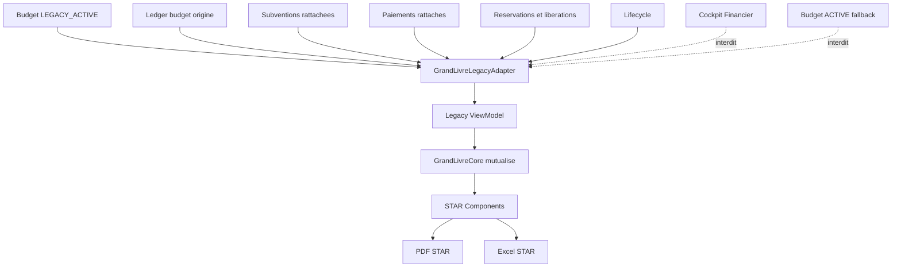
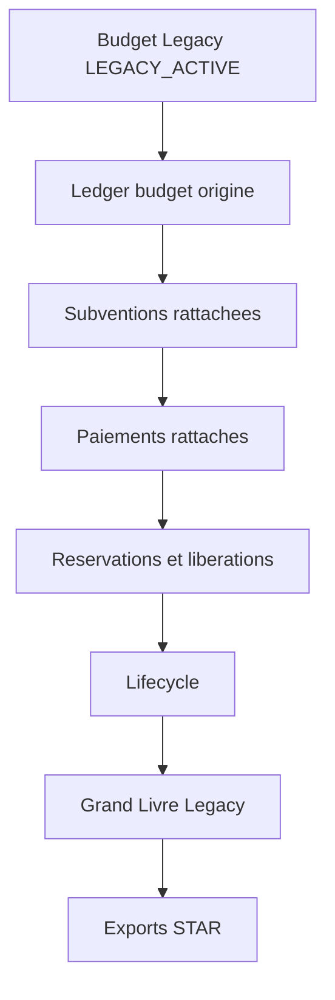

# LEGACY GRAND LIVRE ADAPTER

## 1. Objectif

Le Grand Livre Legacy a pour mission de restituer les ecritures financieres rattachees a un budget historique `LEGACY_ACTIVE`.

Il sert a la liquidation controlee d'un budget d'origine. Il permet de lire les mouvements, les reservations, les paiements, les subventions rattachees, les cycles financiers et les blocages de cloture sans basculer vers le budget actif courant.

Le Grand Livre Legacy est independant du Grand Livre Cockpit car le Cockpit Financier pilote le budget ASC actif, tandis que le Legacy traite un budget historique en cours de fermeture. Le contexte metier n'est donc pas le meme :

- le Cockpit lit le budget courant ;
- le Legacy lit le budget d'origine ;
- le Cockpit sert le pilotage financier ;
- le Legacy sert la liquidation historique et la cloture budgetaire.

Le Grand Livre Legacy ne partage jamais le contexte metier du Cockpit Financier. Il peut uniquement reutiliser le socle de presentation.

---

## 2. Doctrine

Les regles metier applicables sont les suivantes :

- le budget d'origine reste la source de verite des operations historiques ;
- les subventions restent rattachees definitivement a leur `budget_id` d'origine ;
- le ledger conserve ses ecritures sur le budget d'origine ;
- aucune migration retroactive des subventions n'est autorisee ;
- aucune migration retroactive du ledger n'est autorisee ;
- aucune fusion avec le budget `ACTIVE` n'est autorisee ;
- aucune reaffectation automatique vers le nouveau budget n'est autorisee ;
- les operations historiques se cloturent sur leur budget d'origine ;
- le statut `LEGACY_ACTIVE` designe un budget historique encore utilise pour finalisation ;
- le passage `LEGACY_ACTIVE` vers `CLOSED` est une operation de gouvernance controlee ;
- le backend reste source de verite pour la cloture et les blocages.

Le Grand Livre Legacy appartient au domaine de liquidation historique, pas au domaine de pilotage du budget actif.

---

## 3. Responsabilites

Le `GrandLivreLegacyAdapter` est responsable de :

- recevoir un contexte Legacy explicite ;
- verifier l'identite du budget cible ;
- verifier l'organisation proprietaire ;
- verifier le statut `LEGACY_ACTIVE` ;
- refuser tout fallback vers un budget `ACTIVE` ;
- charger les ecritures ledger du budget d'origine ;
- charger les lignes Grand Livre filtrees sur le `budget_id` ;
- associer les subventions rattachees au budget ;
- associer les paiements rattaches au budget ;
- restituer les reservations et liberations ;
- restituer la timeline lifecycle ;
- exposer les blocages de cloture ;
- produire un ViewModel Legacy distinct du ViewModel Cockpit ;
- fournir un contexte stable aux composants STAR mutualises ;
- fournir un contexte stable aux exports PDF et Excel Legacy.

Le `GrandLivreLegacyAdapter` ne prend aucune decision de cloture. Il restitue les donnees et signaux utiles a la liquidation.

---

## 4. Contrat

### Entrees

- `budget_id` obligatoire ;
- `organization_id` obligatoire ;
- `budget_status` obligatoire ;
- `budget_type` obligatoire ;
- exercice obligatoire ;
- periode obligatoire ou explicitement absente ;
- utilisateur authentifie ;
- role utilisateur si les signaux de cloture sont restitues ;
- budget legacy ;
- lignes ledger ;
- lignes `v_grand_livre_asc` filtrees par budget ;
- subventions rattachees ;
- paiements rattaches ;
- reservations ;
- liberations ;
- timeline `budget_status_events` ;
- etat de cloture.

### Sorties

- contexte budget Legacy valide ;
- lignes Grand Livre Legacy ;
- KPI financiers Legacy ;
- total credits ;
- total debits ;
- total reserve ;
- total libere ;
- solde budgetaire courant ;
- dossiers ouverts ;
- dossiers clotures ;
- paiements inities ;
- paiements executes ;
- cycles financiers incomplets ;
- timeline lifecycle ;
- readiness de cloture ;
- alertes metier Legacy ;
- contexte d'export PDF Legacy ;
- contexte d'export Excel Legacy ;
- statut de coherence.

### Preconditions

- l'utilisateur est authentifie ;
- `organization_id` est connu ;
- `budget_id` est fourni ;
- le budget existe ;
- le budget appartient a l'organisation ;
- le budget est de type `ASC` ;
- le budget est `LEGACY_ACTIVE` ;
- les tables `budgets`, `budget_ledger`, `subventions`, `subvention_payments` sont consultables ;
- la vue `v_grand_livre_asc` est disponible ;
- le contexte de periode est fourni ou explicitement absent.

### Postconditions

- aucune donnee du budget `ACTIVE` n'est injectee ;
- toutes les lignes appartiennent au `budget_id` fourni ;
- toutes les lignes appartiennent a l'`organization_id` fourni ;
- le contexte Legacy est explicite ;
- le ViewModel produit ne depend pas du Cockpit Financier ;
- les composants STAR recoivent un contexte Legacy ;
- les exports recoivent un contexte Legacy ;
- les anomalies et blocages sont restitues sans correction automatique.

### Contraintes

- aucun fallback vers `ACTIVE` ;
- aucune selection implicite ;
- aucune navigation implicite ;
- aucune dependance au Cockpit Financier ;
- aucun export sans `budget_id` ;
- aucun export sans contexte Legacy ;
- aucune correction automatique ;
- aucune reaffectation metier ;
- aucune migration de donnees ;
- aucune modification du ledger ;
- aucune modification des subventions ;
- aucune creation de decision implicite.

---

## 5. Architecture

Le Grand Livre Legacy repose sur une separation stricte entre metier Legacy et presentation mutualisee.

Flux architectural :

GrandLivreLegacyAdapter

↓

Legacy ViewModel

↓

GrandLivreCore (mutualise)

↓

STAR Components

↓

PDF / Excel

---

## 6. Composants mutualises

Composants pouvant etre partages :

- GrandLivreCore ;
- ViewModel ligne Grand Livre ;
- formatters financiers ;
- formatters date ;
- metadonnees mouvements `CREDIT`, `RESERVE`, `RELEASE`, `DEBIT` ;
- filtres type de mouvement ;
- filtres source ;
- filtres categorie ;
- recherche texte ;
- pagination ;
- KPI presentation ;
- table Grand Livre ;
- styles STAR ;
- composants STAR de surface ;
- composants d'export PDF ;
- composants d'export Excel ;
- styles Excel STAR ;
- helpers de mapping d'export.

Ces composants ne doivent porter aucune regle metier Cockpit.

---

## 7. Composants specifiques Legacy

Composants propres au Legacy :

- GrandLivreLegacyAdapter ;
- Legacy ViewModel ;
- contexte budget `LEGACY_ACTIVE` ;
- controle d'appartenance organisation ;
- lecture des subventions rattachees au budget d'origine ;
- lecture des paiements rattaches au budget d'origine ;
- lecture des reservations restantes ;
- lecture des liberations non debitees ;
- signaux de cloture ;
- alertes de liquidation ;
- libelles d'export Legacy ;
- contexte de periode Legacy ;
- restitution des cycles financiers incomplets ;
- restitution des blocages de gouvernance.

---

## 8. Dependances autorisees

Dependances autorisees :

- `profiles` ;
- `budgets` ;
- `budget_ledger` ;
- `v_grand_livre_asc` ;
- `subventions` ;
- `subvention_payments` ;
- `budget_status_events` ;
- evaluation de cloture existante ;
- registres Knowledge applicables ;
- doctrine Legacy documentee ;
- GrandLivreCore mutualise ;
- STAR Components ;
- Export Components ;
- formatters financiers ;
- helpers de presentation ;
- composants table ;
- composants KPI.

---

## 9. Dependances interdites

Dependances interdites :

- fallback vers le dernier budget `ACTIVE` ;
- selection automatique du budget courant ;
- contexte interne du Cockpit Financier ;
- `GdbcseFinancialCockpit` comme source metier ;
- narratifs metier Cockpit ;
- KPI Cockpit non contextualises Legacy ;
- exports libelles `Budget ASC actif` ;
- navigation implicite vers `grand-livre-asc` sans contexte ;
- endpoint appele sans `budget_id` ;
- lecture Grand Livre sans filtre organisation ;
- lecture Grand Livre sans filtre budget ;
- toute logique de reaffectation des subventions ;
- toute logique de reaffectation du ledger ;
- toute correction automatique des anomalies ;
- toute creation automatique de decision, EPIC, COS ou registre.

---

## 10. Invariants

### Invariants d'architecture

- `budget_id` obligatoire ;
- `organization_id` obligatoire ;
- budget `LEGACY_ACTIVE` obligatoire ;
- budget type `ASC` obligatoire ;
- aucun fallback `ACTIVE` ;
- aucune dependance Cockpit ;
- aucune navigation implicite ;
- aucun export sans contexte Legacy ;
- aucune correction automatique ;
- aucune reaffectation metier ;
- aucune migration retroactive ;
- aucune fusion avec le budget actif ;
- aucune ligne hors budget d'origine ;
- aucune ligne hors organisation ;
- aucun partage du contexte metier Cockpit ;
- le backend reste source de verite ;
- la cloture reste une operation de gouvernance controlee.

---

## 11. Flux fonctionnel

Flux fonctionnel attendu :

Budget Legacy

↓

Ledger

↓

Subventions

↓

Paiements

↓

Reservations

↓

Lifecycle

↓

Grand Livre Legacy

↓

Exports STAR

---

## 12. Risques

Risques d'une implementation incorrecte :

- ouvrir le Grand Livre du budget actif depuis un contexte Legacy ;
- perdre le `budget_id` du budget d'origine ;
- melanger budget historique et budget courant ;
- afficher des KPI Cockpit dans une logique de liquidation ;
- exporter un document Legacy avec un libelle Cockpit ;
- masquer des subventions ouvertes ;
- ignorer des paiements inities ;
- ignorer des reservations restantes ;
- perdre la timeline `LEGACY_ACTIVE` vers `CLOSED` ;
- produire une lecture incoherente du solde ;
- autoriser une cloture sur donnees incompletes ;
- reutiliser un narratif Cockpit qui ne correspond pas au Legacy ;
- creer une dependance implicite au Cockpit Financier ;
- rendre impossible l'audit de liquidation historique.

---

## 13. Compatibilite

Le Grand Livre Legacy est compatible avec le socle existant uniquement par la presentation.

Il peut reutiliser :

- GrandLivreCore pour les lignes, filtres, pagination et KPI de presentation ;
- STAR Components pour l'interface visuelle ;
- Export Components pour produire PDF et Excel ;
- formatters pour les montants, dates et libelles ;
- table components pour la restitution des ecritures ;
- KPI components pour la restitution des totaux.

Il ne partage pas :

- le contexte metier du Cockpit ;
- le fallback budget actif ;
- les narratifs Cockpit ;
- la selection budgetaire du Cockpit ;
- les decisions de pilotage du budget actif.

La compatibilite repose donc sur une frontiere stricte :

- presentation mutualisee ;
- metier separe ;
- contexte Legacy obligatoire ;
- adapter Legacy dedie.

---

## 14. Decision

Le Grand Livre Legacy est une implementation metier independante.

Il reutilise uniquement le socle de presentation.

Il ne partage jamais le contexte metier du Cockpit Financier.
