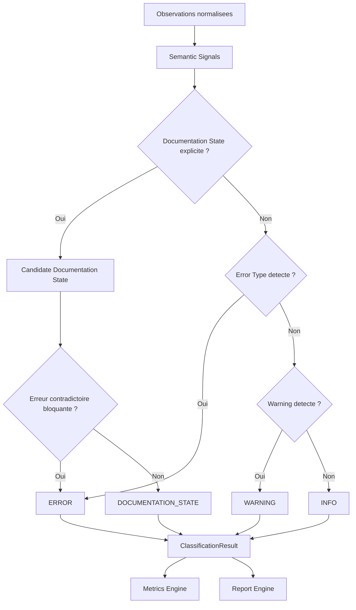

# VALIDATOR CLASSIFICATION ENGINE

Version : 1.0

Statut : DRAFT

References :

- COS-201
- VALIDATOR_ARCHITECTURE_V2.md
- VALIDATOR_SCHEMA_V2.md
- VALIDATOR_CORE_PIPELINE.md

---

## Objectif

Decrire le role du moteur de classification du VALIDATOR V2.

Le Classification Engine transforme les observations produites par le pipeline en objets metier normalises.

Il se situe apres l'analyse semantique et avant le calcul des metriques.

Il doit produire des classifications stables, traçables et exploitables par les rapports JSON, Markdown, Console et Summary.

---

## Architecture

### Responsabilites

Le moteur de classification :

- reçoit des observations normalisees et semantiques ;
- applique les regles de priorite ;
- distingue ERROR, WARNING, DOCUMENTATION_STATE et INFO ;
- assigne une severite ;
- renseigne la localisation ;
- renseigne les metadonnees utiles au scoring ;
- garantit qu'une observation possede une classification principale unique.

### Entrees

- observations normalisees ;
- resultats de resolution ;
- resultats d'analyse semantique ;
- configuration des states ;
- configuration des errors ;
- configuration des warnings ;
- contexte de perimetre.

### Sorties

- liste de ClassificationResult ;
- liste d'errors ;
- liste de warnings ;
- liste de documentationStates ;
- liste d'info.

### Regles

- une erreur reelle prime sur un warning ;
- un warning prime sur une information ;
- un Documentation State explicite n'est pas une erreur par defaut ;
- une observation ne peut pas etre a la fois ERROR et DOCUMENTATION_STATE comme classification principale ;
- les doubles statuts sont conserves en metadata.

### Priorites

Le moteur applique les priorites officielles avant toute sortie :

1. ERROR ;
2. WARNING ;
3. DOCUMENTATION_STATE ;
4. INFO.

---

## Documentation States

### Existing

Definition : objet present, resolu et exploitable.

Criteres d'identification :

- fichier ou reference existe ;
- chemin resolu ;
- contenu lisible lorsque requis ;
- aucune erreur bloquante.

Impact sur le score : aucun malus.

Impact sur la readiness : contribue positivement a la couverture.

### Placeholder

Definition : objet reserve ou cree sans contenu complet.

Criteres d'identification :

- statut explicite placeholder, reserve, vide ou a renseigner ;
- identifiant stable ;
- absence de contenu acceptee par le contexte documentaire.

Impact sur le score : aucun malus si explicite.

Impact sur la readiness : aucun blocage si le placeholder est declare.

### Reserved

Definition : objet conserve pour usage futur.

Criteres d'identification :

- statut reserve ;
- identifiant ou emplacement volontairement conserve ;
- usage futur documente ou implicite par convention officielle.

Impact sur le score : aucun malus.

Impact sur la readiness : aucun blocage.

### Pattern

Definition : motif documentaire ou convention generique.

Criteres d'identification :

- presence de wildcard ou motif connu ;
- usage dans une section de convention, schema ou pipeline ;
- ne designe pas un fichier unique attendu.

Impact sur le score : aucun malus.

Impact sur la readiness : aucun blocage.

### Gap

Definition : ecart documentaire connu et suivi.

Criteres d'identification :

- identifiant de gap ;
- section de lacunes, gaps ou points a surveiller ;
- cause ou objet du gap explicite.

Impact sur le score : aucun malus si ouvert et documente.

Impact sur la readiness : peut reduire quality_score si nombreux, mais ne bloque pas sans ERROR.

### Legacy

Definition : objet historique conserve pour migration ou tracabilite.

Criteres d'identification :

- statut legacy ;
- chemin ou reference historique ;
- usage non actif ou compare a une source actuelle.

Impact sur le score : aucun malus hors flux actif.

Impact sur la readiness : aucun blocage si le statut est explicite.

### Archive

Definition : objet conserve hors flux actif.

Criteres d'identification :

- statut archive ;
- emplacement d'archive ;
- usage historique, audit ou conservation.

Impact sur le score : aucun malus hors flux actif.

Impact sur la readiness : aucun blocage.

### Incubation

Definition : objet exploratoire non integre au socle officiel.

Criteres d'identification :

- dossier ou statut incubation ;
- absence de rattachement officiel assumee ;
- contenu exploratoire.

Impact sur le score : aucun malus.

Impact sur la readiness : aucun blocage si hors flux actif.

### Deprecated

Definition : objet present mais remplace, deconseille ou sorti du flux de reference.

Criteres d'identification :

- statut deprecated ;
- mention de remplacement ou retrait ;
- reference conservee pour compatibilite.

Impact sur le score : aucun malus si remplacement documente.

Impact sur la readiness : warning possible si encore utilise comme source active.

### Generated

Definition : objet produit automatiquement ou derive d'une source primaire.

Criteres d'identification :

- statut generated ;
- trace de generation ;
- source primaire identifiable.

Impact sur le score : aucun malus si source primaire disponible.

Impact sur la readiness : aucun blocage.

---

## Error Classification

### MissingFile

Definition : fichier attendu comme source reelle mais absent.

Regle de detection : reference resolue vers un fichier obligatoire inexistant et non qualifiee comme Pattern, Placeholder, Gap, Archive, Legacy ou Incubation.

Severite : ERROR.

Impact : diminue semantic_score et peut produire NOT_READY.

### BrokenLink

Definition : lien Markdown dont la cible n'existe pas.

Regle de detection : lien Markdown interne resolu vers une cible absente.

Severite : ERROR.

Impact : diminue semantic_score et peut produire NOT_READY.

### InvalidAnchor

Definition : lien Markdown pointant vers une ancre absente ou invalide.

Regle de detection : cible fichier existante, ancre demandee absente apres normalisation.

Severite : ERROR.

Impact : diminue semantic_score.

### DuplicateIdentifier

Definition : identifiant repete lorsque l'unicite est obligatoire.

Regle de detection : meme identifiant observe plusieurs fois dans un contexte d'unicite.

Severite : ERROR.

Impact : diminue semantic_score et bloque la readiness si l'ambiguite affecte une source active.

### CircularReference

Definition : cycle de references non documente empechant de determiner l'autorite.

Regle de detection : graphe de references cyclique sans relation autorisee ou sans source primaire identifiable.

Severite : ERROR.

Impact : diminue semantic_score et peut bloquer la readiness.

### InvalidPath

Definition : chemin invalide, non resoluble ou incompatible avec les conventions.

Regle de detection : chemin contenant une syntaxe invalide, un emplacement interdit ou un format non canonique bloquant.

Severite : ERROR.

Impact : diminue semantic_score.

---

## Warning Classification

### WeakReference

Reference exploitable mais peu precise.

Comportement : warning ; ne diminue pas semantic_score ; peut diminuer quality_score.

### DeprecatedReference

Reference vers un objet deprecated encore utilise.

Comportement : warning si l'usage n'est pas bloquant ; ERROR si l'objet deprecated remplace une source obligatoire absente.

### IncompleteDocumentation

Document exploitable mais incomplet.

Comportement : warning ; peut diminuer quality_score et coverage.

### ReservedDocument

Document reserve present dans le perimetre actif.

Comportement : Documentation State principal ; warning uniquement si le document est utilise comme source active.

### LegacyDependency

Dependance a un objet legacy.

Comportement : warning si la dependance reste active ; Documentation State si elle est seulement historique.

### DocumentationDrift

Ecart entre deux sources qui restent chacune lisibles.

Comportement : warning ; ERROR uniquement si l'ecart empeche de determiner l'autorite.

---

## Priorite de classification

Ordre exact :

```text
ERROR
  ↓
WARNING
  ↓
DOCUMENTATION_STATE
  ↓
INFO
```

Regle :

- si une observation satisfait un Error Type officiel, elle devient ERROR sauf si elle est explicitement couverte par un Documentation State autorise ;
- si elle ne satisfait pas un Error Type mais presente un risque, elle devient WARNING ;
- si elle decrit un etat documentaire stable, elle devient DOCUMENTATION_STATE ;
- sinon elle devient INFO ou est ignoree selon la configuration.

---

## Contrat

Objet produit : ClassificationResult.

Champs obligatoires :

| Champ | Description |
|---|---|
| type | ERROR, WARNING, DOCUMENTATION_STATE ou INFO. |
| severity | CRITICAL, HIGH, MEDIUM, LOW ou NONE. |
| identifier | Identifiant ou reference classee. |
| message | Message court de classification. |
| location | Fichier, ligne et section. |
| documentationState | State associe si applicable. |
| metadata | Donnees complementaires de resolution, preuve et contexte. |

Exemple logique :

```json
{
  "type": "DOCUMENTATION_STATE",
  "severity": "NONE",
  "identifier": "COS-*.md",
  "message": "Pattern documentaire valide",
  "location": {
    "file": "VALIDATOR_CORE_PIPELINE.md",
    "line": 0,
    "section": "Pipeline"
  },
  "documentationState": "Pattern",
  "metadata": {
    "scoreImpact": 0,
    "readinessImpact": "none"
  }
}
```

---

## Regles metier

### Placeholder valide

Un Placeholder est valide si :

- son statut est explicite ;
- son identifiant est stable ;
- il n'est pas utilise comme source active obligatoire ;
- son absence de contenu est acceptee par le contexte.

### Pattern valide

Un Pattern est valide si :

- il est volontairement generique ;
- il apparait dans une section de convention, schema, architecture ou pipeline ;
- il ne pretend pas pointer vers un fichier unique.

### REL-GAP acceptable

Un REL-GAP est acceptable si :

- il est declare dans une section de gaps ou surveillance ;
- il possede un identifiant stable ;
- il decrit l'ecart observe ;
- il n'est pas presente comme relation active resolue.

### Legacy acceptable

Un Legacy est acceptable si :

- le statut legacy est explicite ;
- l'objet n'est pas exige comme source active ;
- son usage historique ou migratoire est clair.

### Archive acceptable

Une Archive est acceptable si :

- le statut archive est explicite ;
- elle est hors flux actif ;
- elle n'est pas requise comme source primaire.

---

## Interaction avec Metrics

### Ce qui augmente semantic_score

Le semantic_score augmente indirectement lorsque les ERROR diminuent.

### Ce qui diminue semantic_score

- MissingFile ;
- BrokenLink ;
- InvalidAnchor ;
- DuplicateIdentifier ;
- CircularReference ;
- InvalidPath.

### Ce qui augmente quality_score

- Documentation States justifies ;
- couverture complete ;
- references canoniques ;
- absence de warnings ;
- classification non ambigue.

### Ce qui diminue quality_score

- warnings ;
- Documentation States sans justification suffisante ;
- gaps ouverts nombreux ;
- dependances legacy actives ;
- documentation incomplete.

### Ce qui augmente coverage

- fichiers presents ;
- references resolues ;
- axes documentaires couverts ;
- sources primaires identifiees.

### Ce qui diminue coverage

- fichiers obligatoires absents ;
- axes non couverts ;
- documents actifs incomplets ;
- references orphelines lorsque le rattachement est requis.

---

## Interaction avec Readiness

### READY

Produit si :

- aucune classification ERROR ;
- warnings absents ou non bloquants selon configuration ;
- coverage complete ;
- Documentation States qualifies.

### READY_WITH_WARNINGS

Produit si :

- aucune classification ERROR ;
- warnings presents ;
- coverage exploitable ;
- aucun warning bloque par configuration.

### NOT_READY

Produit si :

- au moins une classification ERROR ;
- coverage obligatoire incomplete ;
- classification ambigue non resolue ;
- source d'autorite impossible a determiner.

---

## Cas limites

### Placeholder sans cible

Classification : DOCUMENTATION_STATE si le placeholder est explicite ; ERROR si une source active obligatoire attend une cible.

### Pattern ambigu

Classification : WARNING si le pattern est detecte mais son usage est ambigu ; ERROR si le pattern est interprete comme chemin obligatoire invalide.

### Double classification

Classification principale unique obligatoire. Les autres interpretations sont stockees dans metadata.

### Legacy + archive

Classification principale : Archive si hors flux actif ; Legacy si conserve pour migration active. L'autre statut est conserve en metadata.

### Gap ferme

Classification : INFO ou Existing si la correction est documentee et resolue.

### Gap ouvert

Classification : DOCUMENTATION_STATE si le gap est declare ; WARNING si le gap affecte quality_score ; ERROR si le gap bloque une source obligatoire.

---

## Extensibilite

### Nouveaux Documentation States

Pour ajouter un state :

- definir son nom stable ;
- definir ses criteres ;
- definir son impact score ;
- definir son impact readiness ;
- conserver la compatibilite des states existants.

### Nouveaux Error Types

Pour ajouter un Error Type :

- definir la cause ;
- definir la regle de detection ;
- definir la severite ;
- definir l'impact ;
- garantir la priorite avec les types existants.

### Nouveaux Warning Types

Pour ajouter un Warning Type :

- definir le risque ;
- definir le comportement ;
- definir l'impact quality_score ;
- garantir qu'il ne bloque pas readiness sauf configuration explicite.

---

## Diagramme


