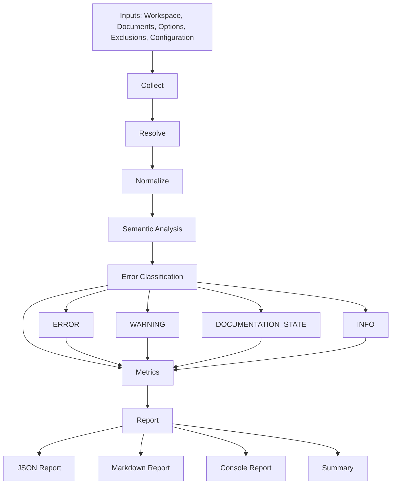

# VALIDATOR CORE PIPELINE

Version : 1.0

Statut : DRAFT

References :

- COS-201
- VALIDATOR_ARCHITECTURE_V2.md
- VALIDATOR_SCHEMA_V2.md

---

## Objectif

Decrire le fonctionnement interne du Core Pipeline du VALIDATOR V2 avant toute implementation.

Le pipeline a pour role de transformer un perimetre documentaire brut en rapport de validation structure, deterministe et conforme au contrat VALIDATOR_SCHEMA_V2.

Il doit distinguer sans ambiguite :

- les erreurs reelles ;
- les warnings ;
- les etats documentaires ;
- les informations de contexte.

---

## Architecture generale

Chaine officielle :

```text
Collect
  ↓
Resolve
  ↓
Normalize
  ↓
Semantic Analysis
  ↓
Error Classification
  ↓
Metrics
  ↓
Report
```

### Collect

Collecte les documents, lignes, titres, tables, liens, chemins explicites, identifiants et metadonnees necessaires.

### Resolve

Resout les chemins, ancres, references croisees et identifiants collectes.

### Normalize

Transforme les donnees resolues vers des formats stables, comparables et conformes au contrat.

### Semantic Analysis

Interprete les observations normalisees pour separer les etats documentaires, erreurs candidates et warnings candidats.

### Error Classification

Classe les observations selon les categories officielles : ERROR, WARNING, DOCUMENTATION_STATE, INFO.

### Metrics

Calcule les scores et compteurs a partir des objets classes.

### Report

Produit les sorties JSON, Markdown, Console et Summary.

---

## Etape 1 - Collect

### Entrees

- workspace ;
- liste des documents ;
- options ;
- exclusions ;
- configuration.

### Responsabilites

- lire les fichiers autorises ;
- extraire les lignes ;
- extraire les titres ;
- extraire les tables ;
- extraire les liens Markdown ;
- extraire les chemins explicites ;
- extraire les identifiants ;
- conserver la position de chaque observation.

### Sorties

- collection de documents lus ;
- collection d'observations brutes ;
- inventaire des fichiers presents ;
- inventaire des fichiers non lus ;
- journal de collecte.

### Preconditions

- workspace resoluble ;
- perimetre declare ;
- droits de lecture disponibles ;
- exclusions chargees.

### Postconditions

- aucune source modifiee ;
- chaque observation possede un fichier et une position ;
- les erreurs de lecture sont tracees.

---

## Etape 2 - Resolve

### Resolution des chemins

Le pipeline resout les chemins relatifs depuis le document source ou depuis le workspace selon le type de reference.

### Resolution des ancres

Le pipeline calcule les ancres Markdown a partir des titres presents dans le document cible.

### Resolution des references

Le pipeline determine si une reference pointe vers :

- un fichier existant ;
- un dossier existant ;
- un pattern ;
- une reference externe ;
- une reference invalide.

### Resolution des identifiants

Le pipeline relie les identifiants observes aux tables, sections et documents qui les declarent.

### Sorties

- observations resolues ;
- statut de resolution ;
- preuves de resolution ;
- echecs de resolution.

---

## Etape 3 - Normalize

### Normalisation des chemins

- separateur stable ;
- suppression des segments ambigus ;
- conservation du chemin original ;
- production d'un chemin canonique lorsque possible.

### Normalisation des identifiants

- casse stable ;
- trim des espaces ;
- conservation de l'identifiant original ;
- qualification du type d'identifiant.

### Normalisation des Documentation States

- mapping vers les states officiels ;
- rejet des states inconnus vers warning ;
- conservation de la justification documentaire.

### Normalisation des formats

- representation commune des liens ;
- representation commune des tables ;
- representation commune des sections ;
- representation commune des observations.

### Sorties

- observations normalisees ;
- valeurs originales ;
- valeurs canoniques ;
- avertissements de normalisation.

---

## Etape 4 - Semantic Analysis

### Identifier les etats documentaires

Le pipeline identifie les objets relevant des Documentation States :

- Existing ;
- Placeholder ;
- Reserved ;
- Pattern ;
- Gap ;
- Legacy ;
- Archive ;
- Incubation ;
- Deprecated ;
- Generated.

### Identifier les erreurs

Le pipeline identifie les erreurs candidates :

- MissingFile ;
- BrokenLink ;
- InvalidAnchor ;
- DuplicateIdentifier ;
- CircularReference ;
- InvalidPath.

### Identifier les warnings

Le pipeline identifie les risques non bloquants :

- reference ambigue ;
- couverture faible ;
- metadonnee optionnelle absente ;
- chemin non canonique ;
- state sans justification suffisante.

### Logique

La decision semantique suit l'ordre suivant :

1. detecter si l'objet est explicitement qualifie comme Documentation State ;
2. verifier si l'objet correspond a une erreur officielle ;
3. verifier si l'objet correspond a un warning ;
4. classer le reste comme information si utile au rapport ;
5. ne jamais convertir un Documentation State explicite en erreur sans preuve contradictoire.

---

## Etape 5 - Error Classification

Cette etape transforme les observations semantiques en categories finales.

### ERROR

Objet qui invalide la conformite ou bloque la resolution documentaire.

### WARNING

Objet non bloquant qui signale une faiblesse ou une ambiguite.

### DOCUMENTATION_STATE

Objet explicitement qualifie comme etat documentaire.

### INFO

Objet informatif utile au rapport, sans impact de conformite.

### Sorties

- liste d'errors ;
- liste de warnings ;
- liste de documentationStates ;
- liste d'info.

---

## Etape 6 - Metrics

### semantic_score

Score calcule uniquement a partir des ERROR.

Les Documentation States ne reduisent pas le score.

### quality_score

Score qualitatif tenant compte :

- des warnings ;
- de la couverture ;
- de la maturite documentaire ;
- de la clarte des justifications.

### coverage

Mesure de couverture du perimetre attendu :

- fichiers attendus ;
- fichiers presents ;
- fichiers lus ;
- axes documentaires couverts.

### readiness

Decision calculee a partir :

- du nombre d'errors ;
- du nombre de warnings ;
- du coverage ;
- du semantic_score ;
- du quality_score.

### Sorties

- metrics ;
- readiness ;
- raisons de readiness.

---

## Etape 7 - Report

### JSON

Sortie contractuelle principale conforme a VALIDATOR_SCHEMA_V2.

### Markdown

Sortie lisible pour revue documentaire.

### Console

Sortie courte destinee a l'execution locale ou CI.

### Summary

Resume synthetique :

- statut readiness ;
- compteurs principaux ;
- erreurs bloquantes ;
- warnings ;
- documentation states.

---

## Contrat entre etapes

| Etape | Entree | Sortie | Responsabilite | Conditions d'echec |
|---|---|---|---|---|
| Collect | Workspace, documents, options, exclusions, configuration | Observations brutes | Lire et extraire sans interpretation | Workspace absent, document illisible, perimetre invalide |
| Resolve | Observations brutes | Observations resolues | Resoudre chemins, ancres, references, identifiants | Chemin invalide, cible introuvable, ancre absente |
| Normalize | Observations resolues | Observations normalisees | Stabiliser les formats et valeurs | Format inconnu, identifiant invalide, state inconnu |
| Semantic Analysis | Observations normalisees | Observations semantiques | Determiner sens documentaire | Ambiguite non resolue, conflit de statut |
| Error Classification | Observations semantiques | Errors, warnings, documentationStates, info | Classer selon le contrat | Type inconnu, classification contradictoire |
| Metrics | Objets classes | Metrics et readiness | Calculer scores et compteurs | Metrique impossible, seuil absent |
| Report | Objets classes, metrics, readiness | JSON, Markdown, Console, Summary | Produire les sorties | Schema incomplet, sortie non serialisable |

---

## Diagramme



---

## Extension

Une nouvelle etape peut etre ajoutee uniquement si elle respecte le contrat suivant :

- entree explicite ;
- sortie explicite ;
- responsabilite unique ;
- absence d'effet de bord ;
- compatibilite avec les etapes existantes ;
- conservation des objets originaux ;
- traçabilite dans le rapport ;
- tests dedies possibles.

L'ajout d'une etape ne doit pas changer la signification des sorties contractuelles existantes.

---

## Principes

### Responsabilite unique

Chaque etape possede une mission unique et ne doit pas dupliquer la responsabilite d'une autre etape.

### Immutabilite des donnees

Chaque etape produit une nouvelle representation sans modifier les donnees d'entree.

### Pipeline deterministe

Une meme entree avec une meme configuration doit produire la meme sortie.

### Extensibilite

Les nouveaux states, warnings, errors et metriques doivent pouvoir etre ajoutes sans casser le contrat existant.

### Testabilite

Chaque etape doit pouvoir etre testee de maniere isolee avec des entrees et sorties verifiables.
