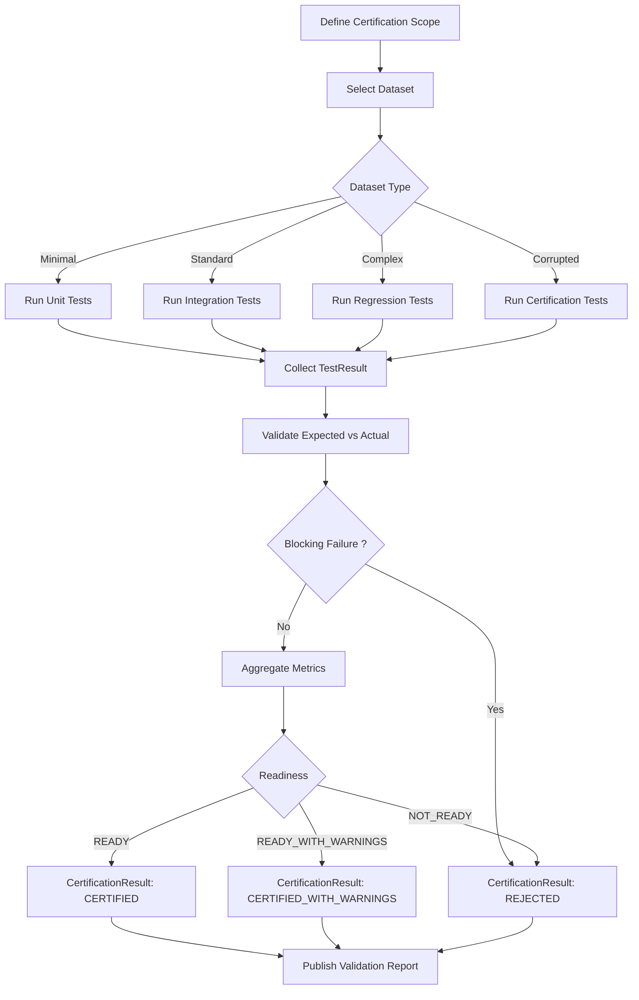

# VALIDATOR TESTING AND CERTIFICATION

Version : 1.0

Statut : DRAFT

Reference : EPIC-204E - Validator Testing and Certification

References :

- COS-201
- VALIDATOR_ARCHITECTURE_V2.md
- VALIDATOR_SCHEMA_V2.md
- VALIDATOR_CORE_PIPELINE.md
- VALIDATOR_CLASSIFICATION_ENGINE.md
- VALIDATOR_METRICS_ENGINE.md

---

## Objectif

Definir la strategie officielle de validation du VALIDATOR V2.

Le present document decrit exclusivement la strategie de tests, de certification et de non-regression du VALIDATOR V2. Il ne definit aucune implementation, aucun script, aucune commande et aucune modification applicative.

La validation doit garantir que le VALIDATOR V2 :

- applique le pipeline officiel ;
- separe correctement `ERROR`, `WARNING`, `DOCUMENTATION_STATE` et `INFO` ;
- ne penalise pas les Documentation States explicites dans le `semantic_score` ;
- calcule les metriques et la readiness conformement au contrat V2 ;
- produit des rapports exploitables et stables ;
- reste extensible sans rupture de certification.

---

## Architecture des tests

### Unit Tests

Les Unit Tests valident chaque responsabilite isolee du VALIDATOR V2.

Perimetre :

- resolution des chemins, liens, ancres et identifiants ;
- normalisation des chemins, identifiants, states et formats ;
- classification d'une observation unique ;
- calcul d'une metrique unique ;
- determination d'un statut readiness simple ;
- generation d'un fragment de rapport conforme au schema.

Objectif qualite :

- chaque fonction conceptuelle du pipeline doit pouvoir etre verifiee avec une entree minimale et une sortie attendue stable ;
- aucun Unit Test ne doit dependre d'un workspace complet ;
- chaque Error Type, Warning Type et Documentation State doit posseder au moins un cas nominal.

### Integration Tests

Les Integration Tests valident l'enchainement de plusieurs etapes du pipeline.

Perimetre :

- `Collect -> Resolve` ;
- `Resolve -> Normalize` ;
- `Normalize -> Semantic Analysis` ;
- `Semantic Analysis -> Error Classification` ;
- `Error Classification -> Metrics` ;
- `Metrics -> Report` ;
- pipeline complet sur workspace controle.

Objectif qualite :

- verifier que les objets conservent leur localisation et leur trace de preuve ;
- verifier qu'une observation ne change pas de sens entre deux etapes ;
- verifier que les sorties intermediaires restent compatibles avec `VALIDATOR_SCHEMA_V2.md`.

### Regression Tests

Les Regression Tests garantissent qu'une correction ou extension ne casse pas les comportements deja certifies.

Perimetre :

- snapshots de rapports JSON et Markdown ;
- cas historiques de `BrokenLink`, `MissingFile`, `DuplicateIdentifier`, `Pattern`, `Placeholder`, `Gap`, `Legacy` et `Archive` ;
- readiness deja certifiee sur workspaces de reference ;
- stabilite des compteurs et scores.

Objectif qualite :

- toute evolution du VALIDATOR V2 doit conserver les resultats certifies, sauf decision documentee de changement de contrat ;
- les changements volontaires doivent etre visibles par difference de rapport et justifies dans la certification.

### Certification Tests

Les Certification Tests valident l'aptitude officielle du VALIDATOR V2 a etre utilise comme outil de validation documentaire.

Perimetre :

- execution conceptuelle du pipeline complet sur les quatre jeux de donnees officiels ;
- verification des criteres `READY`, `READY_WITH_WARNINGS` et `NOT_READY` ;
- verification du contrat `TestResult` ;
- verification du contrat `CertificationResult` ;
- verification de la coherence entre classifications, metriques, readiness et rapport.

Objectif qualite :

- certifier uniquement un VALIDATOR V2 qui produit des resultats deterministes, tracables et conformes ;
- refuser la certification si les rapports sont incomplets, contradictoires ou non reproductibles.

---

## Jeux de donnees

### Workspace minimal

Objectif : valider le fonctionnement de base sur un perimetre documentaire reduit.

Contenu attendu :

- un document Markdown valide ;
- un lien interne valide ;
- un identifiant unique ;
- aucun warning ;
- aucun Documentation State complexe.

Resultat attendu :

- `errors = 0` ;
- `warnings = 0` ;
- `coverage = 100` ;
- `readiness = READY`.

### Workspace standard

Objectif : valider un perimetre documentaire representatif d'un usage normal.

Contenu attendu :

- plusieurs documents Markdown ;
- liens croises valides ;
- ancres valides ;
- identifiants uniques ;
- Documentation States explicites ;
- warnings non bloquants possibles.

Resultat attendu :

- `errors = 0` ;
- warnings acceptes si justifies ;
- Documentation States qualifies ;
- `readiness = READY` ou `READY_WITH_WARNINGS` selon les warnings.

### Workspace complexe

Objectif : valider la robustesse du VALIDATOR V2 sur un perimetre dense.

Contenu attendu :

- plusieurs dossiers ;
- references relatives et absolues au workspace ;
- patterns documentaires ;
- gaps documentes ;
- archives et legacy hors flux actif ;
- objets generated relies a une source primaire ;
- metriques consolidees par document, dossier, projet et Operating System.

Resultat attendu :

- aucune erreur si tous les ecarts sont qualifies ;
- warnings possibles pour couverture faible ou metadonnees optionnelles absentes ;
- aucun malus `semantic_score` pour `Pattern`, `Gap`, `Archive`, `Legacy`, `Incubation`, `Reserved`, `Generated` ou `Deprecated` explicites.

### Workspace corrompu

Objectif : valider la detection des erreurs reelles.

Contenu attendu :

- lien Markdown casse ;
- ancre invalide ;
- fichier obligatoire absent ;
- identifiant duplique dans un contexte d'unicite ;
- chemin invalide ;
- reference circulaire non documentee ;
- rapport attendu partiellement impossible si le schema est viole.

Resultat attendu :

- `errors > 0` ;
- `semantic_score < 100` ;
- `readiness = NOT_READY` ;
- rapport listant les erreurs avec cause, preuve, impact et localisation.

---

## Cas de tests

### Documentation States

Les tests doivent couvrir chaque Documentation State officiel.

| State | Cas nominal | Attendu |
|---|---|---|
| Existing | Objet present, resolu et exploitable. | `DOCUMENTATION_STATE` ou information de couverture, aucun malus. |
| Placeholder | Fichier ou section reservee sans contenu complet mais statut explicite. | Aucun `MissingFile`, aucun malus. |
| Reserved | Emplacement conserve pour usage futur documente. | Aucun blocage readiness. |
| Pattern | Motif `COS-*.md` ou convention generique. | Aucun `InvalidPath`, aucun `MissingFile`. |
| Gap | Ecart declare dans une section de gaps. | Documentation State, warning possible, pas d'erreur sans blocage. |
| Legacy | Source historique hors flux actif. | Aucun malus semantique. |
| Archive | Source conservee hors flux actif. | Aucun malus semantique. |
| Incubation | Objet exploratoire non integre au socle officiel. | Aucun blocage si hors flux actif. |
| Deprecated | Objet remplace ou deconseille avec raison. | Warning possible si encore utilise activement. |
| Generated | Objet derive avec source primaire identifiable. | Aucun malus si la source primaire est resolue. |

### Error Types

Les tests doivent couvrir chaque Error Type officiel.

| Error Type | Cas de test | Attendu |
|---|---|---|
| MissingFile | Source obligatoire absente, non qualifiee comme state autorise. | `ERROR`, impact readiness. |
| BrokenLink | Lien Markdown interne vers cible absente. | `ERROR`, `broken_links` incremente. |
| InvalidAnchor | Fichier cible present, ancre absente. | `ERROR`, localisation du lien. |
| DuplicateIdentifier | Identifiant repete dans un contexte d'unicite. | `ERROR`, `duplicates` incremente. |
| CircularReference | Cycle non documente empechant de determiner l'autorite. | `ERROR`, readiness bloquee. |
| InvalidPath | Chemin invalide ou non resoluble hors pattern. | `ERROR`, preuve de non-resolution. |

### Warning Types

Les tests doivent couvrir les warnings officiels du schema et les warnings du moteur de classification.

| Warning Type | Cas de test | Attendu |
|---|---|---|
| AmbiguousReference | Reference resolue vers plusieurs cibles possibles. | `WARNING`, pas de malus semantic_score. |
| WeakCoverage | Couverture partielle mais exploitable. | `WARNING`, impact quality_score possible. |
| DeprecatedUsage | Usage non bloquant d'un objet deprecated. | `WARNING`. |
| MissingOptionalMetadata | Metadonnee optionnelle absente. | `WARNING`. |
| NonCanonicalPath | Chemin resolu mais non canonique. | `WARNING`. |
| GeneratedWithoutTimestamp | Objet generated sans horodatage. | `WARNING`. |
| StateWithoutJustification | State declare avec justification faible. | `WARNING`, impact quality_score possible. |
| WeakReference | Reference exploitable mais peu precise. | `WARNING`. |
| IncompleteDocumentation | Document exploitable mais incomplet. | `WARNING`. |
| LegacyDependency | Dependance active a un objet legacy. | `WARNING`. |
| DocumentationDrift | Ecart non bloquant entre deux sources. | `WARNING`. |

### Metrics

Les tests doivent verifier :

- `files_scanned` ;
- `files_validated` ;
- `documentation_states` ;
- `errors` ;
- `warnings` ;
- `duplicates` ;
- `orphan_references` ;
- `broken_links` ;
- `coverage` ;
- `semantic_score` ;
- `quality_score` ;
- `readiness_score` ;
- `readiness`.

Cas obligatoires :

- tous les compteurs a zero sauf fichiers presents ;
- une erreur unique ;
- plusieurs erreurs de types differents ;
- warnings sans erreurs ;
- Documentation States nombreux sans erreur ;
- couverture complete ;
- couverture exploitable mais partielle ;
- couverture obligatoire incomplete.

### Reporting

Les tests doivent verifier les sorties :

- JSON conforme au schema ;
- Markdown lisible ;
- Console courte ;
- Summary synthetique.

Chaque rapport doit conserver :

- mission_id ;
- validator_version ;
- workspace ;
- scope ;
- generated_at ;
- readiness ;
- compteurs principaux ;
- details des erreurs, warnings et states ;
- raisons de certification.

---

## Criteres de certification

### READY

Un perimetre est certifie `READY` uniquement si toutes les conditions suivantes sont vraies :

- `errors = 0` ;
- `blocking_errors = 0` ;
- `semantic_score = 100` ;
- `coverage = 100` pour le perimetre obligatoire ;
- `readiness_score = 100` ;
- `warnings = 0` ou warnings explicitement configures comme informatifs sans impact ;
- tous les Documentation States observes sont qualifies ;
- toutes les sections obligatoires du rapport sont produites ;
- aucune ambiguite ne bloque la determination de la source d'autorite.

### READY_WITH_WARNINGS

Un perimetre est certifie `READY_WITH_WARNINGS` uniquement si toutes les conditions suivantes sont vraies :

- `errors = 0` ;
- `blocking_errors = 0` ;
- `semantic_score = 100` ;
- `warnings > 0` ou `quality_score < 100` ;
- `coverage` reste superieure ou egale au seuil configure ;
- `readiness_score` reste superieur ou egal au seuil configure ;
- aucun warning n'est declare bloquant par configuration ;
- les Documentation States sont qualifies ;
- les rapports obligatoires sont produits.

### NOT_READY

Un perimetre est certifie `NOT_READY` si au moins une condition suivante est vraie :

- `errors > 0` ;
- `blocking_errors > 0` ;
- `semantic_score < 100` ;
- `coverage` obligatoire incomplete ;
- `coverage` inferieure au seuil configure ;
- `readiness_score` inferieur au seuil configure ;
- impossibilite de calculer une metrique obligatoire ;
- impossibilite de produire une section obligatoire du rapport ;
- classification ambigue non resolue ;
- source d'autorite impossible a determiner ;
- contradiction entre classifications, metriques et readiness.

---

## Couverture

### Pipeline

Objectif : couvrir toutes les etapes officielles.

Couverture attendue :

- Collect ;
- Resolve ;
- Normalize ;
- Semantic Analysis ;
- Error Classification ;
- Metrics ;
- Report.

Chaque etape doit disposer :

- d'un cas nominal ;
- d'un cas limite ;
- d'un cas d'echec ;
- d'un cas de propagation vers l'etape suivante.

### Classification

Objectif : couvrir toutes les categories de classification.

Couverture attendue :

- `ERROR` ;
- `WARNING` ;
- `DOCUMENTATION_STATE` ;
- `INFO` ;
- priorite de classification ;
- double interpretation stockee en metadata ;
- contradiction entre state et erreur reelle.

### Metriques

Objectif : couvrir tous les compteurs, scores et seuils.

Couverture attendue :

- compteur individuel ;
- aggregation document ;
- aggregation dossier ;
- aggregation projet ;
- aggregation Operating System ;
- seuils `READY`, `READY_WITH_WARNINGS`, `NOT_READY`.

### Reporting

Objectif : couvrir toutes les sorties contractuelles.

Couverture attendue :

- JSON ;
- Markdown ;
- Console ;
- Summary ;
- coherence entre rapport detaille et summary ;
- stabilite des champs obligatoires.

---

## Regression

La strategie de non-regression repose sur des jeux de donnees de reference et des attentes stables.

Regles :

- chaque bug corrige doit ajouter ou mettre a jour un cas de regression ;
- chaque Error Type officiel doit posseder au moins un cas de regression ;
- chaque Documentation State doit posseder un cas prouvant qu'il ne diminue pas le `semantic_score` lorsqu'il est explicite ;
- chaque statut readiness doit posseder au moins un cas certifie ;
- les snapshots de rapport ne peuvent changer que si le contrat change ou si une correction documentee l'exige ;
- les changements de score doivent etre expliques par une difference de classification, de couverture ou de seuil.

Blocages de regression :

- un cas precedemment `READY` devient `NOT_READY` sans justification contractuelle ;
- un `Pattern`, `Placeholder`, `Gap`, `Archive`, `Legacy` ou `Incubation` explicite devient `ERROR` ;
- une erreur reelle disparait du rapport sans correction de la cause ;
- un rapport perd une section obligatoire ;
- une metrique obligatoire devient absente ou non numerique.

---

## Contrat

### TestResult

`TestResult` represente le resultat d'un test individuel.

Champs obligatoires :

| Champ | Type logique | Description |
|---|---|---|
| test_id | string | Identifiant stable du test. |
| test_type | string | `unit`, `integration`, `regression` ou `certification`. |
| scope | string | Perimetre teste. |
| dataset | string | Jeu de donnees utilise. |
| status | string | `PASSED`, `FAILED`, `SKIPPED` ou `BLOCKED`. |
| expected | object | Resultat attendu. |
| actual | object | Resultat observe. |
| evidence | array | Preuves ou extraits de verification. |
| errors | array | Erreurs de test ou ecarts bloquants. |
| warnings | array | Ecarts non bloquants. |
| certification_impact | string | Impact sur la certification. |

Regles :

- `PASSED` exige une egalite entre resultat attendu et resultat observe sur les champs certifies ;
- `FAILED` bloque la certification si le test appartient au perimetre obligatoire ;
- `SKIPPED` exige une justification ;
- `BLOCKED` indique que le test ne peut pas conclure.

### CertificationResult

`CertificationResult` represente la decision globale de certification.

Champs obligatoires :

| Champ | Type logique | Description |
|---|---|---|
| certification_id | string | Identifiant stable de la certification. |
| validator_version | string | Version du VALIDATOR evaluee. |
| scope | string | Perimetre certifie. |
| datasets | array | Jeux de donnees utilises. |
| test_results | array | Liste des `TestResult`. |
| metrics | object | Metriques consolidees. |
| readiness | string | `READY`, `READY_WITH_WARNINGS` ou `NOT_READY`. |
| decision | string | `CERTIFIED`, `CERTIFIED_WITH_WARNINGS` ou `REJECTED`. |
| reasons | array | Raisons factuelles de la decision. |
| blocking_failures | array | Tests ou criteres bloquants. |
| generated_at | string | Date ou horodatage de certification. |

Regles :

- `CERTIFIED` exige `readiness = READY` et aucun test obligatoire en echec ;
- `CERTIFIED_WITH_WARNINGS` exige `readiness = READY_WITH_WARNINGS` et aucun echec bloquant ;
- `REJECTED` est obligatoire si `readiness = NOT_READY` ou si un test de certification obligatoire echoue.

---

## Diagramme

---

## Extensibilite

L'ajout futur de nouveaux tests ne doit pas casser la certification existante.

Regles d'ajout :

- ajouter un identifiant de test stable ;
- rattacher le test a un type officiel ;
- rattacher le test a un jeu de donnees ;
- definir explicitement `expected` ;
- definir son impact de certification ;
- conserver les tests existants ;
- ne pas modifier la signification de `READY`, `READY_WITH_WARNINGS` ou `NOT_READY` ;
- ne pas transformer un Documentation State explicite en erreur sans changement de contrat ;
- fournir une valeur par defaut pour toute nouvelle metrique testee ;
- documenter tout nouveau seuil avant de l'utiliser dans une certification.

Compatibilite :

- un nouveau test non bloquant peut produire un warning de certification ;
- un nouveau test bloquant doit etre declare comme tel avant execution de certification ;
- une extension ne peut pas invalider retrospectivement une certification anterieure sans decision explicite ;
- les anciens `TestResult` et `CertificationResult` doivent rester lisibles.

Critere final :

Le VALIDATOR V2 reste certifiable si les tests nouveaux s'ajoutent au systeme sans rompre les contrats existants, sans changer les identifiants metier et sans modifier les criteres de readiness deja publies.
