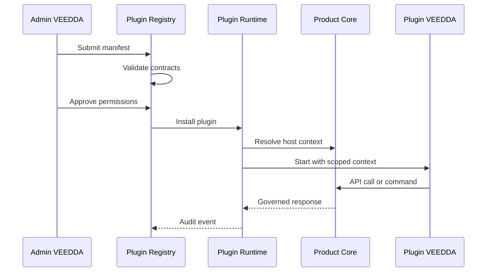

# NOVA-011 - Plugin Platform

MISSION_ID : NOVA-011

AGENT : AGENT 11 - Plugin Platform

STATUT : DRAFT_VALIDABLE

DATE : 2026-07-02

OBJET : SDK, contracts, plugin, integration, premier plugin VEEDDA

---

## 1. Objet

Ce document definit l'architecture cible de la Plugin Platform VEEDDA.

Il decrit :

- le SDK ;
- les contracts ;
- le modele de plugin ;
- le modele d'integration ;
- le premier plugin officiel : `VEEDDA`.

Il ne definit pas :

- une implementation finale ;
- un registre public de marketplace ;
- un systeme de facturation plugin ;
- une execution non gouvernee dans le produit ;
- une extension capable de contourner les domaines metier VEEDDA.

---

## 2. Principe directeur

La Plugin Platform permet d'etendre VEEDDA sans diluer les responsabilites des domaines metier.

Un plugin n'est pas un module autonome qui remplace le produit. C'est une extension gouvernee, versionnee et contractuelle qui consomme des capacites VEEDDA exposees par des contrats stables.

Regles principales :

- un plugin declare explicitement ses capacites ;
- un plugin declare explicitement ses permissions ;
- un plugin s'integre par contrats, jamais par acces direct aux stores internes ;
- un plugin est isole par tenant, projet, utilisateur et contexte ;
- un plugin ne peut pas redefinir les invariants metier VEEDDA ;
- un plugin doit etre observable, desactivable et versionne.

---

## 3. Positionnement architectural

| Couche | Role | Responsabilite |
| --- | --- | --- |
| Product Core | Produit VEEDDA canonique | Domaines, workflows, decisions metier, UI officielle |
| Plugin Platform | Couche d'extension gouvernee | SDK, contracts, registry, permissions, lifecycle |
| Plugin Runtime | Execution controlee | Chargement, appels, contexte, erreurs, observabilite |
| Plugin | Extension declaree | Capacites additionnelles bornees |
| Integration Layer | Frontiere technique | API, events, webhooks, UI slots, commands |

La Plugin Platform se place entre les modules VEEDDA et les extensions. Elle expose des points d'extension officiels sans ouvrir l'interieur des modules.

---

## 4. Sources de verite

Les plugins doivent respecter, par ordre d'autorite :

1. les documents d'Enterprise Architecture ;
2. les contrats de domaines VEEDDA ;
3. les politiques de securite et de gouvernance ;
4. les schemas d'API publics ;
5. les contracts de Plugin Platform ;
6. le manifeste du plugin.

Un manifeste plugin ne peut pas accorder une permission absente des politiques de plateforme.

---

## 5. Concepts canoniques

| Concept | Definition |
| --- | --- |
| `Plugin` | Extension versionnee declaree dans un manifeste. |
| `Plugin Manifest` | Fichier de declaration du plugin, de ses permissions et de ses points d'integration. |
| `Plugin SDK` | Bibliotheque officielle utilisee pour interagir avec VEEDDA. |
| `Plugin Contract` | Contrat technique stable entre VEEDDA et le plugin. |
| `Capability` | Fonction exposee ou consommee par un plugin. |
| `Permission` | Droit explicite accorde au plugin. |
| `Integration Point` | Surface d'accroche autorisee : API, event, UI slot, command, webhook. |
| `Host Context` | Contexte borne fourni au plugin par VEEDDA. |
| `Plugin Runtime` | Composant qui charge, controle et trace l'execution plugin. |
| `Plugin Registry` | Catalogue interne des plugins autorises. |

---

## 6. SDK

### 6.1 Cible initiale

Le SDK cible initial est TypeScript.

Autres cibles possibles :

- REST OpenAPI generated client ;
- Python pour integrations back-office ;
- web component adapter pour slots UI.

### 6.2 Objectif du SDK

Le SDK fournit une interface stable pour :

- lire le contexte autorise ;
- appeler les API publiques ;
- recevoir des events autorises ;
- emettre des commands autorisees ;
- declarer des handlers ;
- exposer des composants UI limites aux slots approuves ;
- gerer les erreurs canoniques ;
- propager les identifiants de correlation.

Le SDK ne contient pas de logique metier canonique. Les decisions metier restent dans VEEDDA.

### 6.3 Client racine cible

```ts
const veedda = createVeeddaPluginClient({
  pluginId: "veedda.core",
  hostUrl: "https://app.veedda.example",
  tokenProvider,
  tenantId: "tenant_001",
  correlationId: "corr_001",
});
```

### 6.4 Modules SDK

| Module | Responsabilite |
| --- | --- |
| `context` | Lire le tenant, l'utilisateur, les roles, le projet et le scope autorise. |
| `auth` | Recuperer une session plugin sans exposer de secret durable. |
| `api` | Appeler les endpoints publics VEEDDA. |
| `events` | S'abonner aux events autorises. |
| `commands` | Demander une action gouvernee. |
| `ui` | Monter des composants dans des slots autorises. |
| `storage` | Lire ou ecrire uniquement dans le storage plugin autorise. |
| `observability` | Journaliser erreurs, traces et metrics plugin. |
| `contracts` | Valider les payloads contre les schemas publics. |

### 6.5 Regles SDK

Le SDK doit :

- typer les permissions ;
- typer les contracts publics ;
- propager `tenant_id`, `plugin_id`, `request_id` et `correlation_id` ;
- refuser une mutation sans permission explicite ;
- exposer les erreurs canoniques sans les masquer ;
- supporter un mode `dryRun` lorsque l'API le permet ;
- permettre la validation locale des schemas sans remplacer la validation serveur.

Le SDK ne doit pas :

- acceder directement a la base de donnees ;
- appeler des routes internes non publiees ;
- inventer une permission ;
- transformer un refus de gouvernance en warning ;
- conserver des secrets dans le bundle client ;
- reproduire les moteurs metier VEEDDA.

---

## 7. Contracts

### 7.1 Familles de contracts

| Famille | Objet |
| --- | --- |
| Manifest Contract | Declaration du plugin. |
| Permission Contract | Capacites autorisees. |
| API Contract | Routes publiques consommables. |
| Event Contract | Events publiables ou consommables. |
| Command Contract | Actions gouvernees demandables. |
| UI Slot Contract | Zones UI extensibles. |
| Storage Contract | Donnees plugin persistables. |
| Error Contract | Erreurs canoniques. |
| Observability Contract | Traces, metrics, audit. |

### 7.2 Manifest minimal

```json
{
  "plugin_id": "veedda.core",
  "name": "VEEDDA",
  "version": "1.0.0",
  "publisher": "VEEDDA",
  "runtime": {
    "type": "hosted",
    "sdk": "typescript",
    "sdk_version": "^1.0.0"
  },
  "permissions": [
    "context:read",
    "dashboard:read",
    "document:read",
    "event:subscribe"
  ],
  "integration_points": {
    "ui_slots": [],
    "events": [],
    "commands": [],
    "webhooks": []
  }
}
```

### 7.3 Permission Contract

Une permission est composee de :

- un domaine ;
- une action ;
- un scope ;
- une condition ;
- une justification ;
- une version.

Exemple :

```json
{
  "permission": "document:read",
  "domain": "document",
  "action": "read",
  "scope": "tenant",
  "condition": "user_has_document_access",
  "version": "1.0"
}
```

### 7.4 Event Contract

Un event expose a un plugin doit contenir :

- `event_id` ;
- `event_type` ;
- `tenant_id` ;
- `source_domain` ;
- `occurred_at` ;
- `payload_version` ;
- `payload` filtre ;
- `correlation_id`.

Le payload ne doit contenir que les champs autorises par les permissions du plugin.

### 7.5 Command Contract

Une command plugin est une demande, pas une decision finale.

Elle doit contenir :

- `command_id` ;
- `plugin_id` ;
- `tenant_id` ;
- `actor_id` si applicable ;
- `command_type` ;
- `payload_version` ;
- `payload` ;
- `idempotency_key` ;
- `correlation_id`.

Le Product Core peut refuser une command pour raison de role, d'etat, de scope, de validation ou de conflit.

### 7.6 UI Slot Contract

Un UI slot definit :

- son identifiant stable ;
- sa page ou zone hote ;
- le type de rendu autorise ;
- les donnees disponibles ;
- les actions disponibles ;
- les contraintes de taille ;
- les etats de chargement et d'erreur ;
- les regles d'accessibilite.

Un plugin UI ne peut pas modifier le layout global ni masquer une action VEEDDA officielle.

### 7.7 Error Contract

| Code | Description |
| --- | --- |
| `PLUGIN_UNAUTHENTICATED` | Identite plugin absente ou invalide. |
| `PLUGIN_FORBIDDEN` | Permission absente ou scope interdit. |
| `PLUGIN_NOT_FOUND` | Plugin inconnu du registry. |
| `PLUGIN_DISABLED` | Plugin desactive. |
| `PLUGIN_CONTRACT_INVALID` | Payload ou manifeste non conforme. |
| `PLUGIN_VERSION_UNSUPPORTED` | Version non supportee. |
| `PLUGIN_RUNTIME_ERROR` | Erreur d'execution plugin. |
| `PLUGIN_TIMEOUT` | Delai d'execution depasse. |
| `PLUGIN_RATE_LIMITED` | Limite d'appel atteinte. |
| `PLUGIN_DEPENDENCY_UNAVAILABLE` | Dependence externe indisponible. |

---

## 8. Modele de plugin

### 8.1 Cycle de vie

| Etat | Definition |
| --- | --- |
| `DRAFT` | Plugin decrit mais non validable. |
| `SUBMITTED` | Plugin soumis a controle. |
| `VALIDATED` | Contracts et permissions valides. |
| `INSTALLED` | Plugin installe pour un tenant ou environnement. |
| `ENABLED` | Plugin actif. |
| `DISABLED` | Plugin desactive sans suppression. |
| `DEPRECATED` | Plugin maintenu temporairement mais remplace. |
| `REMOVED` | Plugin retire. |

### 8.2 Installation

L'installation exige :

- manifeste valide ;
- version compatible ;
- publisher identifie ;
- permissions approuvees ;
- contracts valides ;
- politique de rollback ;
- plan d'observabilite ;
- environnement cible explicite.

### 8.3 Execution

Un plugin s'execute uniquement avec :

- un `plugin_id` connu ;
- un `tenant_id` autorise ;
- un contexte borne ;
- des permissions resolues ;
- un timeout ;
- une trace d'audit ;
- une politique d'erreur.

### 8.4 Desactivation

La plateforme doit permettre de desactiver un plugin :

- par tenant ;
- par environnement ;
- par version ;
- par permission ;
- par integration point.

La desactivation ne doit pas supprimer les traces d'audit.

---

## 9. Integration

### 9.1 Integration Points

| Point | Usage |
| --- | --- |
| REST API | Lecture et mutations gouvernees. |
| Events | Notification de faits metier autorises. |
| Commands | Demandes d'actions controlees par le Product Core. |
| Webhooks | Sortie vers systemes externes. |
| UI Slots | Extension visible dans l'application. |
| Scheduled Jobs | Traitements planifies limites. |
| Import/Export | Echanges de donnees contractuels. |

### 9.2 Flux nominal



### 9.3 Integration avec les domaines VEEDDA

| Domaine | Exposition plugin V1 |
| --- | --- |
| Auth et roles | Lecture contexte, jamais gestion directe des roles. |
| Document Core | Lecture controlee, commands documentaires limitees. |
| DMS | Slots et actions documentaires autorisees. |
| GDBCSE | Lecture reporting et events financiers autorises. |
| QF et droits | Lecture de resultats autorises, pas recalcul autonome. |
| Subventions | Suivi et commands gouvernees, pas decision finale. |
| Ledger | Lecture de vues autorisees, pas ecriture directe. |
| Audit | Emission de traces plugin. |

### 9.4 Interdictions d'integration

Un plugin ne doit pas :

- ecrire directement dans Supabase ;
- contourner les RPC metier ;
- lire un document hors permission utilisateur ;
- recalculer un droit comme source de verite ;
- modifier le ledger ;
- modifier les roles ;
- injecter du code non valide dans l'UI ;
- bloquer une action native VEEDDA ;
- communiquer un secret dans un event, un log ou une erreur.

---

## 10. Premier plugin : VEEDDA

### 10.1 Identite

| Champ | Valeur |
| --- | --- |
| Plugin | `VEEDDA` |
| `plugin_id` | `veedda.core` |
| Publisher | VEEDDA |
| Statut | Plugin officiel de reference |
| Role | Valider les contracts, le SDK et les points d'integration V1 |

Le premier plugin VEEDDA sert de reference interne. Il prouve que la plateforme peut charger, gouverner et auditer une extension officielle avant ouverture a des plugins tiers.

### 10.2 Perimetre V1

Le plugin `VEEDDA` couvre :

- lecture du contexte hote ;
- lecture de dashboards autorises ;
- abonnement a quelques events publics internes ;
- exposition d'un slot UI de diagnostic ;
- emission de traces d'observabilite ;
- validation du SDK TypeScript ;
- validation du manifeste et des permissions.

Il ne couvre pas :

- marketplace ;
- plugins tiers ;
- permissions administrateur globales ;
- ecriture ledger ;
- modification des droits salarie ;
- recalcul QF ;
- mutation directe des documents.

### 10.3 Manifest cible

```json
{
  "plugin_id": "veedda.core",
  "name": "VEEDDA",
  "version": "1.0.0",
  "publisher": "VEEDDA",
  "status": "DRAFT_VALIDABLE",
  "runtime": {
    "type": "hosted",
    "sdk": "typescript",
    "sdk_version": "^1.0.0"
  },
  "permissions": [
    "context:read",
    "dashboard:read",
    "event:subscribe",
    "observability:write"
  ],
  "integration_points": {
    "ui_slots": [
      "admin.plugin.diagnostics"
    ],
    "events": [
      "plugin.installed",
      "plugin.enabled",
      "plugin.disabled"
    ],
    "commands": [],
    "webhooks": []
  }
}
```

### 10.4 Critere de validation du premier plugin

Le plugin `VEEDDA` est validable si :

- le manifeste est conforme ;
- les permissions sont minimales ;
- aucun acces direct aux stores internes n'est requis ;
- le SDK couvre les appels necessaires ;
- le runtime trace installation, activation, appel et erreur ;
- le plugin peut etre desactive sans effet sur le Product Core ;
- les erreurs plugin utilisent le contract canonique ;
- aucune regle metier VEEDDA n'est dupliquee dans le plugin.

---

## 11. Securite

### 11.1 Isolation

L'isolation minimale couvre :

- tenant ;
- utilisateur ;
- role ;
- projet ;
- plugin ;
- version ;
- integration point ;
- scope de donnees.

### 11.2 Secrets

Les secrets ne doivent jamais etre :

- inclus dans le manifeste ;
- exposes au client ;
- publies dans un event ;
- journalises ;
- retournes dans une erreur ;
- stockes dans un storage plugin non chiffre.

### 11.3 Autorisation

Une action plugin est autorisee uniquement si :

1. le plugin est connu ;
2. le plugin est active ;
3. la version est supportee ;
4. la permission existe ;
5. le tenant est autorise ;
6. l'utilisateur ou le service a le droit metier ;
7. le scope demande est compatible ;
8. le Product Core accepte l'etat courant.

---

## 12. Observabilite

Chaque appel plugin doit produire :

- `request_id` ;
- `correlation_id` ;
- `plugin_id` ;
- `plugin_version` ;
- `tenant_id` ;
- integration point ;
- operation ;
- resultat ;
- duree ;
- code d'erreur si applicable.

L'observabilite sert a auditer, diagnostiquer, limiter et desactiver un plugin. Elle ne doit pas exposer de donnees metier inutiles.

---

## 13. Versioning

### 13.1 SemVer

Les plugins et le SDK utilisent SemVer.

Regles :

- patch : correction compatible ;
- minor : ajout compatible ;
- major : rupture de contract.

### 13.2 Compatibilite

Un plugin declare :

- sa version ;
- la version minimale du SDK ;
- les contracts consommes ;
- les integration points requis.

Le runtime refuse une version incompatible avant execution.

---

## 14. Roadmap cible

| Phase | Objectif | Livrable |
| --- | --- | --- |
| V0 | Doctrine plateforme | Document NOVA-011 |
| V1 | SDK et contracts minimaux | SDK TypeScript, manifest schema, error contract |
| V2 | Plugin Runtime interne | Registry, install, enable, disable, audit |
| V3 | Premier plugin VEEDDA | `veedda.core` validable |
| V4 | Extension UI controlee | UI slots limites |
| V5 | Integrations externes | Webhooks et scheduled jobs gouvernes |
| V6 | Ecosysteme controle | Plugins partenaires sous validation |

---

## 15. Critere d'arret

La mission NOVA-011 est complete lorsque ce document decrit :

- le SDK ;
- les contracts ;
- le modele de plugin ;
- le modele d'integration ;
- le premier plugin `VEEDDA` ;
- les permissions ;
- les erreurs ;
- la securite ;
- l'observabilite ;
- le versioning ;
- les limites explicites du perimetre.

Statut propose : `DRAFT_VALIDABLE`.
