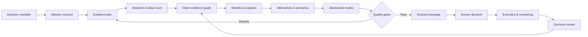

# NSIOS Reference Architecture

## 1. Architectural intent

NSIOS est une couche de l’Operating System NOVA. Il consomme des missions, sources, données et référentiels ; il produit des preuves structurées, analyses, options, recommandations et décisions traçables. Il ne modifie ni le Kernel, ni les données sources, ni l’autorité humaine.



## 2. Six layers

| Layer | Responsibility | Canonical output |
|---|---|---|
| 1. Mandate | décision, sponsor, horizon, matérialité, contraintes | Mission Contract |
| 2. Evidence | sources, data, interviews, provenance, freshness | Evidence Register |
| 3. Intelligence | market, competitor, customer, product, financial, tech | Fact Base |
| 4. Modeling | formulas, causal models, scenarios, valuation, sensitivities | Model Pack |
| 5. Challenge | alternatives, bear case, contradictions, reviewer | Challenge Log |
| 6. Decision | recommendation, conditions, owner, milestones, review | Decision Package |

## 3. Canonical objects

### 3.1 Mission Contract

| Field | Required content |
|---|---|
| Decision | verbatim question the authority must answer |
| Decision owner | named human authority |
| Scope | included/excluded geography, segment, product and period |
| Materiality | financial, strategic, regulatory and reversibility class |
| Deadline | decision date and evidence cut-off |
| Modes | one lead audit mode; supporting modes |
| Constraints | access, confidentiality, budget, legal limits |
| Acceptance | explicit pass/fail criteria |

### 3.2 Claim

Every material statement is stored conceptually as:

`CLAIM-ID | statement | type | scope | date | evidence IDs | calculation ID | confidence | owner | status`

Claim types: `FACT`, `CALCULATED`, `HYPOTHESIS`, `INFERENCE`, `RECOMMENDATION`, `DECISION`.

### 3.3 Evidence item

`EVIDENCE-ID | title | publisher | URL/path | publication date | access date | tier | directness | independence | excerpt/location | hash/version | limitations`

### 3.4 Hypothesis

`HYP-ID | proposition | rationale | metric | falsification threshold | test | deadline | result | impact`

An assertion without a falsification condition is not an NSIOS hypothesis; it is an opinion.

### 3.5 Model

`MODEL-ID | purpose | inputs | formulas | units | time basis | scenarios | sensitivities | reconciliation | owner | version | limitations`

### 3.6 Finding and recommendation

`FINDING-ID | condition | criterion | cause | effect | evidence | severity | confidence`

`REC-ID | action | finding IDs | options rejected | owner | cost | benefit | risk | dependency | trigger | KPI | deadline`

## 4. Mission lifecycle: NOVA-12

| Gate | Stage | Required proof | Stop condition |
|---:|---|---|---|
| G0 | Mandate | decision, authority, scope, deadline | no decision owner |
| G1 | Question architecture | MECE issue tree and priority hypotheses | question not testable |
| G2 | Evidence design | source map, sample plan, data request | critical source unavailable without fallback |
| G3 | Fact base | provenance, reconciliation, contradictions | material data integrity failure |
| G4 | Market/customer | segment, demand, competition, outside view | market boundary undefined |
| G5 | Product/technology | capability and feasibility linkage | growth thesis technically impossible |
| G6 | Economics | unit economics, cash, scenarios, reconciliation | units/time bases inconsistent |
| G7 | Alternatives | status quo + at least two credible options | recommendation predetermined |
| G8 | Stress test | bear case, sensitivities, pre-mortem | no downside model |
| G9 | Synthesis | answer-first storyline and traceability | recommendation exceeds evidence |
| G10 | Independent review | reviewer challenges assumptions and calculations | unresolved critical finding |
| G11 | Decision | decision record, conditions, owner | authority absent |
| G12 | Learning | forecast vs actual, lessons, model updates | not applicable until execution |

## 5. Materiality and proportionality

Score each dimension 1–5: capital at risk, strategic irreversibility, regulatory exposure, people impact, data sensitivity, uncertainty. The highest score controls minimum rigor.

| Class | Trigger | Minimum standard |
|---|---|---|
| M1 Rapid | all dimensions ≤2 | one analyst, one reviewer, desk evidence, base/downside |
| M2 Standard | any dimension 3 | triangulation, primary research where useful, three scenarios |
| M3 Enhanced | any dimension 4 | independent workstreams, model audit, red-team review |
| M4 Critical | any dimension 5 | specialist review, formal committee, versioned evidence room, legal/professional escalation |

## 6. Evidence graph

NSIOS forbids the common chain `source → narrative → recommendation`. The valid chain is:

```text
Source/Data → Atomic fact → Reconciled finding → Analytical inference
            → Alternative evaluation → Recommendation → Decision condition
```

Every edge records the transformation used: extraction, normalization, formula, comparison, causal inference or judgment.

## 7. Analytical workstreams

| Workstream | Core question | Interface |
|---|---|---|
| Market | where is demand and why now? | feeds revenue envelope |
| Customer | who buys, uses, pays, renews? | feeds segmentation and churn |
| Competition | what alternatives constrain value? | feeds positioning/pricing |
| Product | what problem is solved and adopted? | feeds willingness to pay |
| Technology | can roadmap and scale be delivered? | constrains growth and capex |
| Cyber/data/AI | what residual risk is acceptable? | constrains deployment and deal |
| Financial | what economics and cash are sustainable? | feeds valuation/financing |
| Organization | can people/process execute? | constrains timing and benefits |
| Strategy | which coherent choice dominates alternatives? | integrates all workstreams |

## 8. Decision package

Every complete mission emits, in one document or linked artifacts:

1. one-page executive decision;
2. mandate and scope;
3. evidence and confidence summary;
4. fact base;
5. models and reconciliations;
6. alternatives including status quo;
7. recommendation and rejected options;
8. risks, downside and kill criteria;
9. implementation roadmap and benefits logic;
10. appendices, source register and assumption ledger.

## 9. Roles and separation of duties

| Role | Accountability | Prohibited shortcut |
|---|---|---|
| Mission lead | scope, integration, final synthesis | reviewing own critical model alone |
| Research lead | source coverage and provenance | treating search rank as authority |
| Domain analyst | analysis and findings | hiding contradictory evidence |
| Model owner | formulas, units, reconciliation | hard-coded unexplained outputs |
| Red-team reviewer | disconfirming case and failure modes | rewriting recommendation before challenge |
| Quality reviewer | gates, traceability, compliance | approving on presentation quality |
| Decision authority | approve/reject/defer/condition | delegating accountability to NOVA |

## 10. Interfaces with NOVA

- Knowledge System stores versioned sources, claims, relations and supersession.
- Mission Engine instantiates the Mission Contract and stages.
- Workflow Engine enforces gates and reviewer separation.
- Simulation Engine evaluates scenarios and sensitivities.
- Agent Engine assigns domain roles without merging accountability.
- Executive Engine assembles the decision package.
- NSIOS remains outside the Kernel and contains no application-specific rule.

## 11. Architectural invariants

1. No recommendation without linked findings.
2. No material finding without evidence or calculation.
3. No model without units, period, formula and reconciliation.
4. No confidence score without rationale.
5. No critical mission without adverse case.
6. No decision without named authority.
7. No current fact inherited past its freshness window.
8. No framework selected before the decision question.
