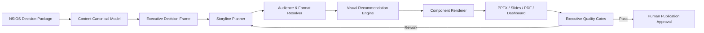

# NEVIS Reference Architecture

## 1. Architectural intent

NEVIS est la couche de transformation éditoriale et visuelle située après l’analyse NSIOS et avant la décision humaine. Il consomme un contenu structuré et traçable ; il ne réinterprète pas silencieusement les preuves.

## 2. Canonical content model

Une mission NEVIS référence au minimum :

`MISSION | AUDIENCE | DECISION_FRAME | CLAIMS | EVIDENCE | METRICS | OPTIONS | VERDICT | RISKS | ACTIONS | CONFIDENCE | SOURCES | VERSION`

Chaque bloc éditorial conserve les identifiants de claims, findings, recommandations et sources NSIOS. Les rendus sont des vues ; le modèle canonique reste la source de vérité.

## 3. Processing stages

| Gate | Stage | Required output | Stop condition |
|---:|---|---|---|
| G0 | Intake | package NSIOS, audience, format, date de décision | source ou audience inconnue |
| G1 | Decision frame | cinq réponses exécutives validées | décision ou confiance absente |
| G2 | Storyline | arc narratif et message de chaque page | page sans fonction décisionnelle |
| G3 | Visual mapping | composant choisi avec justification | graphique décoratif ou trompeur |
| G4 | Composition | rendu selon tokens et gabarits | overflow, contraste ou densité non conforme |
| G5 | Traceability | liens vers claims et annexes | assertion matérielle orpheline |
| G6 | Readiness | score et contrôles automatiques | blocker ouvert |
| G7 | Review | approbation éditoriale et métier | reviewer ou autorité absent |
| G8 | Publication | artefacts versionnés et manifest | formats désynchronisés |

## 4. Storytelling contract

L’arc canonique est :

`Pourquoi maintenant ? → Problème → Marché → Concurrents → Risques → Opportunités → Stratégie → Décisions → Plan d’action → KPI → Annexes`

Il s’agit d’un ordre par défaut, pas d’une obligation de créer une section vide. Chaque transition doit répondre à la question laissée ouverte par la section précédente. La storyline contient pour chaque page : `message`, `preuve`, `visuel`, `implication`, `transition`, `claim IDs`.

## 5. Slide generation contract

Chaque slide comporte :

- un titre-message formulé comme une conclusion ;
- une preuve dominante ou un visuel principal ;
- une implication explicite pour la décision ;
- une source ou un renvoi traçable ;
- des notes présentateur incluant intention, commentaire, limites et transition ;
- un ordre de lecture accessible et stable à l’export.

Les animations sont facultatives, non porteuses d’information exclusive et limitées aux capacités communes des formats cibles. Un export statique doit conserver tout le sens.

## 6. Decision dashboard contract

Le dashboard mission expose selon disponibilité : confiance, maturité, risques, opportunités, ROI, CAC, LTV, ARR, MRR, priorités et actions. Chaque KPI déclare définition, unité, période, source, formule, cible, tendance, fraîcheur et confiance.

La vue par défaut présente :

1. verdict et décision attendue ;
2. cinq à huit KPI critiques ;
3. risques et opportunités matériels ;
4. priorités, responsables et échéances ;
5. accès aux analyses et preuves détaillées.

## 7. Multi-format invariants

1. Même verdict, même version et même date de preuve dans tous les formats.
2. Même sémantique de couleur et de confiance.
3. Même identifiant pour un graphique et sa table accessible.
4. Aucune information critique disponible seulement au survol ou en animation.
5. Pagination, ratio ou responsive peuvent changer ; le sens ne change pas.
6. Toute divergence intentionnelle est déclarée dans le manifest de livraison.

## 8. Publication manifest

Chaque livraison émet un manifest :

`delivery_id | mission_id | source_version | audience | format | template_version | design_tokens_version | generated_at | evidence_cutoff | readiness_score | reviewer | approver | artifact_hashes | exceptions`
