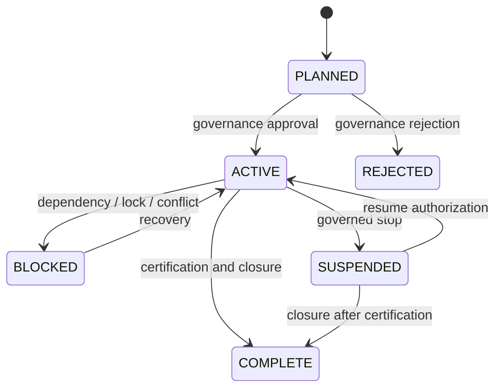
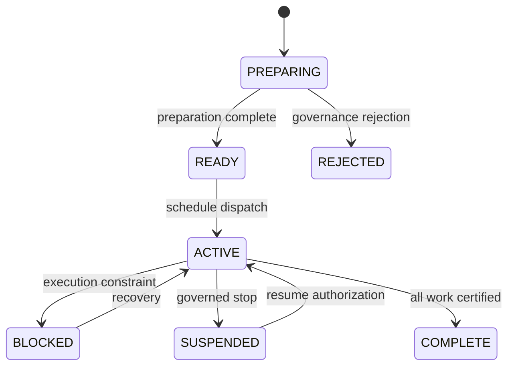
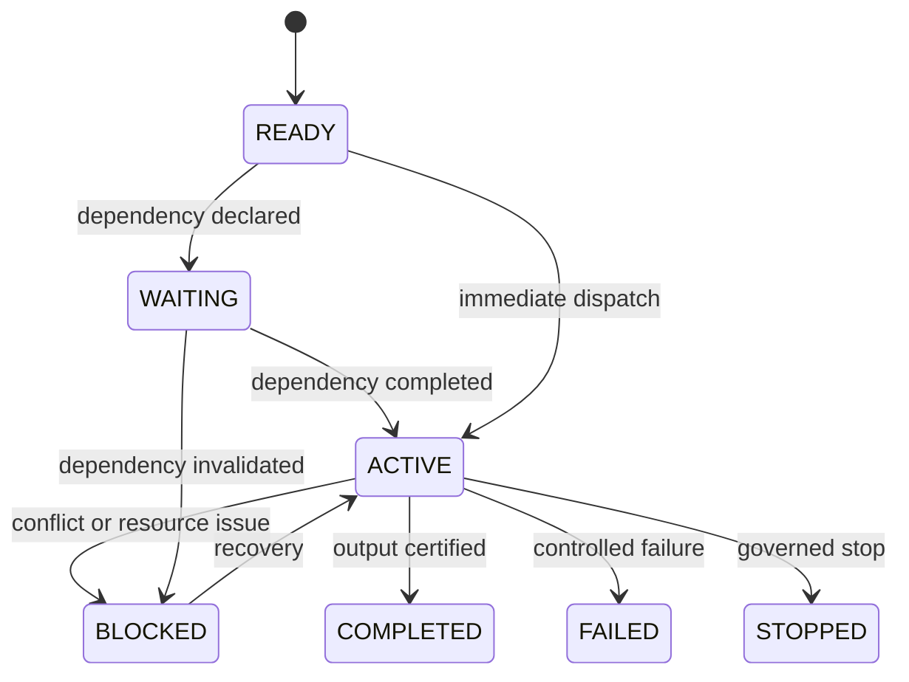
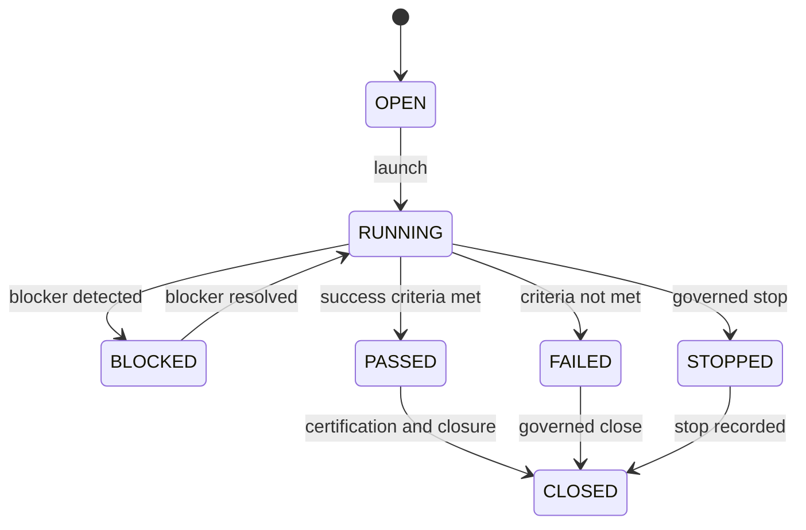
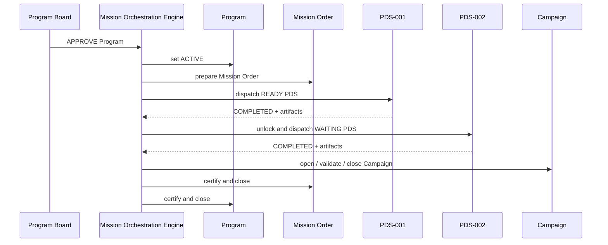

# Mission Orchestration Engine Specification

## 1. Document Status

This document is a normative specification.

It defines the rules that any future Mission Orchestration Engine implementation MUST follow.

It does not describe the current implementation.

It defines the operating contract of the NOVA Operating System for mission orchestration.

## 2. Purpose

The Mission Orchestration Engine MUST coordinate portfolio execution across Programs, Mission Orders, Program Delivery Squads, and Campaigns.

The engine MUST preserve governance, traceability, isolation, certification discipline, and repository integrity while enabling sequential and parallel execution.

The engine MUST provide a deterministic orchestration contract for all future Programs.

## 3. Scope

The Mission Orchestration Engine MUST govern:

- Portfolio execution sequencing.
- Program activation and closure readiness.
- Mission Order creation, dispatch, and closure.
- Program Delivery Squad allocation and dependency handling.
- Campaign launch, validation, and certification.
- Artifact propagation between execution units.
- Conflict detection and resolution.
- Rollback and recovery.
- Event emission and traceability.

The Mission Orchestration Engine MUST NOT define business strategy, product strategy, technical implementation details, or runtime internals beyond orchestration rules.

## 4. Normative Language

The keywords MUST, MUST NOT, SHALL, SHALL NOT, SHOULD, and MAY are to be interpreted as normative requirements.

Any implementation claiming conformance MUST satisfy every requirement marked with MUST or SHALL.

## 5. Core Role

The Mission Orchestration Engine MUST serve as the authoritative execution coordinator for NOVA mission-based work.

The engine SHALL:

- accept approved execution context;
- compute execution order;
- enforce dependency and lock constraints;
- produce orchestration events;
- propagate approved artifacts;
- stop unsafe execution;
- resume safe execution after recovery conditions are satisfied;
- certify execution boundaries;
- close completed work units.

The engine MUST remain agnostic of the business domain of the Program it orchestrates.

## 6. Canonical Entities

The Mission Orchestration Engine MUST manage the following canonical entities:

- Portfolio.
- Program.
- Mission Order.
- PDS.
- Campaign.

The engine MAY manage derived orchestration artifacts, but those derived artifacts MUST NOT alter the canonical entity model.

## 7. Entity State Models

### 7.1 Portfolio

The Portfolio MUST support the following states:

- `PLANNED`
- `ACTIVE`
- `BLOCKED`
- `SUSPENDED`
- `COMPLETE`

Portfolio transitions MUST obey the following rules:

- `PLANNED -> ACTIVE` SHALL occur only after governance approval.
- `ACTIVE -> BLOCKED` SHALL occur when a critical dependency, conflict, or policy breach prevents safe execution.
- `BLOCKED -> ACTIVE` SHALL occur only after the blocking condition is cleared and recovery is certified.
- `ACTIVE -> SUSPENDED` SHALL occur when execution must stop globally.
- `SUSPENDED -> ACTIVE` SHALL occur only after explicit resume authorization.
- `ACTIVE -> COMPLETE` SHALL occur only when all active Programs are complete and closure conditions are met.

### 7.2 Program

The Program MUST support the following states:

- `PLANNED`
- `APPROVED`
- `ACTIVE`
- `BLOCKED`
- `SUSPENDED`
- `COMPLETE`
- `REJECTED`

Program transitions MUST obey the following rules:

- `PLANNED -> APPROVED` SHALL occur only after Program Board approval.
- `APPROVED -> ACTIVE` SHALL occur only when the Program has a valid bootstrap context.
- `ACTIVE -> BLOCKED` SHALL occur when execution is prevented by dependency, lock, resource, or conflict conditions.
- `BLOCKED -> ACTIVE` SHALL occur only after the blocking condition is resolved.
- `ACTIVE -> SUSPENDED` SHALL occur when execution must stop.
- `SUSPENDED -> ACTIVE` SHALL occur only after explicit recovery.
- `ACTIVE -> COMPLETE` SHALL occur only when all Mission Orders and Campaigns are complete and certification is satisfied.
- `PLANNED -> REJECTED` SHALL occur only by governance decision.

### 7.3 Mission Order

The Mission Order MUST support the following states:

- `PREPARING`
- `READY`
- `ACTIVE`
- `BLOCKED`
- `SUSPENDED`
- `COMPLETE`
- `REJECTED`

Mission Order transitions MUST obey the following rules:

- `PREPARING -> READY` SHALL occur when the mission order preparation plan is complete.
- `READY -> ACTIVE` SHALL occur only when the Mission Orchestration Engine schedules execution.
- `ACTIVE -> BLOCKED` SHALL occur when an execution constraint prevents progress.
- `BLOCKED -> ACTIVE` SHALL occur only after recovery conditions are satisfied.
- `ACTIVE -> SUSPENDED` SHALL occur when the mission order must be paused.
- `SUSPENDED -> ACTIVE` SHALL occur only after explicit resume authorization.
- `ACTIVE -> COMPLETE` SHALL occur only after all required PDS and Campaign work is complete and certified.
- `PREPARING -> REJECTED` SHALL occur only by governance decision.

### 7.4 PDS

The Program Delivery Squad MUST support the following states:

- `READY`
- `WAITING`
- `ACTIVE`
- `BLOCKED`
- `COMPLETED`
- `FAILED`
- `STOPPED`

PDS transitions MUST obey the following rules:

- `READY -> ACTIVE` SHALL occur only when all dependency, lock, and resource conditions are satisfied.
- `WAITING -> ACTIVE` SHALL occur only when the declared dependency is completed.
- `ACTIVE -> COMPLETED` SHALL occur only when the PDS has produced all required artifacts, evidence, and certification outputs.
- `ACTIVE -> FAILED` SHALL occur when execution cannot continue due to a controlled failure.
- `ACTIVE -> BLOCKED` SHALL occur when an external dependency, lock, or conflict prevents safe continuation.
- `BLOCKED -> ACTIVE` SHALL occur only after the blocking condition is resolved.
- `READY -> WAITING` SHALL occur when the PDS is declared dependent on another PDS.
- `WAITING -> BLOCKED` SHALL occur when the dependency is invalidated or becomes unavailable.
- `BLOCKED -> STOPPED` SHALL occur when governance determines the PDS cannot resume safely.
- `ACTIVE -> STOPPED` SHALL occur when the orchestrator issues a governed stop.

### 7.5 Campaign

The Campaign MUST support the following states:

- `OPEN`
- `RUNNING`
- `BLOCKED`
- `PASSED`
- `FAILED`
- `CLOSED`
- `STOPPED`

Campaign transitions MUST obey the following rules:

- `OPEN -> RUNNING` SHALL occur when the campaign is launched.
- `RUNNING -> BLOCKED` SHALL occur when a campaign-level blocker appears.
- `RUNNING -> PASSED` SHALL occur when all campaign criteria are satisfied.
- `RUNNING -> FAILED` SHALL occur when campaign requirements are not satisfied.
- `BLOCKED -> RUNNING` SHALL occur only after the blocker is resolved.
- `PASSED -> CLOSED` SHALL occur after certification and closure conditions are satisfied.
- `FAILED -> CLOSED` SHALL occur only if governance authorizes closure of a failed campaign.
- `RUNNING -> STOPPED` SHALL occur when the campaign is force-stopped by governed control.
- `STOPPED -> CLOSED` SHALL occur only after stop evidence is recorded.

## 8. Allowed Transitions Summary

The Mission Orchestration Engine MUST allow only valid forward or recovery transitions.

The engine SHALL reject any transition not explicitly permitted by this specification.

The engine MUST treat invalid transitions as governance violations.

## 9. Dependency Rules Between PDS

The Mission Orchestration Engine MUST support declared dependencies between PDS.

Each dependency MUST identify one upstream PDS and one downstream PDS.

The engine MUST enforce the following rules:

- A downstream PDS in `WAITING` state MUST NOT enter `ACTIVE` until the upstream PDS is `COMPLETED`.
- A downstream PDS MUST NOT depend on an upstream PDS that is `FAILED`, `STOPPED`, or `REJECTED` unless governance explicitly authorizes an exception.
- A dependency chain SHOULD be acyclic.
- A cycle in declared dependencies MUST be treated as a blocking error.
- Dependency readiness MUST be evaluated before resource assignment and before lock acquisition.
- Multiple downstream PDS MAY depend on the same upstream PDS.
- A downstream PDS MAY have multiple upstream dependencies only if all upstream dependencies are satisfied before activation.

## 10. Automatic Trigger Conditions

The Mission Orchestration Engine MUST automatically trigger execution when all of the following conditions are true:

- the Portfolio is `ACTIVE`;
- the Program is `APPROVED` or `ACTIVE`;
- the Mission Order is `READY`;
- all upstream dependency PDS are `COMPLETED`;
- required resources are available;
- required locks are available;
- no certification gate is unresolved;
- no conflict rule blocks execution;
- no governance stop condition is active.

The engine MAY auto-dispatch a PDS when the above conditions remain true after a scheduling cycle.

The engine MUST NOT auto-dispatch any PDS when a dependency or lock condition is unresolved.

## 11. Block Conditions

The Mission Orchestration Engine MUST block execution when any of the following conditions is true:

- a required upstream PDS is not `COMPLETED`;
- a required resource is not available;
- a required lock cannot be acquired;
- a declared artifact conflict exists;
- a certification prerequisite is missing;
- a governance stop condition is active;
- the entity is in a suspended state;
- the entity is in a failed state that requires recovery;
- a cycle is detected in dependencies;
- the current execution context is inconsistent with approved bootstrap context.

While blocked, the engine MUST NOT advance the PDS, Campaign, Mission Order, Program, or Portfolio to a state that implies safe progress.

## 12. Resume Conditions

The Mission Orchestration Engine MUST resume execution only when the blocking condition has been removed and the entity is still eligible for continuation.

The engine SHALL require the following before resumption:

- the original blocker is cleared;
- the entity’s scope remains unchanged or a governed scope change is approved;
- required locks can be reacquired;
- required resources remain available;
- no new conflict has appeared;
- recovery events are recorded.

The engine MUST preserve previously produced evidence across resume operations.

The engine MUST NOT resume a PDS that has been formally stopped unless governance explicitly reactivates it.

## 13. Artifact Propagation Rules

The Mission Orchestration Engine MUST define artifact propagation as a controlled, immutable handoff from one execution unit to the next.

Artifact propagation MUST obey the following rules:

- An artifact generated by a PDS MUST be attributable to that PDS.
- A downstream PDS MAY consume an upstream artifact only if the upstream PDS is `COMPLETED`, unless a specific intermediate artifact is explicitly approved for early consumption.
- Propagated artifacts MUST retain source, timestamp, entity identifiers, and certification status.
- Propagated artifacts MUST NOT overwrite canonical source artifacts without explicit governance authorization.
- Artifact propagation MUST preserve traceability links between source and consumer.
- Artifact propagation MUST NOT create ambiguity about origin or ownership.

## 14. Certification Rules

The Mission Orchestration Engine MUST certify execution only when all required evidence is present.

Certification MUST satisfy the following rules:

- A PDS MAY be certified only after its required artifacts, evidence, and verification outputs exist.
- A Mission Order MAY be certified only after all its required PDS are complete and certified.
- A Program MAY be certified only after all required Mission Orders and Campaigns are complete and certified.
- A Portfolio MAY be certified only after all included Programs are complete and certified.
- Certification MUST be blocked when any required evidence is missing.
- Certification MUST preserve the chain of custody for all evidence.
- Certification MUST NOT be inferred from completion alone.

## 15. Resource Locking

The Mission Orchestration Engine MUST use resource locking to prevent concurrent mutation of the same protected scope.

Resource locks MUST obey the following rules:

- A lock MUST identify the protected scope, owner, and acquisition timestamp.
- A lock MUST be exclusive unless the resource is explicitly declared shareable.
- A PDS MUST acquire all required locks before entering `ACTIVE`.
- A PDS MUST release its locks when it leaves `ACTIVE`, unless a governed hold is required.
- A lock MAY have a time-to-live only if the governance model allows it.
- Expired or orphaned locks MUST be treated as a recovery event.
- Locks MUST be visible to conflict detection and scheduling logic.

## 16. Conflict Resolution

The Mission Orchestration Engine MUST detect conflicts before they cause unauthorized mutation.

Conflicts MUST include, at minimum:

- identical artifact ownership attempts;
- incompatible lock requests;
- dependency cycles;
- resource overcommitment;
- certification prerequisite mismatch;
- bootstrap context mismatch.

Conflict resolution MUST obey the following priority:

1. Protect repository integrity.
2. Preserve the certified baseline.
3. Preserve already published evidence.
4. Stop unsafe concurrent mutation.
5. Escalate unresolved conflicts to governance.

The engine SHOULD prefer governed stop over ambiguous continuation.

The engine MUST NOT silently ignore a conflict.

## 17. Parallel Execution Rules

The Mission Orchestration Engine MUST allow parallel execution only when entity scopes are disjoint or explicitly governed as shareable.

Parallel execution MUST obey the following rules:

- Multiple READY PDS MAY be activated in the same scheduling wave if their locks and dependencies are compatible.
- Parallel execution MUST NOT bypass dependency evaluation.
- Parallel execution MUST NOT permit overlapping protected writes.
- Parallel execution MUST preserve per-PDS evidence isolation.
- Parallel execution MUST preserve per-Campaign evidence isolation.
- Parallel execution SHOULD maximize throughput only within governance boundaries.

## 18. Rollback and Recovery

The Mission Orchestration Engine MUST support rollback and recovery.

Rollback and recovery MUST obey the following rules:

- A rollback MUST preserve a record of the state before rollback.
- A rollback MUST NOT destroy evidence that was already produced.
- A failed or stopped entity MAY be recovered only if governance authorizes it.
- Recovery MUST restore the last known valid orchestration state.
- Recovery MUST revalidate dependencies, locks, and resources before resuming.
- Recovery MUST emit recovery events.
- Recovery MUST NOT silently advance the entity to completion.

## 19. Event Model

The Mission Orchestration Engine MUST emit immutable events.

Each event MUST include:

- event identifier;
- timestamp;
- source entity;
- target entity;
- event type;
- prior state;
- next state;
- correlation identifier;
- evidence reference, if applicable.

Required event types MUST include:

- `PortfolioActivated`
- `ProgramApproved`
- `ProgramActivated`
- `MissionOrderPrepared`
- `MissionOrderActivated`
- `PDSAllocated`
- `PDSWaiting`
- `PDSStarted`
- `PDSBlocked`
- `PDSCompleted`
- `PDSFailed`
- `PDSStopped`
- `CampaignOpened`
- `CampaignPassed`
- `CampaignFailed`
- `CampaignStopped`
- `ArtifactPropagated`
- `LockAcquired`
- `LockReleased`
- `ConflictDetected`
- `RecoveryRequested`
- `RecoveryApplied`
- `CertificationRecorded`
- `EntityClosed`

The engine MUST NOT mutate emitted events after publication.

## 20. State Machine

The Mission Orchestration Engine MUST implement the following normative state machine behavior.

The engine MUST maintain a valid state graph for every canonical entity.

The engine MUST NOT allow a transition that contradicts the state graph or the governance rules of this specification.

## 21. Sequence Diagrams

The Mission Orchestration Engine MUST support the following normative execution sequence.

The engine MUST ensure that a downstream PDS is not dispatched until the upstream dependency completion event has been recorded.

## 22. Extension Points

The Mission Orchestration Engine MAY expose extension points for:

- scheduling policy selection;
- resource allocation policy;
- conflict resolution policy;
- certification policy;
- artifact routing policy;
- event sink integration;
- external observability integration;
- portfolio policy overlays.

Any extension point MUST preserve the normative rules of this specification.

Any extension point MUST NOT weaken governance, traceability, or isolation.

## 23. Backward Compatibility

The Mission Orchestration Engine SHOULD remain backward compatible with earlier NOVA orchestration concepts that already rely on mission, campaign, evidence, and certification semantics.

Backward compatibility MUST obey the following rules:

- Existing canonical entity names MUST remain valid.
- Existing evidence references MUST remain traceable.
- Existing certification semantics MUST remain intact.
- New states MAY be introduced only if they do not invalidate already certified transitions.
- Older Programs MUST continue to close under the rules that were valid when they were certified, unless a retroactive governance policy explicitly requires migration.

The engine MUST NOT invalidate already certified programs by changing the meaning of completed historical states.

## 24. Versioning

This specification MUST be versioned.

Versioning MUST obey the following rules:

- A major version MUST indicate a breaking change to state, transition, dependency, or certification semantics.
- A minor version SHOULD indicate additive extension without breaking conformance.
- A patch version SHOULD indicate editorial clarification or non-breaking normative refinement.
- An implementation MUST declare the specification version it conforms to.
- A conformant implementation MUST state any supported backward-compatibility range.

## 25. Invariants

The Mission Orchestration Engine MUST preserve the following invariants at all times:

- A completed entity MUST retain its evidence.
- A failed or stopped entity MUST retain its failure or stop evidence.
- A downstream PDS MUST NOT become active before required dependencies are satisfied.
- A lock conflict MUST NOT be ignored.
- A certification decision MUST be evidence-based.
- A closed Program MUST NOT reopen without governance authorization.
- A repository mutation MUST NOT occur without an owning execution context.
- A propagated artifact MUST remain attributable to its source.
- A state transition MUST be valid for the entity type.
- A resume action MUST NOT erase prior evidence.

## 26. Mission Completion Criteria

An execution agent MAY declare a mission complete only when all of the following are true:

- the Mission Order is `COMPLETE`;
- all required PDS are `COMPLETED` or `STOPPED` under governed closure rules;
- all required Campaigns are `CLOSED`;
- all required artifacts have been propagated and recorded;
- all required certifications are recorded;
- no unresolved conflict exists in the mission scope;
- no blocking dependency remains;
- the closure event has been emitted;
- the owning Program remains consistent with the completed mission state.

An execution agent MUST NOT declare a mission complete if any of the above conditions is false.

## 27. Conformance

A Mission Orchestration Engine implementation MAY claim conformance only if it satisfies every normative requirement in this document.

Any implementation that violates an invariant, allows an invalid transition, or loses traceability MUST be considered non-conformant.

## 28. Normative Summary

The Mission Orchestration Engine MUST act as the official orchestration contract for NOVA.

It MUST define the legal execution states, transitions, dependencies, locks, conflicts, recoveries, events, certifications, and closures required for all future programs.

It MUST preserve evidence, deterministic governance, and safe parallel execution.

It MUST NOT permit ambiguous orchestration behavior.
