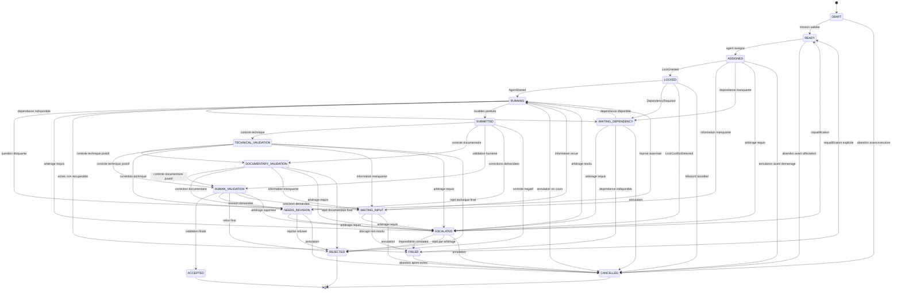

# ORCH-0001-B - Workflow de cycle de vie d'une mission

Agent : Workflow Designer

Statut : Specification

Version : 1.0

---

## 1. Objectif

Ce document definit le cycle de vie complet d'une mission dans le cadre de l'orchestration agentique CEREBRAU.

Il fixe :

- les etats autorises ;
- les transitions autorisees ;
- les cas d'echec ;
- les cas de reprise ;
- les cas d'annulation ;
- les etats bloquants ;
- la machine a etats de reference.

Une mission est l'unite de travail confiee a un agent. Elle ne peut pas etre elargie, fusionnee avec une autre mission ou transformee en nouvelle mission par l'agent executant.

---

## 2. Principes de workflow

### 2.1 Mission unique

Une mission possede un identifiant unique et un seul agent responsable.

Une mission ne peut pas porter plusieurs objectifs autonomes.

### 2.2 Perimetre borne

La mission est executable uniquement si son objectif, ses entrees, son perimetre autorise, ses livrables et son critere d'arret sont identifiables.

### 2.3 Transitions explicites

Aucun changement d'etat n'est implicite.

Toute transition doit etre declenchee par un evenement identifiable : creation, validation, demarrage, production, controle, echec, blocage, reprise, annulation ou cloture.

### 2.4 Arret prioritaire

Un etat bloquant ou terminal arrete l'execution.

L'agent ne contourne pas un blocage en modifiant le perimetre, en inventant une decision ou en creant une mission derivee.

---

## 3. Etats autorises

| Etat | Type | Description | Responsable de sortie |
| --- | --- | --- | --- |
| `DRAFT` | Preparation | Mission en cours de formulation. Le perimetre peut encore etre incomplet. | Product Owner ou Architecte |
| `READY` | Executable | Mission suffisamment definie pour etre prise en charge par l'agent designe. | Orchestrator ou agent designe |
| `ASSIGNED` | Executable | Mission affectee a un agent unique. | Agent designe |
| `LOCKED` | Executable | Mission affectee et protegee par un verrou actif sur son perimetre. | Orchestrator ou Lock Manager |
| `RUNNING` | Actif | Mission en cours d'execution dans son perimetre autorise. | Agent designe |
| `WAITING_INPUT` | Bloquant | Execution suspendue en attente d'une information, autorisation ou decision externe. | Product Owner, Architecte ou demandeur |
| `WAITING_DEPENDENCY` | Bloquant | Execution suspendue en attente d'une dependance explicite : livrable, fichier, rapport, verrou ou ressource. | Orchestrator ou responsable de dependance |
| `ESCALATED` | Bloquant | Mission suspendue pour arbitrage explicite. | Orchestrator, Architecte ou Product Owner |
| `SUBMITTED` | Controle | Livrables produits et soumis au controle. | Controleur, Architecte ou Product Owner |
| `TECHNICAL_VALIDATION` | Controle | Controle technique, structurel ou schema du rapport et des artefacts. | Validator ou QA autorise |
| `DOCUMENTARY_VALIDATION` | Controle | Controle documentaire du livrable, du perimetre et des references. | Architecte ou controleur documentaire |
| `HUMAN_VALIDATION` | Controle | Validation par l'autorite competente avant decision finale. | Product Owner, Architecte ou autorite definie |
| `NEEDS_REVISION` | Reprenable | Livrable controle mais insuffisant ; reprise autorisee dans le meme perimetre. | Agent designe |
| `ACCEPTED` | Terminal | Mission livree et acceptee selon le critere d'arret. | Product Owner ou autorite de validation |
| `REJECTED` | Terminal | Mission livree mais refusee ; elle ne peut etre reprise que par nouvelle instruction. | Product Owner |
| `FAILED` | Bloquant reprenable | Mission non livree a cause d'une impossibilite factuelle dans le perimetre autorise. | Product Owner ou Architecte |
| `CANCELLED` | Terminal | Mission abandonnee volontairement avant livraison. | Product Owner ou Architecte |

---

## 4. Transitions autorisees

| Depuis | Vers | Evenement declencheur | Conditions |
| --- | --- | --- | --- |
| `DRAFT` | `READY` | Mission validee pour execution | Objectif, agent cible ou type d'agent, livrables et critere d'arret presents |
| `DRAFT` | `CANCELLED` | Abandon avant execution | Decision explicite de l'autorite |
| `READY` | `ASSIGNED` | Affectation agent | Agent unique identifie |
| `READY` | `CANCELLED` | Abandon avant affectation | Decision explicite de l'autorite |
| `ASSIGNED` | `LOCKED` | `LockGranted` | Perimetre verrouillable et aucun verrou concurrent actif |
| `ASSIGNED` | `WAITING_INPUT` | Donnee manquante detectee avant execution | Information requise absente |
| `ASSIGNED` | `WAITING_DEPENDENCY` | Dependance manquante detectee avant execution | Dependance explicite non disponible |
| `ASSIGNED` | `ESCALATED` | Arbitrage requis | Conflit ou autorite manquante exige arbitrage |
| `ASSIGNED` | `CANCELLED` | Annulation avant verrouillage | Decision explicite de l'autorite |
| `LOCKED` | `RUNNING` | `AgentStarted` | Agent demarre dans le perimetre verrouille |
| `LOCKED` | `WAITING_DEPENDENCY` | `DependencyRequired` | Le verrou depend d'une ressource indisponible |
| `LOCKED` | `ESCALATED` | `LockConflictDetected` | Collision ou incoherence de verrou detectee |
| `LOCKED` | `CANCELLED` | `MissionCancelled` | Decision explicite de l'autorite |
| `RUNNING` | `WAITING_INPUT` | Question bloquante | Decision, precision ou validation indispensable |
| `RUNNING` | `WAITING_DEPENDENCY` | Dependance indisponible | Fichier, rapport, verrou ou ressource indisponible |
| `RUNNING` | `ESCALATED` | Arbitrage requis | Conflit exigeant une autorite competente |
| `RUNNING` | `FAILED` | Echec d'execution | Erreur non contournable dans le perimetre autorise |
| `RUNNING` | `SUBMITTED` | Livraison produite | Tous les livrables demandes sont disponibles |
| `RUNNING` | `CANCELLED` | Annulation en cours d'execution | Decision explicite de l'autorite |
| `WAITING_INPUT` | `RUNNING` | Reponse recue | L'information recue leve le blocage sans changer l'objectif |
| `WAITING_INPUT` | `ESCALATED` | Arbitrage requis | L'information attendue releve d'une autorite |
| `WAITING_INPUT` | `CANCELLED` | Annulation pendant attente | Decision explicite de l'autorite |
| `WAITING_INPUT` | `FAILED` | Blocage non resolu | Delai, contradiction ou absence d'autorite rend la mission impossible |
| `WAITING_DEPENDENCY` | `RUNNING` | Dependance disponible | La dependance correspond au besoin initial |
| `WAITING_DEPENDENCY` | `ESCALATED` | Arbitrage requis | Dependance ambigue ou conflictuelle |
| `WAITING_DEPENDENCY` | `CANCELLED` | Annulation pendant attente | Decision explicite de l'autorite |
| `WAITING_DEPENDENCY` | `FAILED` | Dependance definitivement indisponible | Mission impossible sans elargissement non autorise |
| `ESCALATED` | `RUNNING` | Arbitrage resolu | Arbitrage leve le blocage dans le meme objectif et perimetre |
| `ESCALATED` | `READY` | Requalification | Autorite requalifie sans changer l'objectif |
| `ESCALATED` | `FAILED` | Arbitrage impossible | Arbitrage constate l'impossibilite |
| `ESCALATED` | `REJECTED` | Rejet par arbitrage | Autorite refuse le livrable ou la mission |
| `ESCALATED` | `CANCELLED` | Annulation par autorite | Decision explicite de l'autorite |
| `SUBMITTED` | `TECHNICAL_VALIDATION` | Controle technique demarre | Controle technique ou structurel requis |
| `SUBMITTED` | `DOCUMENTARY_VALIDATION` | Controle documentaire demarre | Controle documentaire requis |
| `SUBMITTED` | `HUMAN_VALIDATION` | Validation humaine demarree | Autorite finale saisie |
| `SUBMITTED` | `NEEDS_REVISION` | Controle avec corrections | Corrections bornees au perimetre initial |
| `SUBMITTED` | `REJECTED` | Controle negatif | Livrable non conforme ou hors perimetre |
| `TECHNICAL_VALIDATION` | `DOCUMENTARY_VALIDATION` | Controle technique positif | Controle documentaire requis |
| `TECHNICAL_VALIDATION` | `HUMAN_VALIDATION` | Controle technique positif | Autorite humaine doit statuer |
| `TECHNICAL_VALIDATION` | `NEEDS_REVISION` | Correction technique demandee | Correction possible dans le perimetre |
| `TECHNICAL_VALIDATION` | `WAITING_INPUT` | Information manquante | Precision necessaire |
| `TECHNICAL_VALIDATION` | `ESCALATED` | Arbitrage requis | Conflit technique ou de perimetre |
| `TECHNICAL_VALIDATION` | `REJECTED` | Rejet technique final | Non-conformite non corrigeable |
| `DOCUMENTARY_VALIDATION` | `HUMAN_VALIDATION` | Controle documentaire positif | Document validable par l'autorite |
| `DOCUMENTARY_VALIDATION` | `NEEDS_REVISION` | Correction documentaire demandee | Correction possible dans le perimetre |
| `DOCUMENTARY_VALIDATION` | `WAITING_INPUT` | Information manquante | Reference ou precision manquante |
| `DOCUMENTARY_VALIDATION` | `ESCALATED` | Arbitrage requis | Conflit documentaire |
| `DOCUMENTARY_VALIDATION` | `REJECTED` | Rejet documentaire final | Non-conformite non corrigeable |
| `HUMAN_VALIDATION` | `ACCEPTED` | Validation finale positive | Autorite competente valide |
| `HUMAN_VALIDATION` | `NEEDS_REVISION` | Revision demandee | Reprise bornee demandee |
| `HUMAN_VALIDATION` | `REJECTED` | Validation finale negative | Autorite competente refuse |
| `HUMAN_VALIDATION` | `WAITING_INPUT` | Precision demandee | Autorite demande une information |
| `HUMAN_VALIDATION` | `ESCALATED` | Arbitrage superieur requis | Autorite competente indisponible ou arbitrage a monter |
| `NEEDS_REVISION` | `RUNNING` | Reprise de correction | Reprise autorisee dans le perimetre initial |
| `NEEDS_REVISION` | `ESCALATED` | Arbitrage requis | Correction exige un arbitrage |
| `NEEDS_REVISION` | `CANCELLED` | Annulation apres controle | Decision explicite de l'autorite |
| `NEEDS_REVISION` | `REJECTED` | Reprise refusee | Correction impossible sans nouvelle mission |
| `FAILED` | `READY` | Requalification par autorite | Nouvelle instruction explicite, meme objectif et perimetre clarifie |
| `FAILED` | `CANCELLED` | Abandon apres echec | Decision explicite de l'autorite |

---

## 5. Transitions interdites

Les transitions suivantes sont interdites :

- `DRAFT` vers `RUNNING` sans validation et affectation ;
- `READY` vers `RUNNING` sans agent assigne ;
- `ASSIGNED` vers `RUNNING` sans verrou ;
- `ASSIGNED` vers `SUBMITTED` sans execution ;
- `WAITING_INPUT` vers `SUBMITTED` sans reprise d'execution ;
- `WAITING_DEPENDENCY` vers `SUBMITTED` sans reprise d'execution ;
- `SUBMITTED` vers `ACCEPTED` sans `HUMAN_VALIDATION` ;
- `FAILED` vers `RUNNING` sans requalification explicite ;
- `CANCELLED` vers tout autre etat ;
- `ACCEPTED` vers tout autre etat ;
- `REJECTED` vers tout autre etat ;
- toute transition qui modifie l'objectif initial sans nouvelle mission.

---

## 6. Cas d'echec

Une mission passe en `FAILED` lorsqu'au moins un cas suivant est constate :

| Cas | Description | Etat source typique |
| --- | --- | --- |
| Perimetre inexecutable | Objectif, fichier, source ou livrable indispensable absent ou contradictoire. | `ASSIGNED`, `RUNNING` |
| Autorite manquante | Une decision du Product Owner ou de l'Architecte est necessaire et indisponible. | `WAITING_INPUT` |
| Regle contradictoire | Deux instructions applicables imposent des resultats incompatibles. | `RUNNING`, `WAITING_INPUT` |
| Dependances indisponibles | Une dependance explicite ne peut pas etre obtenue dans le cadre autorise. | `WAITING_DEPENDENCY` |
| Livrable impossible | Le livrable demande ne peut pas etre produit sans sortir du perimetre. | `RUNNING` |
| Erreur non recuperable | Incident technique ou documentaire empechant la production fiable. | `RUNNING` |
| Controle non resoluble | Les corrections demandees exigent une nouvelle mission ou un arbitrage absent. | `NEEDS_REVISION` |

Un echec doit produire un constat factuel : etat atteint, cause, element bloquant, livrables partiels eventuels et condition minimale de reprise.

---

## 7. Cas de reprise

Une reprise est autorisee uniquement si elle respecte l'objectif initial.

| Etat de depart | Etat de reprise | Cas de reprise | Conditions |
| --- | --- | --- | --- |
| `WAITING_INPUT` | `RUNNING` | Information manquante fournie | La reponse leve le blocage sans modifier la mission |
| `WAITING_DEPENDENCY` | `RUNNING` | Dependance disponible | La dependance correspond a celle attendue |
| `ESCALATED` | `RUNNING` | Arbitrage leve | L'arbitrage leve le blocage dans le meme objectif et perimetre |
| `ESCALATED` | `READY` | Requalification | L'autorite requalifie la mission sans changer l'objectif |
| `NEEDS_REVISION` | `RUNNING` | Corrections demandees | Les corrections restent dans le perimetre initial |
| `FAILED` | `READY` | Requalification | Autorite explicite, cause d'echec levee, perimetre clarifie |

Une reprise est interdite si elle implique :

- un nouvel objectif ;
- un livrable supplementaire ;
- un changement d'agent non valide ;
- une modification de regle metier ;
- un contournement d'un critere d'arret ;
- une lecture ou modification hors perimetre.

---

## 8. Cas d'annulation

Une mission passe en `CANCELLED` lorsqu'une autorite decide de l'arreter avant acceptation ou rejet.

Cas autorises :

- mission devenue inutile ;
- priorite produit modifiee ;
- mission remplacee par une nouvelle mission explicite ;
- dependance externe abandonnee ;
- risque de perimetre juge trop eleve ;
- doublon confirme avec une mission existante.

Une annulation doit conserver une trace minimale :

- identifiant de mission ;
- etat au moment de l'annulation ;
- autorite ayant annule ;
- motif ;
- livrables produits ou absence de livrable ;
- effet sur les dependances.

`CANCELLED` est terminal. Une mission annulee ne reprend pas. Toute continuation passe par une nouvelle mission.

---

## 9. Etats bloquants

Les etats bloquants sont :

- `WAITING_INPUT` ;
- `WAITING_DEPENDENCY` ;
- `ESCALATED` ;
- `FAILED` tant qu'aucune requalification explicite n'existe.

Un etat bloquant suspend l'execution et interdit :

- la production finale ;
- l'elargissement autonome du perimetre ;
- la creation d'une mission derivee ;
- la substitution d'une decision absente par une hypothese ;
- la modification de fichiers non autorises pour contourner le blocage.

### 9.1 Sortie d'un etat bloquant

La sortie d'un etat bloquant est autorisee uniquement par :

- reception de l'information attendue ;
- disponibilite de la dependance attendue ;
- annulation explicite ;
- constat d'echec si le blocage ne peut pas etre leve.

---

## 10. Cycle de vie du verrou

Le verrou est cree par l'evenement `LockGranted`.

Transition officielle :

- `ASSIGNED` vers `LOCKED`

Conditions :

- mission affectee a un agent principal ;
- perimetre verrouillable identifie ;
- aucun verrou concurrent actif sur le meme perimetre ;
- condition de liberation definie.

### Renouvellement

Le verrou peut etre renouvele si la mission reste dans un etat non terminal et si l'autorite ou l'orchestrateur confirme que le perimetre reste actif.

Etats compatibles :

- `LOCKED`
- `RUNNING`
- `WAITING_INPUT`
- `WAITING_DEPENDENCY`
- `ESCALATED`
- `SUBMITTED`
- `TECHNICAL_VALIDATION`
- `DOCUMENTARY_VALIDATION`
- `HUMAN_VALIDATION`
- `NEEDS_REVISION`
- `FAILED` uniquement si une requalification explicite est attendue.

Le renouvellement ne modifie pas l'etat canonique de la mission.

### Expiration

Un verrou expire uniquement si une condition d'expiration explicite existe.

L'expiration ne libere pas automatiquement le perimetre.

Si un verrou expire alors que la mission n'est pas terminale, la mission passe ou reste en `ESCALATED` jusqu'a arbitrage.

### Liberation

Le verrou est libere lorsque la mission atteint un etat terminal :

- `ACCEPTED`
- `REJECTED`
- `CANCELLED`

Le verrou peut aussi etre libere par instruction explicite d'autorite pendant `ESCALATED` ou `FAILED`.

### Abandon

Un verrou abandonne ou orphelin n'est pas supprime automatiquement.

Si le responsable du verrou n'a plus de mission active identifiable, l'etat canonique de la mission associee doit etre `ESCALATED` jusqu'a resolution.

---

## 11. Etats terminaux

Les etats terminaux sont :

- `ACCEPTED` ;
- `REJECTED` ;
- `CANCELLED`.

`FAILED` n'est pas terminal canonique. Il est bloquant et non executable tant qu'aucune requalification explicite n'existe.

---

## 12. Machine a etats

---

## 13. Controle de coherence

Une mission est conforme au workflow si :

- elle possede un identifiant unique ;
- elle possede un objectif unique ;
- elle possede un agent responsable unique ;
- son etat courant appartient a la liste des etats autorises ;
- toute transition appliquee figure dans la table des transitions autorisees ;
- aucun etat terminal n'est relance ;
- tout blocage est documente ;
- tout echec indique une cause et une condition de reprise eventuelle ;
- toute reprise est autorisee par le workflow ;
- toute annulation est explicite et tracee.

---

## 14. Critere d'arret

La specification est complete lorsque les elements suivants sont disponibles dans ce document :

- etats ;
- transitions autorisees ;
- cas d'echec ;
- cas de reprise ;
- cas d'annulation ;
- etats bloquants ;
- machine a etats.
