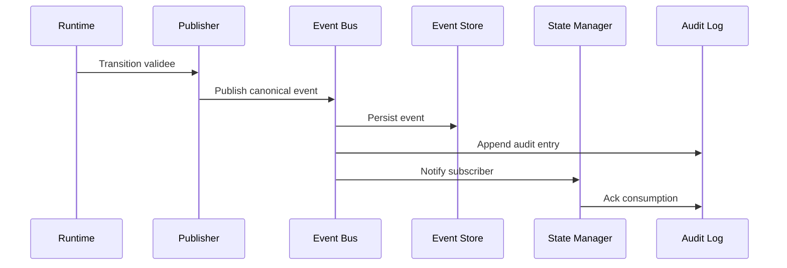
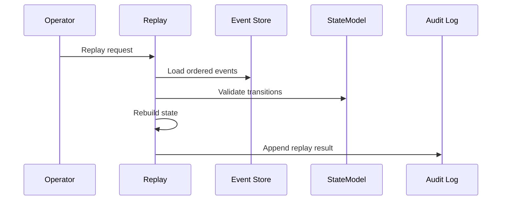

# ORCHESTRATOR EVENT ARCHITECTURE V1

Version : 1.0

Statut : DRAFT_VALIDABLE

Mission : AGENT-3-EVENT-ARCHITECT

Agent : Event Architect

Objet : Architecture evenementielle ORCHESTRATOR V1

---

# 1. Objectif

Ce document definit l'architecture evenementielle de l'ORCHESTRATOR V1.

Il construit les composants suivants :

- Event Bus ;
- Event Publisher ;
- Event Subscriber ;
- Replay ;
- Audit Log ;
- Correlation ID ;
- Event Ordering.

Ce document ne decrit pas une implementation technique. Il definit les responsabilites, contrats et contraintes conceptuelles que tout moteur ORCHESTRATOR V1 devra respecter.

---

# 2. Sources de Verite

L'architecture evenementielle applique les documents suivants, par ordre d'autorite :

1. `ORCHESTRATOR_CANONICAL_DICTIONARY_V1.md`
2. `ORCHESTRATOR_STATE_MODEL_V1.md`
3. `ORCHESTRATOR_RUNTIME_CONTRACT_V1.md`
4. `ORCHESTRATOR_V1_ARCHITECTURE.md`
5. `ORCH-0001-B_WORKFLOW.md`
6. `ORCHESTRATION_GOVERNANCE.md`

Regles :

- aucun evenement non canonique ne peut modifier l'etat d'une mission ;
- aucun consommateur ne peut interpreter librement un evenement ;
- toute transition d'etat doit etre reconstructible depuis l'Event Store et l'Audit Log ;
- un evenement publie est immuable.

---

# 3. Principes Evenementiels

## 3.1 Evenement comme preuve

Un evenement est une preuve factuelle qu'une commande, transition, validation, erreur ou action de verrou a ete acceptee par le Runtime.

Un evenement ne remplace pas :

- une decision Product Owner ;
- une validation humaine ;
- une mission ;
- un rapport ;
- un verrou ;
- un document de gouvernance.

## 3.2 Publication apres validation

Un evenement est publie uniquement apres controle :

- du nom canonique ;
- de l'etat source ;
- de la transition autorisee ;
- du producteur ;
- du perimetre projet ;
- du verrou si applicable.

## 3.3 Consommation sans decision autonome

Un subscriber applique uniquement l'effet prevu par l'evenement.

Il ne cree pas de nouvelle mission, ne change pas le perimetre et ne valide pas un livrable sans evenement ou autorite explicite.

## 3.4 Reconstructibilite

L'etat courant d'une mission doit pouvoir etre reconstruit depuis la sequence ordonnee de ses evenements acceptes.

---

# 4. Event

## 4.1 Definition

Un `Event` est un fait canonique publie par un producteur autorise et consommable par un ou plusieurs subscribers autorises.

## 4.2 Schema conceptuel

```json
{
  "event_id": "EVT-...",
  "event_name": "MissionAccepted",
  "project_id": "VEEDDA",
  "mission_id": "ORCH-0001",
  "run_id": "RUN-...",
  "correlation_id": "CORR-...",
  "causation_id": "EVT-...",
  "sequence": 12,
  "source_state": "DRAFT",
  "target_state": "READY",
  "producer": "MissionIntake",
  "occurred_at": "YYYY-MM-DDTHH:MM:SSZ",
  "published_at": "YYYY-MM-DDTHH:MM:SSZ",
  "payload": {},
  "metadata": {}
}
```

## 4.3 Champs obligatoires

| Champ | Obligation | Description |
| --- | --- | --- |
| `event_id` | Obligatoire | Identifiant unique global d'evenement. |
| `event_name` | Obligatoire | Nom canonique issu du dictionnaire. |
| `project_id` | Obligatoire | Projet auquel l'evenement appartient. |
| `mission_id` | Obligatoire | Mission concernee. |
| `correlation_id` | Obligatoire | Identifiant de correlation du flux complet. |
| `sequence` | Obligatoire | Ordre strict dans le flux mission. |
| `source_state` | Obligatoire si transition | Etat avant transition. |
| `target_state` | Obligatoire si transition | Etat apres transition. |
| `producer` | Obligatoire | Composant ou agent ayant publie l'evenement. |
| `occurred_at` | Obligatoire | Moment logique de l'evenement. |
| `published_at` | Obligatoire | Moment de publication dans le bus. |

## 4.4 Immutabilite

Un evenement publie n'est jamais modifie.

Toute correction passe par un nouvel evenement canonique.

---

# 5. Event Bus

## 5.1 Role

L'Event Bus est le canal conceptuel qui transporte les evenements valides entre publishers et subscribers.

Il garantit :

- admission des seuls evenements canoniques ;
- routage par `project_id`, `mission_id` et `event_name` ;
- conservation de l'ordre mission ;
- distribution aux subscribers autorises ;
- non-mutation du contenu ;
- tracabilite vers l'Audit Log.

## 5.2 Responsabilites

L'Event Bus :

- recoit un evenement depuis un Event Publisher ;
- controle l'enveloppe minimale ;
- attribue ou verifie le numero de sequence ;
- persiste l'evenement dans l'Event Store ;
- notifie les subscribers concernes ;
- transmet une copie a l'Audit Log.

## 5.3 Interdictions

L'Event Bus ne doit pas :

- creer un evenement ;
- modifier un payload ;
- decider d'une transition ;
- corriger un ordre d'evenements par interpretation ;
- publier un evenement sans producteur identifie ;
- router un evenement vers un projet non concerne.

---

# 6. Event Publisher

## 6.1 Role

L'Event Publisher transforme un resultat valide de composant en evenement canonique publiable.

## 6.2 Producteurs autorises

| Producteur | Evenements typiques |
| --- | --- |
| Mission Intake | `MissionCreated`, `MissionAccepted` |
| Agent Registry | `AgentAssigned` |
| Lock Manager | `LockGranted`, `LockRenewed`, `LockReleased`, `LockExpired`, `LockConflictDetected` |
| Agent Executor | `AgentStarted`, `ReportSubmitted`, `ExecutionFailed` |
| Validator | Evenements de validation technique ou documentaire |
| Authority | `FinalValidationAccepted`, `FinalValidationRejected`, `MissionCancelled` |
| Orchestrator Core | `EscalationRequested`, `MissionRequalified`, `BlockingUnresolved` |

## 6.3 Obligations

Un publisher doit :

- utiliser un `event_name` canonique ;
- fournir un `correlation_id` ;
- fournir un `mission_id` et un `project_id` ;
- indiquer l'etat source et l'etat cible si l'evenement modifie l'etat ;
- fournir une cause ou reference lorsque l'evenement resulte d'un arbitrage, rejet, annulation ou erreur ;
- refuser la publication si la transition est interdite.

## 6.4 Idempotence

Un publisher doit pouvoir detecter une tentative de republication du meme evenement logique.

La republication d'un evenement deja accepte ne doit pas produire une deuxieme transition.

---

# 7. Event Subscriber

## 7.1 Role

Un Event Subscriber consomme des evenements publies et execute uniquement l'effet autorise par son role.

## 7.2 Subscribers officiels

| Subscriber | Responsabilite |
| --- | --- |
| State Manager | Appliquer les transitions d'etat canoniques. |
| Lock Manager | Maintenir le cycle de vie des verrous. |
| Mission Dispatcher | Declencher ou mettre a jour la mission agent lorsque l'etat le permet. |
| Report Store | Enregistrer les rapports soumis. |
| Validator | Demarrer les validations requises. |
| Authority Interface | Signaler les validations humaines attendues. |
| Audit Log | Journaliser tous les evenements acceptes et rejetes. |
| Replay Engine | Reconstruire l'etat depuis l'historique. |

## 7.3 Regles de consommation

Un subscriber doit :

- verifier que l'evenement le concerne ;
- verifier l'ordre attendu ;
- appliquer l'effet une seule fois ;
- journaliser l'accuse de consommation ;
- signaler une erreur si l'evenement attendu manque ou arrive hors ordre.

## 7.4 Interdictions

Un subscriber ne doit pas :

- emettre une transition non prevue par l'evenement ;
- modifier le payload original ;
- consommer un evenement d'un autre projet ;
- masquer une erreur d'ordre ;
- deduire une validation finale depuis une validation technique ou documentaire.

---

# 8. Event Ordering

## 8.1 Principe

L'ordre des evenements est strict par mission.

La cle d'ordre principale est :

- `project_id`
- `mission_id`
- `sequence`

## 8.2 Sequence

Chaque evenement accepte pour une mission possede un `sequence` entier strictement croissant.

Deux evenements d'une meme mission ne peuvent pas partager la meme sequence.

## 8.3 Ordre inter-missions

L'ordre global entre deux missions differentes n'est pas garanti en V1.

Les relations entre missions passent par dependances explicites, pas par ordre temporel implicite.

## 8.4 Rejet hors ordre

Un evenement est rejete ou mis en attente technique si :

- sa sequence est inferieure a la derniere sequence acceptee ;
- sa sequence saute une sequence obligatoire ;
- son `source_state` ne correspond pas a l'etat courant ;
- il reference une correlation inconnue lorsque cette correlation est obligatoire.

## 8.5 Evenements concurrents

En cas d'evenements concurrents sur une meme mission :

- l'evenement valide avec sequence la plus basse est traite d'abord ;
- les autres sont revalides apres application du premier ;
- tout conflit resultant produit `LockConflictDetected`, `EscalationRequested` ou un rejet technique selon la cause.

---

# 9. Correlation ID

## 9.1 Role

Le `correlation_id` relie tous les evenements issus d'un meme flux d'execution ou d'une meme intention de mission.

Il sert a :

- suivre un cycle de mission complet ;
- relier commandes, evenements, verrous, rapports et validations ;
- reconstruire un incident ;
- filtrer un replay ;
- produire un audit factuel.

## 9.2 Creation

Un `correlation_id` est cree au plus tard lors de `MissionCreated`.

Il reste stable pour le cycle de mission courant.

## 9.3 Causation ID

Le `causation_id` reference l'evenement qui a directement provoque l'evenement courant.

Exemples :

- `LockGranted` peut avoir pour `causation_id` l'evenement `AgentAssigned` ;
- `AgentStarted` peut avoir pour `causation_id` l'evenement `LockGranted` ;
- `FinalValidationAccepted` peut avoir pour `causation_id` l'evenement `HumanValidationStarted`.

## 9.4 Reprise

Une reprise conserve le meme `correlation_id` si elle appartient a la meme mission et au meme objectif.

Une nouvelle mission cree un nouveau `correlation_id`.

---

# 10. Audit Log

## 10.1 Role

L'Audit Log conserve une trace complete, immutable et consultable des evenements acceptes, rejetes et replays.

## 10.2 Contenu minimal

Chaque entree d'audit contient :

- `audit_id` ;
- `event_id` si applicable ;
- `project_id` ;
- `mission_id` ;
- `correlation_id` ;
- `sequence` si applicable ;
- action observee ;
- resultat : accepte, rejete, rejoue, ignore ;
- cause factuelle ;
- acteur ou composant ;
- horodatage.

## 10.3 Evenements rejetes

Un evenement rejete doit etre audite avec :

- raison du rejet ;
- code d'erreur canonique si disponible ;
- etat courant attendu ;
- etat source fourni ;
- producteur ;
- payload minimal non sensible.

## 10.4 Interdictions

L'Audit Log ne doit pas contenir :

- secrets ;
- donnees hors mission ;
- interpretation non factuelle ;
- contenu complet d'un document non necessaire a la preuve.

---

# 11. Replay

## 11.1 Role

Le Replay reconstruit l'etat d'une mission depuis les evenements acceptes.

Il sert a :

- verifier la coherence d'un State Store ;
- reconstruire apres incident ;
- auditer une transition ;
- reproduire une sequence pour validation documentaire.

## 11.2 Sources

Le Replay utilise uniquement :

- Event Store ;
- Audit Log ;
- State Model ;
- dictionnaire canonique ;
- Snapshot d'etat si disponible et explicitement autorise.

## 11.3 Modes de replay

| Mode | Usage |
| --- | --- |
| `FullReplay` | Reconstruire depuis le premier evenement de la mission. |
| `FromSequence` | Reconstruire depuis une sequence donnee. |
| `FromSnapshot` | Reprendre depuis un snapshot valide puis rejouer les evenements suivants. |
| `AuditReplay` | Rejouer sans modifier l'etat, pour controle. |

## 11.4 Regles

Le Replay :

- respecte strictement l'ordre des sequences ;
- ignore les evenements rejetes pour reconstruire l'etat ;
- journalise toute divergence entre etat reconstruit et State Store ;
- ne publie pas d'evenement metier pendant un `AuditReplay` ;
- ne libere pas de verrou par deduction.

## 11.5 Echec de replay

Un replay echoue si :

- une sequence obligatoire manque ;
- un evenement non canonique est present dans la chaine acceptee ;
- une transition est interdite par le State Model ;
- le `correlation_id` est incoherent ;
- un evenement appartient a un autre `project_id`.

---

# 12. Event Store

## 12.1 Role

L'Event Store conserve les evenements acceptes dans leur ordre canonique.

## 12.2 Index minimaux

L'Event Store doit permettre les recherches par :

- `event_id` ;
- `project_id` ;
- `mission_id` ;
- `correlation_id` ;
- `event_name` ;
- `sequence` ;
- intervalle temporel.

## 12.3 Retention

Les evenements ORCHESTRATOR V1 sont conserves tant que la mission, le rapport ou la decision associee reste reference documentaire active ou auditable.

La retention ne doit pas supprimer les preuves necessaires a la reconstruction d'une mission non terminale.

---

# 13. Flux Nominal



---

# 14. Flux Replay



---

# 15. Erreurs Evenementielles

| Situation | Reponse | Effet |
| --- | --- | --- |
| Evenement non canonique | `InvalidEvent` | Rejet et audit. |
| Transition interdite | `InvalidState` | Rejet et audit. |
| Producteur non autorise | `Forbidden` | Rejet et audit. |
| Sequence dupliquee | `Conflict` | Rejet ou escalade. |
| Sequence manquante | `Conflict` | Mise en attente technique ou escalade. |
| Correlation absente | `InvalidEvent` | Rejet si obligatoire. |
| Projet incoherent | `Forbidden` | Rejet. |
| Subscriber indisponible | `Retry` | Retentative sans nouvelle transition. |

---

# 16. Conformite

L'architecture evenementielle est conforme si :

- tous les evenements publies sont canoniques ;
- chaque changement d'etat correspond a un evenement accepte ;
- chaque evenement accepte possede un `correlation_id` ;
- l'ordre est strict par mission ;
- les subscribers appliquent uniquement les effets autorises ;
- l'Audit Log conserve les evenements acceptes et rejetes ;
- le Replay peut reconstruire l'etat depuis l'Event Store ;
- aucun secret n'est publie dans un evenement ou journal ;
- aucun evenement legacy ne modifie l'etat canonique.

---

# 17. Critere d'Arret

La specification Event Architecture V1 est complete lorsque les elements suivants sont definis :

- Event Bus ;
- Event Publisher ;
- Event Subscriber ;
- Replay ;
- Audit Log ;
- Correlation ID ;
- Event Ordering.
