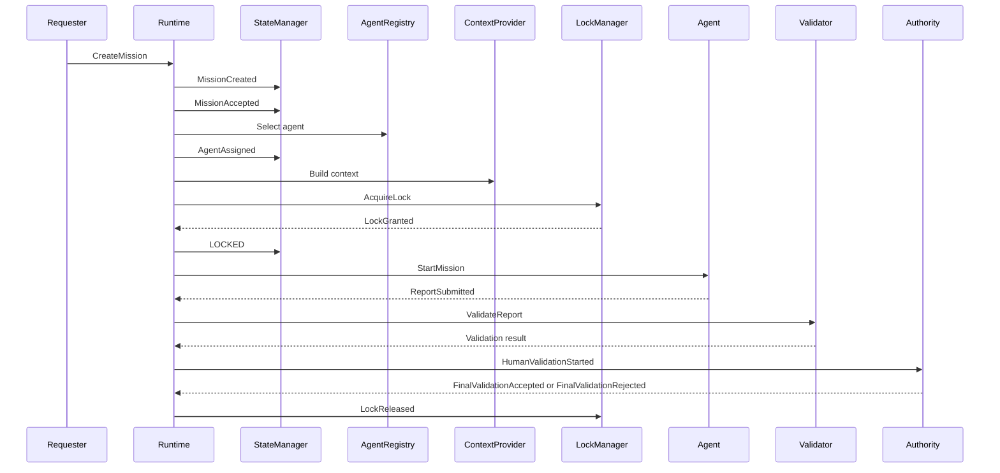

# ORCHESTRATOR RUNTIME CONTRACT V1

Version : 1.0

Statut : DRAFT_VALIDABLE

Mission : ORCH-FOUNDATION-002

Objet : Contrat d'execution du moteur ORCHESTRATOR V1

---

# 1. Objet

Ce document definit le contrat d'execution du Runtime ORCHESTRATOR V1.

Il ne decrit pas une implementation technique. Il definit les obligations d'execution que tout moteur ORCHESTRATOR V1 devra respecter pour creer, affecter, verrouiller, executer, valider et cloturer une mission.

Le Runtime est le composant conceptuel qui transforme une demande de mission en cycle d'execution gouverne.

Il doit garantir :

- un langage canonique ;
- un etat canonique unique ;
- une execution bornee ;
- une isolation par projet ;
- une selection d'agent explicite ;
- une injection de contexte controlee ;
- un verrouillage deterministe ;
- une publication d'evenements fiable ;
- une validation separee ;
- une propagation d'erreurs non ambigue ;
- une persistance d'etat reconstructible.

---

# 2. Sources de Verite

Le Runtime applique les sources de verite suivantes, par ordre d'autorite :

1. `ORCHESTRATOR_CANONICAL_DICTIONARY_V1.md`
2. `ORCHESTRATOR_STATE_MODEL_V1.md`
3. `ORCHESTRATOR_V1_ARCHITECTURE.md`
4. `ORCH-0001-B_WORKFLOW.md`
5. `ORCHESTRATION_GOVERNANCE.md`

Regles :

- le dictionnaire canonique definit les termes autorises ;
- le State Model definit les etats, transitions et evenements ;
- l'architecture definit les composants conceptuels ;
- le workflow definit le deroulement mission ;
- la gouvernance definit les autorites, conflits et validations.

Aucun document de niveau inferieur ne peut redefinir un terme, un etat, un evenement ou une transition.

---

# 3. Perimetre du Runtime

## 3.1 Inclus

Le Runtime couvre :

- creation de mission ;
- acceptation de mission ;
- selection d'agent ;
- injection de contexte ;
- acquisition de verrou ;
- demarrage d'execution ;
- publication d'evenements ;
- persistance d'etat ;
- reception de rapport ;
- validation technique ;
- validation documentaire ;
- validation humaine ;
- validation finale ;
- propagation d'erreurs ;
- gestion des blocages ;
- coexistence multi-projets.

## 3.2 Exclu

Le Runtime ne couvre pas :

- decision Product Owner ;
- decision Architecte ;
- modification automatique de gouvernance ;
- creation automatique d'EPIC, COS, DECISION ou registre ;
- generation automatique de code applicatif ;
- execution de taches hors perimetre mission ;
- contournement d'un verrou ;
- interpretation libre d'une consigne.

---

# 4. Identite Runtime

## 4.1 Runtime

Le Runtime est l'autorite d'execution technique du cycle de mission.

Il n'est pas une autorite de decision produit, metier ou architecture.

## 4.2 Instance Runtime

Une instance Runtime execute des missions dans un ou plusieurs projets, en maintenant une isolation stricte par `project_id`.

## 4.3 Scope Runtime

Le Runtime agit uniquement sur :

- missions connues ;
- agents connus ;
- projets connus ;
- verrous connus ;
- etats canoniques ;
- evenements canoniques ;
- artefacts explicitement autorises.

---

# 5. Modele d'Identifiants

Tout objet Runtime doit posseder un identifiant stable.

| Objet | Identifiant canonique | Definition |
| --- | --- | --- |
| Projet | `project_id` | Identifiant du projet, par exemple `VEEDDA`. |
| Mission | `mission_id` | Identifiant unique de mission. |
| Agent | `agent_id` | Identifiant de l'agent principal ou secondaire. |
| Etat | `state_id` | Etat canonique courant. |
| Evenement | `event_id` | Identifiant unique d'evenement publie. |
| Verrou | `lock_id` | Identifiant unique de verrou. |
| Rapport | `report_id` | Identifiant unique de rapport. |
| Contexte | `context_id` | Identifiant de contexte injecte. |
| Execution | `run_id` | Identifiant d'une tentative d'execution. |

Regles :

- `mission_id` est unique dans un `project_id` ;
- `event_id` est unique globalement ;
- `lock_id` est unique dans un `project_id` ;
- `run_id` distingue deux tentatives d'execution d'une meme mission.

---

# 6. Coexistence Multi-Projets

Le Runtime doit permettre la coexistence de VEEDDA et de futurs projets.

## 6.1 Isolation Projet

Toute mission appartient a un `project_id`.

Tous les objets suivants sont rattaches a un `project_id` :

- mission ;
- agent affecte ;
- contexte ;
- verrou ;
- etat ;
- evenement ;
- rapport ;
- erreur.

## 6.2 Frontiere Projet

Une mission d'un projet ne peut pas lire, verrouiller ou modifier le perimetre d'un autre projet sauf si une autorite competente le declare explicitement dans la mission.

## 6.3 Verrou Multi-Projets

Un verrou est scoped par defaut au projet.

Un verrou `Project` peut proteger un projet entier.

Un verrou inter-projets est interdit en V1 sauf declaration explicite d'autorite.

## 6.4 Queue Multi-Projets

Le Runtime peut maintenir une `Queue` par projet.

Une priorite dans un projet ne modifie pas la priorite d'un autre projet.

---

# 7. Cycle Runtime Global

Le cycle Runtime nominal est :

1. `CreateMission`
2. `MissionCreated`
3. `AcceptMission`
4. `MissionAccepted`
5. `AssignMission`
6. `AgentAssigned`
7. `AcquireLock`
8. `LockGranted`
9. `StartMission`
10. `AgentStarted`
11. `SubmitReport`
12. `ReportSubmitted`
13. `ValidateReport`
14. validations requises
15. `ApproveMission` ou `RejectMission`
16. `FinalValidationAccepted` ou `FinalValidationRejected`
17. `LockReleased`

Diagramme :

---

# 8. Creation de Mission

## 8.1 Commande

Commande canonique :

- `CreateMission`

## 8.2 Entrees obligatoires

Une mission ne peut etre creee que si les informations suivantes existent :

- `project_id` ;
- `mission_id` ;
- `mission_type` ;
- objectif ;
- autorite emettrice ;
- perimetre autorise ;
- perimetre interdit ;
- livrables attendus ;
- criteres d'arret ;
- references autorisees.

## 8.3 Sortie

Evenement publie :

- `MissionCreated`

Etat cible :

- `DRAFT`

## 8.4 Erreurs

| Situation | Code |
| --- | --- |
| Mission deja existante | `ORCH-ERR-002` |
| Perimetre absent | `ORCH-ERR-008` |
| Perimetre ambigu | `ORCH-ERR-009` |
| Autorite manquante | `ORCH-ERR-015` |
| Terme non canonique | `ORCH-ERR-026` |

---

# 9. Acceptation de Mission

## 9.1 Commande

Commande canonique :

- `AcceptMission`

## 9.2 Conditions

Une mission passe de `DRAFT` a `READY` si :

- elle possede un objectif unique ;
- son perimetre est borne ;
- ses livrables sont explicites ;
- ses criteres d'arret sont explicites ;
- son type de mission est canonique ;
- aucune contradiction bloquante n'est detectee.

## 9.3 Sortie

Evenement publie :

- `MissionAccepted`

Etat cible :

- `READY`

## 9.4 Erreurs

| Situation | Code |
| --- | --- |
| Etat courant invalide | `ORCH-ERR-003` |
| Transition interdite | `ORCH-ERR-004` |
| Perimetre ambigu | `ORCH-ERR-009` |
| Reference documentaire incoherente | `ORCH-ERR-029` |

---

# 10. Selection d'Agent

## 10.1 Commande

Commande canonique :

- `AssignMission`

## 10.2 Entrees

La selection d'agent utilise :

- `mission_type` ;
- livrable principal ;
- perimetre autorise ;
- perimetre interdit ;
- agent explicitement nomme si present ;
- fiches agents autorisees ;
- disponibilite non conflictuelle.

## 10.3 Priorite de Selection

L'ordre de selection est :

1. agent explicitement nomme ;
2. agent dont le perimetre couvre directement le livrable principal ;
3. Orchestrator pour qualification ;
4. escalade si plusieurs agents sont compatibles sans critere de choix.

## 10.4 Sortie

Evenement publie :

- `AgentAssigned`

Etat cible :

- `ASSIGNED`

## 10.5 Erreurs

| Situation | Code |
| --- | --- |
| Agent introuvable | `ORCH-ERR-006` |
| Agent non autorise | `ORCH-ERR-007` |
| Autorite manquante | `ORCH-ERR-015` |
| Escalade requise | `ORCH-ERR-025` |

---

# 11. Injection de Contexte

## 11.1 Principe

Le contexte injecte a un agent est minimal, borne et explicitement autorise.

Le Runtime ne transmet jamais le depot complet.

## 11.2 Context

Un `Context` contient :

- `project_id` ;
- `mission_id` ;
- `context_id` ;
- objectif ;
- perimetre autorise ;
- perimetre interdit ;
- fichiers ou references autorises ;
- livrables attendus ;
- criteres d'arret ;
- etat canonique courant ;
- lock scope si disponible.

## 11.3 Context Provider

Le Context Provider assemble le contexte depuis :

- mission ;
- dictionnaire canonique ;
- state model ;
- references explicitement autorisees ;
- rapport amont explicitement autorise ;
- decision explicitement referencee.

## 11.4 Interdictions

Le contexte ne doit pas contenir :

- fichiers non autorises ;
- secrets ;
- decisions implicites ;
- missions non liees ;
- informations d'un autre projet sans autorisation ;
- interpretation du Runtime.

## 11.5 Erreurs

| Situation | Code |
| --- | --- |
| Perimetre interdit | `ORCH-ERR-010` |
| Source de verite absente | `ORCH-ERR-028` |
| Reference incoherente | `ORCH-ERR-029` |

---

# 12. Acquisition de Verrou

## 12.1 Commande

Commande canonique :

- `AcquireLock`

## 12.2 Conditions

Le verrou est accorde si :

- la mission est en `ASSIGNED` ;
- le perimetre verrouillable est identifie ;
- aucun verrou concurrent actif ne couvre le meme perimetre ;
- la condition de liberation est definie ;
- le verrou respecte `project_id`.

## 12.3 Sortie

Evenement publie :

- `LockGranted`

Etat cible :

- `LOCKED`

## 12.4 Renouvellement

Commande :

- `RenewLock`

Evenement :

- `LockRenewed`

Le renouvellement ne modifie pas l'etat canonique.

## 12.5 Expiration

Evenement :

- `LockExpired`

Si un verrou expire alors que la mission n'est pas terminale, l'etat reste ou passe en `ESCALATED` jusqu'a arbitrage.

## 12.6 Liberation

Commande :

- `ReleaseLock`

Evenement :

- `LockReleased`

Le verrou est libere lorsque la mission atteint :

- `ACCEPTED` ;
- `REJECTED` ;
- `CANCELLED`.

Il peut aussi etre libere par instruction explicite pendant `ESCALATED` ou `FAILED`.

## 12.7 Erreurs

| Situation | Code |
| --- | --- |
| Verrou deja actif | `ORCH-ERR-011` |
| Verrou introuvable | `ORCH-ERR-012` |
| Conflit de verrou | `ORCH-ERR-013` |
| Verrou expire | `ORCH-ERR-014` |

---

# 13. Demarrage d'Execution

## 13.1 Commande

Commande canonique :

- `StartMission`

## 13.2 Conditions

Une mission demarre si :

- son etat est `LOCKED` ;
- le contexte est injecte ;
- l'agent principal est designe ;
- le verrou est actif ;
- aucun conflit non resolu n'existe.

## 13.3 Sortie

Evenement publie :

- `AgentStarted`

Etat cible :

- `RUNNING`

## 13.4 Erreurs

| Situation | Code |
| --- | --- |
| Etat courant invalide | `ORCH-ERR-003` |
| Transition interdite | `ORCH-ERR-004` |
| Verrou introuvable | `ORCH-ERR-012` |
| Action interdite par critere d'arret | `ORCH-ERR-030` |

---

# 14. Publication d'Evenements

## 14.1 Principe

Tout changement d'etat doit etre justifie par un evenement canonique.

Aucun changement d'etat implicite n'est autorise.

## 14.2 Event

Un `Event` contient :

- `event_id` ;
- `project_id` ;
- `mission_id` ;
- `run_id` si applicable ;
- nom canonique de l'evenement ;
- etat source ;
- etat cible ;
- producteur ;
- consommateur ;
- horodatage ;
- parametres ;
- correlation id si applicable.

## 14.3 Publication

Un evenement est publie apres validation des conditions de transition.

## 14.4 Consommation

Les consommateurs possibles sont :

- State Manager ;
- Lock Manager ;
- Dispatcher ;
- Validator ;
- Report Store ;
- Authority ;
- Audit Log.

## 14.5 Rejet d'Evenement

Un evenement est rejete si :

- son nom n'est pas canonique ;
- l'etat source est incorrect ;
- la transition est interdite ;
- le projet ne correspond pas ;
- le producteur n'est pas autorise.

Codes :

- `ORCH-ERR-005`
- `ORCH-ERR-004`
- `ORCH-ERR-007`

---

# 15. Persistance d'Etat

## 15.1 State Store

Le State Store conserve l'etat canonique courant.

Il contient :

- `project_id` ;
- `mission_id` ;
- `state_id` ;
- etat precedent ;
- dernier `event_id` ;
- `lock_id` si applicable ;
- `run_id` si applicable ;
- horodatage de mise a jour.

## 15.2 Event Store

L'Event Store conserve l'historique des evenements publies.

Il sert de preuve de transition.

## 15.3 Mission Store

Le Mission Store conserve :

- definition de mission ;
- type de mission ;
- autorite ;
- perimetres ;
- livrables ;
- criteres d'arret ;
- references autorisees.

## 15.4 Context Store

Le Context Store conserve la trace du contexte injecte.

Il ne doit pas conserver de secret.

## 15.5 Lock Store

Le Lock Store conserve :

- `lock_id` ;
- `project_id` ;
- `mission_id` ;
- type de verrou ;
- perimetre verrouille ;
- etat du verrou ;
- condition de liberation.

## 15.6 Report Store

Le Report Store conserve les rapports soumis par les agents.

## 15.7 Reconstructibilite

Une mission doit pouvoir etre reconstruite depuis :

- Mission Store ;
- Event Store ;
- State Store ;
- Lock Store ;
- Report Store ;
- Context Store si disponible.

---

# 16. Soumission et Validation des Rapports

## 16.1 Soumission

Commande :

- `SubmitReport`

Evenement :

- `ReportSubmitted`

Etat cible :

- `SUBMITTED`

## 16.2 Rapport Minimal

Un rapport contient :

- `project_id` ;
- `mission_id` ;
- `report_id` ;
- `agent_id` ;
- type de rapport ;
- livrables produits ;
- fichiers crees ou modifies si applicable ;
- controles effectues ;
- blocages ;
- erreurs ;
- confirmation de perimetre.

## 16.3 Validation Technique

Commande :

- `ValidateReport`

Evenements possibles :

- `TechnicalValidationStarted`
- `TechnicalValidationAccepted`
- `TechnicalValidationRejectedRecoverable`
- `TechnicalValidationRejectedFinal`

## 16.4 Validation Documentaire

Evenements possibles :

- `DocumentaryValidationStarted`
- `DocumentaryValidationAccepted`
- `DocumentaryValidationRejectedRecoverable`
- `DocumentaryValidationRejectedFinal`

## 16.5 Validation Humaine

Evenement :

- `HumanValidationStarted`

Evenements de decision :

- `FinalValidationAccepted`
- `FinalValidationRejected`

## 16.6 Regle de Separation

La validation technique ne vaut pas validation documentaire.

La validation documentaire ne vaut pas validation humaine.

La validation humaine ne vaut validation finale que lorsqu'elle produit `FinalValidationAccepted` ou `FinalValidationRejected`.

## 16.7 Erreurs

| Situation | Code |
| --- | --- |
| Rapport introuvable | `ORCH-ERR-017` |
| Rapport invalide | `ORCH-ERR-018` |
| Livrable manquant | `ORCH-ERR-019` |
| Livrable supplementaire | `ORCH-ERR-020` |
| Validation technique echouee | `ORCH-ERR-021` |
| Validation documentaire echouee | `ORCH-ERR-022` |
| Validation humaine refusee | `ORCH-ERR-023` |

---

# 17. Propagation des Erreurs

## 17.1 Principe

Une erreur Runtime ne doit jamais etre masquee.

Elle doit produire :

- un code d'erreur canonique ;
- une reponse canonique ;
- un evenement canonique si elle modifie l'etat ;
- un rapport de blocage si l'execution ne peut pas continuer.

## 17.2 Erreur Bloquante

Une erreur bloquante peut produire :

- `InputRequired` ;
- `DependencyRequired` ;
- `EscalationRequested` ;
- `ExecutionFailed` ;
- `BlockingUnresolved`.

## 17.3 Erreur Non Bloquante

Une erreur non bloquante peut produire :

- `Retry` ;
- correction dans le meme etat ;
- journalisation sans transition.

## 17.4 Interdictions

Le Runtime ne doit pas :

- convertir une erreur en succes ;
- changer de perimetre pour contourner l'erreur ;
- remplacer une commande par une autre ;
- creer une mission derivee sans commande explicite ;
- liberer un verrou pour contourner un conflit.

---

# 18. Gestion des Blocages

## 18.1 Input

Si une information manque :

- evenement : `InputRequired` ;
- etat : `WAITING_INPUT`.

Reprise :

- evenement : `InputProvided` ;
- etat cible : `RUNNING`.

## 18.2 Dependency

Si une dependance manque :

- evenement : `DependencyRequired` ;
- etat : `WAITING_DEPENDENCY`.

Reprise :

- evenement : `DependencyAvailable` ;
- etat cible : `RUNNING`.

Echec :

- evenement : `DependencyUnavailable` ;
- etat cible : `FAILED`.

## 18.3 Escalation

Si un arbitrage est requis :

- evenement : `EscalationRequested` ;
- etat : `ESCALATED`.

Reprise :

- evenement : `EscalationResolved` ;
- etat cible : `RUNNING` ou `READY`.

Echec :

- evenement : `EscalationFailed` ;
- etat cible : `FAILED`.

---

# 19. Queue et Priorisation

## 19.1 Queue

Une `Queue` est un ensemble ordonne de missions en attente.

Le Runtime peut maintenir une Queue par `project_id`.

## 19.2 Admission

Une mission entre en Queue si :

- elle est en `READY` ;
- elle attend affectation ;
- elle attend verrou ;
- elle attend priorisation.

## 19.3 Priorisation

La priorisation ne peut pas contredire une autorite explicite.

La priorisation ne peut pas contourner un verrou.

## 19.4 Sortie de Queue

Une mission sort de Queue lorsqu'elle passe en :

- `ASSIGNED` ;
- `CANCELLED` ;
- `REJECTED` ;
- `FAILED`.

---

# 20. Isolation et Securite

## 20.1 Isolation

Le Runtime isole :

- projets ;
- missions ;
- agents ;
- contextes ;
- verrous ;
- rapports ;
- evenements.

## 20.2 Secrets

Le Runtime ne doit pas injecter, persister ou publier de secrets dans :

- contexte ;
- evenement ;
- rapport ;
- journal ;
- erreur.

## 20.3 Acces

Un agent ne recoit que :

- les references autorisees ;
- le contexte minimal ;
- le perimetre autorise ;
- les criteres d'arret.

---

# 21. Contrat de Reprise

Une mission peut reprendre si :

- son etat est reprenable ;
- le blocage est leve ;
- le perimetre n'est pas elargi ;
- le verrou est actif, renouvele ou reattribue explicitement ;
- l'autorite requise a arbitre si necessaire.

Une mission ne peut pas reprendre depuis :

- `ACCEPTED` ;
- `REJECTED` ;
- `CANCELLED`.

---

# 22. Contrat de Cloture

Une mission est cloturee lorsque son etat est :

- `ACCEPTED` ;
- `REJECTED` ;
- `CANCELLED`.

Effets :

- verrou liberable ;
- mission non reprenable ;
- aucune continuation automatique ;
- tout nouveau travail exige une nouvelle mission.

---

# 23. Observabilite Runtime

Le Runtime doit permettre de repondre factuellement a :

- quelle mission a ete creee ?
- quel projet porte la mission ?
- quel agent a ete selectionne ?
- quel contexte a ete injecte ?
- quel verrou a ete obtenu ?
- quels evenements ont ete publies ?
- quel rapport a ete soumis ?
- quelles validations ont ete effectuees ?
- quelles erreurs ont ete propagees ?
- quel etat canonique est courant ou final ?

---

# 24. Conformite Runtime

Un Runtime est conforme si :

- il utilise le dictionnaire canonique ;
- il applique le State Model ;
- il publie uniquement des evenements canoniques ;
- il persiste les transitions ;
- il isole les projets ;
- il n'injecte que le contexte autorise ;
- il obtient un verrou avant execution ;
- il separe les validations ;
- il propage les erreurs avec codes canoniques ;
- il interdit toute continuation apres etat terminal.

---

# 25. Questions Runtime Couvertes

| Question | Section |
| --- | --- |
| Comment une mission est-elle creee ? | Section 8 |
| Comment un agent est-il selectionne ? | Section 10 |
| Comment le contexte est-il injecte ? | Section 11 |
| Comment un verrou est-il obtenu ? | Section 12 |
| Comment les evenements sont-ils publies ? | Section 14 |
| Comment les rapports sont-ils valides ? | Section 16 |
| Comment les erreurs sont-elles propagees ? | Section 17 |
| Comment plusieurs projets coexistent-ils ? | Section 6 |
| Comment l'etat est-il persiste ? | Section 15 |

---

# 26. Critere d'Arret

Le contrat Runtime V1 est complet lorsque :

- le cycle de creation mission est defini ;
- la selection agent est definie ;
- l'injection contexte est definie ;
- le verrouillage est defini ;
- la publication d'evenements est definie ;
- la validation des rapports est definie ;
- la propagation d'erreurs est definie ;
- la coexistence multi-projets est definie ;
- la persistance d'etat est definie ;
- aucune implementation technique n'est prescrite.
