# ORCHESTRATOR STATE MODEL V1

Version : 1.0

Statut : DRAFT_VALIDABLE

Mission : ORCH-FIX-001

Agent : State Model Designer

---

# 1. Objectif

Ce document definit le modele d'etat canonique officiel de l'ORCHESTRATOR V1.

Il est cree pour resoudre l'incompatibilite constatee par la revue ORCH-REVIEW-001 entre les documents suivants :

- `ORCHESTRATOR_V1_ARCHITECTURE.md`
- `ORCH-0001-B_WORKFLOW.md`
- `ORCHESTRATION_GOVERNANCE.md`

La cause principale identifiee est l'existence de plusieurs vocabulaires d'etat non alignes :

- l'architecture utilise des etats d'execution techniques ;
- le workflow utilise des etats de cycle de vie mission ;
- la gouvernance utilise des statuts d'activite, de validation et de cloture.

Ce document etablit une source de verite unique.

Il ne remplace pas les documents existants. Il definit le contrat auquel ces documents devront ensuite se conformer.

---

# 2. Principes

## 2.1 Un seul etat officiel

Une mission ORCHESTRATOR V1 possede un seul etat canonique courant.

Les anciens termes issus de l'architecture, du workflow ou de la gouvernance ne sont pas des etats officiels lorsqu'ils different du vocabulaire canonique. Ils doivent etre mappes vers une cible canonique unique ou traites comme marqueurs legacy non operationnels.

## 2.2 Une seule source de verite

Le modele d'etat canonique est la reference unique pour :

- nommer l'etat courant d'une mission ;
- autoriser ou interdire une transition ;
- determiner si une mission est reprenable ;
- determiner si une mission est terminale ;
- creer, maintenir ou liberer un verrou.

## 2.3 Aucune ambiguite

Un meme mot ne doit pas designer plusieurs situations.

Un meme etat ne doit pas couvrir deux phases qui exigent des responsabilites ou transitions differentes.

## 2.4 Aucune synonymie operationnelle

Les termes `COMPLETED`, `ACCEPTED`, `CLOTUREE_VALIDEE`, `SUBMITTED`, `PRETE POUR VALIDATION` et equivalents ne sont pas interchangeables.

Chaque terme externe doit etre traduit vers un etat canonique unique ou vers un evenement.

## 2.5 Etat deterministe

Une transition est valide uniquement si :

- l'etat source est connu ;
- l'evenement declencheur est connu ;
- la condition de transition est satisfaite ;
- l'etat cible est defini dans ce document.

Aucun changement d'etat implicite n'est autorise.

## 2.6 Separation execution, validation et cloture

L'execution d'une mission, la validation technique, la validation documentaire, la validation humaine et la validation finale sont des phases distinctes.

Une mission livree par un agent n'est pas automatiquement acceptee par l'autorite finale.

## 2.7 Blocage reprenable par defaut, rejet terminal par decision

Un blocage n'est pas un rejet.

Une mission bloquee peut reprendre si le blocage est leve sans modifier l'objectif ni le perimetre.

Une mission rejetee est terminale dans le cadre de la mission courante.

---

# 3. Etats canoniques

Liste officielle des etats canoniques ORCHESTRATOR V1 :

1. `DRAFT`
2. `READY`
3. `ASSIGNED`
4. `LOCKED`
5. `RUNNING`
6. `WAITING_INPUT`
7. `WAITING_DEPENDENCY`
8. `ESCALATED`
9. `SUBMITTED`
10. `TECHNICAL_VALIDATION`
11. `DOCUMENTARY_VALIDATION`
12. `HUMAN_VALIDATION`
13. `NEEDS_REVISION`
14. `ACCEPTED`
15. `REJECTED`
16. `FAILED`
17. `CANCELLED`

Aucun autre etat de mission n'est officiel en V1.

## 3.1 `DRAFT`

Description :

Mission en cours de formulation. Le perimetre peut etre incomplet.

Role :

Representer une mission non encore executable.

Entrant :

- creation initiale de mission.

Sortant :

- vers `READY` si la mission est complete ;
- vers `CANCELLED` si l'autorite abandonne la mission avant execution.

Terminal :

Non.

Reprenable :

Oui, par clarification de mission.

## 3.2 `READY`

Description :

Mission complete et eligible a l'attribution.

Role :

Indiquer que l'objectif, le perimetre, les livrables, les criteres d'arret et les references autorisees sont suffisamment definis.

Entrant :

- depuis `DRAFT` apres acceptation de mission ;
- depuis `FAILED` apres requalification explicite par autorite.

Sortant :

- vers `ASSIGNED` lorsqu'un agent principal est designe ;
- vers `CANCELLED` si l'autorite annule avant affectation.

Terminal :

Non.

Reprenable :

Oui.

## 3.3 `ASSIGNED`

Description :

Mission affectee a un agent principal unique.

Role :

Fixer la responsabilite d'execution avant verrouillage et demarrage.

Entrant :

- depuis `READY` apres affectation agent.

Sortant :

- vers `LOCKED` si le perimetre peut etre verrouille ;
- vers `WAITING_INPUT` si une information indispensable manque ;
- vers `WAITING_DEPENDENCY` si une dependance explicite manque ;
- vers `ESCALATED` si un conflit ou une autorite manquante exige arbitrage ;
- vers `CANCELLED` si l'autorite annule avant verrouillage.

Terminal :

Non.

Reprenable :

Oui.

## 3.4 `LOCKED`

Description :

Mission affectee et protegee par un verrou actif sur son perimetre.

Role :

Empecher les executions concurrentes non autorisees avant demarrage effectif.

Entrant :

- depuis `ASSIGNED` apres octroi du verrou.

Sortant :

- vers `RUNNING` lorsque l'agent demarre ;
- vers `WAITING_DEPENDENCY` si le verrou depend d'une ressource indisponible ;
- vers `ESCALATED` si un conflit de verrou est detecte ;
- vers `CANCELLED` si l'autorite annule avant demarrage.

Terminal :

Non.

Reprenable :

Oui.

## 3.5 `RUNNING`

Description :

Mission en cours d'execution par l'agent principal dans le perimetre autorise.

Role :

Representer l'execution active.

Entrant :

- depuis `LOCKED` apres demarrage agent ;
- depuis `WAITING_INPUT` apres levee d'information ;
- depuis `WAITING_DEPENDENCY` apres disponibilite de dependance ;
- depuis `NEEDS_REVISION` apres reprise de correction autorisee ;
- depuis `ESCALATED` si l'arbitrage leve le blocage et maintient le meme objectif.

Sortant :

- vers `WAITING_INPUT` si une information, autorisation ou decision est necessaire ;
- vers `WAITING_DEPENDENCY` si une dependance devient indisponible ;
- vers `ESCALATED` si un conflit exige arbitrage ;
- vers `FAILED` si l'execution devient impossible dans le perimetre ;
- vers `SUBMITTED` si les livrables sont produits ;
- vers `CANCELLED` si l'autorite annule.

Terminal :

Non.

Reprenable :

Oui.

## 3.6 `WAITING_INPUT`

Description :

Execution suspendue en attente d'une information, autorisation, precision ou decision externe.

Role :

Bloquer sans rejeter lorsque la mission peut reprendre apres reponse.

Entrant :

- depuis `ASSIGNED` ;
- depuis `RUNNING` ;
- depuis `TECHNICAL_VALIDATION` ;
- depuis `DOCUMENTARY_VALIDATION` ;
- depuis `HUMAN_VALIDATION`.

Sortant :

- vers `RUNNING` si l'information recue leve le blocage sans changer l'objectif ;
- vers `ESCALATED` si l'information attendue releve d'un arbitrage ;
- vers `FAILED` si l'absence de reponse rend la mission impossible ;
- vers `CANCELLED` si l'autorite annule.

Terminal :

Non.

Reprenable :

Oui.

## 3.7 `WAITING_DEPENDENCY`

Description :

Execution suspendue en attente d'une dependance explicite : livrable, fichier, rapport, verrou, ressource ou mission amont.

Role :

Bloquer sans rejeter lorsque la dependance peut encore devenir disponible.

Entrant :

- depuis `ASSIGNED` ;
- depuis `LOCKED` ;
- depuis `RUNNING` ;
- depuis une phase de validation si une dependance de controle manque.

Sortant :

- vers `RUNNING` si la dependance devient disponible sans changer l'objectif ;
- vers `ESCALATED` si la dependance est ambigue ou conflictuelle ;
- vers `FAILED` si la dependance est definitivement indisponible ;
- vers `CANCELLED` si l'autorite annule.

Terminal :

Non.

Reprenable :

Oui.

## 3.8 `ESCALATED`

Description :

Mission suspendue pour arbitrage explicite par l'Orchestrator Agent, l'Architecte ou le Product Owner selon le conflit.

Role :

Representer un blocage gouverne qui ne doit pas etre resolu par interpretation de l'agent.

Entrant :

- depuis `ASSIGNED` ;
- depuis `LOCKED` ;
- depuis `RUNNING` ;
- depuis `WAITING_INPUT` ;
- depuis `WAITING_DEPENDENCY` ;
- depuis une phase de validation ;
- depuis `NEEDS_REVISION`.

Sortant :

- vers `RUNNING` si l'arbitrage leve le blocage dans le meme objectif et perimetre ;
- vers `READY` si l'autorite requalifie la mission sans changer l'objectif ;
- vers `FAILED` si l'arbitrage constate l'impossibilite ;
- vers `REJECTED` si l'arbitrage refuse le livrable ou la mission ;
- vers `CANCELLED` si l'autorite annule.

Terminal :

Non.

Reprenable :

Oui, uniquement par instruction explicite.

## 3.9 `SUBMITTED`

Description :

Livrables produits par l'agent et soumis au controle.

Role :

Separer la production agent de la validation.

Entrant :

- depuis `RUNNING` apres soumission du rapport ou des livrables.

Sortant :

- vers `TECHNICAL_VALIDATION` si un controle technique ou structurel est requis ;
- vers `DOCUMENTARY_VALIDATION` si seul un controle documentaire est requis ;
- vers `HUMAN_VALIDATION` si les controles automatisables ne sont pas requis ou deja satisfaits ;
- vers `NEEDS_REVISION` si le controle initial exige une reprise bornee ;
- vers `REJECTED` si un rejet direct est fonde par une regle explicite.

Terminal :

Non.

Reprenable :

Oui, via controle ou revision.

## 3.10 `TECHNICAL_VALIDATION`

Description :

Controle technique, structurel ou schema du rapport, des artefacts ou des contraintes formelles.

Role :

Verifier la conformite technique sans donner de validation finale.

Entrant :

- depuis `SUBMITTED`.

Sortant :

- vers `DOCUMENTARY_VALIDATION` si la validation technique est acceptee et qu'un controle documentaire est requis ;
- vers `HUMAN_VALIDATION` si la validation technique est acceptee et que l'autorite humaine doit statuer ;
- vers `NEEDS_REVISION` si une correction technique reste dans le perimetre ;
- vers `WAITING_INPUT` si une information manque ;
- vers `ESCALATED` si un conflit technique ou de perimetre exige arbitrage ;
- vers `REJECTED` si la non-conformite est non corrigeable dans le perimetre.

Terminal :

Non.

Reprenable :

Oui.

## 3.11 `DOCUMENTARY_VALIDATION`

Description :

Controle de conformite documentaire : objet, statut, perimetre, regles, references, absence de contradiction connue.

Role :

Verifier que le livrable documentaire est exploitable sans interpretation externe.

Entrant :

- depuis `SUBMITTED` ;
- depuis `TECHNICAL_VALIDATION`.

Sortant :

- vers `HUMAN_VALIDATION` si le document est validable ;
- vers `NEEDS_REVISION` si une correction documentaire reste dans le perimetre ;
- vers `WAITING_INPUT` si une reference ou precision manque ;
- vers `ESCALATED` si un conflit documentaire exige arbitrage ;
- vers `REJECTED` si le document est non conforme et non corrigeable dans le perimetre.

Terminal :

Non.

Reprenable :

Oui.

## 3.12 `HUMAN_VALIDATION`

Description :

Validation par l'autorite competente : Product Owner, Architecte ou autorite explicitement definie par la mission.

Role :

Separer la validation humaine et finale de toute validation technique ou documentaire.

Entrant :

- depuis `SUBMITTED` ;
- depuis `TECHNICAL_VALIDATION` ;
- depuis `DOCUMENTARY_VALIDATION`.

Sortant :

- vers `ACCEPTED` si l'autorite valide ;
- vers `NEEDS_REVISION` si l'autorite demande une reprise bornee ;
- vers `REJECTED` si l'autorite refuse ;
- vers `WAITING_INPUT` si l'autorite demande une precision ;
- vers `ESCALATED` si l'autorite competente n'est pas disponible ou si l'arbitrage doit monter.

Terminal :

Non.

Reprenable :

Oui.

## 3.13 `NEEDS_REVISION`

Description :

Livrable controle mais insuffisant, avec correction autorisee dans le meme objectif et le meme perimetre.

Role :

Autoriser une reprise bornee sans creer une nouvelle mission.

Entrant :

- depuis `SUBMITTED` ;
- depuis `TECHNICAL_VALIDATION` ;
- depuis `DOCUMENTARY_VALIDATION` ;
- depuis `HUMAN_VALIDATION`.

Sortant :

- vers `RUNNING` si la reprise est acceptee ;
- vers `ESCALATED` si la correction exige arbitrage ;
- vers `REJECTED` si la correction est impossible sans nouvelle mission ;
- vers `CANCELLED` si l'autorite annule.

Terminal :

Non.

Reprenable :

Oui.

## 3.14 `ACCEPTED`

Description :

Mission acceptee par l'autorite competente apres validations requises.

Role :

Representer la cloture validee.

Entrant :

- depuis `HUMAN_VALIDATION`.

Sortant :

- aucun.

Terminal :

Oui.

Reprenable :

Non. Toute continuation exige une nouvelle mission.

## 3.15 `REJECTED`

Description :

Mission refusee apres controle, arbitrage ou validation.

Role :

Representer une cloture negative.

Entrant :

- depuis `SUBMITTED` ;
- depuis `TECHNICAL_VALIDATION` ;
- depuis `DOCUMENTARY_VALIDATION` ;
- depuis `HUMAN_VALIDATION` ;
- depuis `NEEDS_REVISION` ;
- depuis `ESCALATED`.

Sortant :

- aucun.

Terminal :

Oui.

Reprenable :

Non. Toute reprise exige une nouvelle instruction et une nouvelle mission ou une requalification explicite hors mission courante.

## 3.16 `FAILED`

Description :

Mission non livree parce que l'execution est impossible dans le perimetre autorise.

Role :

Representer une impossibilite factuelle avant acceptation ou rejet final.

Entrant :

- depuis `RUNNING` ;
- depuis `WAITING_INPUT` ;
- depuis `WAITING_DEPENDENCY` ;
- depuis `ESCALATED`.

Sortant :

- vers `READY` uniquement par requalification explicite de l'autorite, avec meme objectif et perimetre clarifie ;
- vers `CANCELLED` si l'autorite abandonne.

Terminal :

Non par nature, mais bloquant tant qu'aucune requalification explicite n'existe.

Reprenable :

Oui uniquement via `READY` apres requalification explicite.

## 3.17 `CANCELLED`

Description :

Mission abandonnee volontairement par autorite competente avant acceptation ou rejet.

Role :

Representer une cloture par annulation.

Entrant :

- depuis `DRAFT` ;
- depuis `READY` ;
- depuis `ASSIGNED` ;
- depuis `LOCKED` ;
- depuis `RUNNING` ;
- depuis `WAITING_INPUT` ;
- depuis `WAITING_DEPENDENCY` ;
- depuis `ESCALATED` ;
- depuis `NEEDS_REVISION` ;
- depuis `FAILED`.

Sortant :

- aucun.

Terminal :

Oui.

Reprenable :

Non. Toute continuation exige une nouvelle mission.

---

# 4. Machine d'etats officielle

```mermaid
stateDiagram-v2
    [*] --> DRAFT

    DRAFT --> READY: MissionAccepted
    DRAFT --> CANCELLED: MissionCancelled

    READY --> ASSIGNED: AgentAssigned
    READY --> CANCELLED: MissionCancelled

    ASSIGNED --> LOCKED: LockGranted
    ASSIGNED --> WAITING_INPUT: InputRequired
    ASSIGNED --> WAITING_DEPENDENCY: DependencyRequired
    ASSIGNED --> ESCALATED: EscalationRequested
    ASSIGNED --> CANCELLED: MissionCancelled

    LOCKED --> RUNNING: AgentStarted
    LOCKED --> WAITING_DEPENDENCY: DependencyRequired
    LOCKED --> ESCALATED: LockConflictDetected
    LOCKED --> CANCELLED: MissionCancelled

    RUNNING --> WAITING_INPUT: InputRequired
    RUNNING --> WAITING_DEPENDENCY: DependencyRequired
    RUNNING --> ESCALATED: EscalationRequested
    RUNNING --> FAILED: ExecutionFailed
    RUNNING --> SUBMITTED: ReportSubmitted
    RUNNING --> CANCELLED: MissionCancelled

    WAITING_INPUT --> RUNNING: InputProvided
    WAITING_INPUT --> ESCALATED: EscalationRequested
    WAITING_INPUT --> FAILED: BlockingUnresolved
    WAITING_INPUT --> CANCELLED: MissionCancelled

    WAITING_DEPENDENCY --> RUNNING: DependencyAvailable
    WAITING_DEPENDENCY --> ESCALATED: EscalationRequested
    WAITING_DEPENDENCY --> FAILED: DependencyUnavailable
    WAITING_DEPENDENCY --> CANCELLED: MissionCancelled

    ESCALATED --> RUNNING: EscalationResolved
    ESCALATED --> READY: MissionRequalified
    ESCALATED --> FAILED: EscalationFailed
    ESCALATED --> REJECTED: ValidationRejected
    ESCALATED --> CANCELLED: MissionCancelled

    SUBMITTED --> TECHNICAL_VALIDATION: TechnicalValidationStarted
    SUBMITTED --> DOCUMENTARY_VALIDATION: DocumentaryValidationStarted
    SUBMITTED --> HUMAN_VALIDATION: HumanValidationStarted
    SUBMITTED --> NEEDS_REVISION: RevisionRequested
    SUBMITTED --> REJECTED: ValidationRejected

    TECHNICAL_VALIDATION --> DOCUMENTARY_VALIDATION: TechnicalValidationAccepted
    TECHNICAL_VALIDATION --> HUMAN_VALIDATION: TechnicalValidationAccepted
    TECHNICAL_VALIDATION --> NEEDS_REVISION: TechnicalValidationRejectedRecoverable
    TECHNICAL_VALIDATION --> WAITING_INPUT: InputRequired
    TECHNICAL_VALIDATION --> ESCALATED: EscalationRequested
    TECHNICAL_VALIDATION --> REJECTED: TechnicalValidationRejectedFinal

    DOCUMENTARY_VALIDATION --> HUMAN_VALIDATION: DocumentaryValidationAccepted
    DOCUMENTARY_VALIDATION --> NEEDS_REVISION: DocumentaryValidationRejectedRecoverable
    DOCUMENTARY_VALIDATION --> WAITING_INPUT: InputRequired
    DOCUMENTARY_VALIDATION --> ESCALATED: EscalationRequested
    DOCUMENTARY_VALIDATION --> REJECTED: DocumentaryValidationRejectedFinal

    HUMAN_VALIDATION --> ACCEPTED: FinalValidationAccepted
    HUMAN_VALIDATION --> NEEDS_REVISION: RevisionRequested
    HUMAN_VALIDATION --> REJECTED: FinalValidationRejected
    HUMAN_VALIDATION --> WAITING_INPUT: InputRequired
    HUMAN_VALIDATION --> ESCALATED: EscalationRequested

    NEEDS_REVISION --> RUNNING: RevisionStarted
    NEEDS_REVISION --> ESCALATED: EscalationRequested
    NEEDS_REVISION --> REJECTED: RevisionRejected
    NEEDS_REVISION --> CANCELLED: MissionCancelled

    FAILED --> READY: MissionRequalified
    FAILED --> CANCELLED: MissionCancelled

    ACCEPTED --> [*]
    REJECTED --> [*]
    CANCELLED --> [*]
```

---

# 5. Mapping canonique operationnel

Cette table remplace toute synonymie implicite pour les termes pouvant etre traduits de maniere deterministe.

Un terme externe n'est operationnel que s'il correspond a un seul etat canonique ou a un seul evenement canonique.

| Terme externe | Type | Cible canonique |
| --- | --- | --- |
| mission explicite en formulation | Etat | `DRAFT` |
| mission attribuable | Etat | `READY` |
| agent principal designe | Evenement | `AgentAssigned` |
| verrou accorde | Evenement | `LockGranted` |
| mission en execution | Etat | `RUNNING` |
| information manquante | Etat | `WAITING_INPUT` |
| dependance manquante | Etat | `WAITING_DEPENDENCY` |
| arbitrage requis | Etat | `ESCALATED` |
| rapport soumis | Etat | `SUBMITTED` |
| validation technique demarree | Etat | `TECHNICAL_VALIDATION` |
| validation documentaire demarree | Etat | `DOCUMENTARY_VALIDATION` |
| validation humaine demarree | Etat | `HUMAN_VALIDATION` |
| correction bornee requise | Etat | `NEEDS_REVISION` |
| validation finale acceptee | Etat | `ACCEPTED` |
| validation finale rejetee | Etat | `REJECTED` |
| execution impossible dans le perimetre | Etat | `FAILED` |
| mission annulee par autorite | Etat | `CANCELLED` |

Regles de mapping operationnel :

- aucun terme externe ne peut etre utilise comme etat canonique ;
- aucun terme externe ambigu ne peut modifier l'etat courant ;
- tout terme externe non listable vers une cible unique doit etre traite par la section `LEGACY COMPATIBILITY` ;
- un mapping operationnel ne peut jamais dependre d'une interpretation libre.

---

# 5 bis. LEGACY COMPATIBILITY

Cette section conserve les anciens termes pour migration documentaire uniquement.

Les termes legacy ci-dessous ne sont pas des synonymes operationnels et ne peuvent pas etre utilises pour faire transiter une mission.

| Terme legacy | Nature | Traitement de compatibilite | Etat operationnel direct |
| --- | --- | --- | --- |
| `RECEIVED` | Ancien etat architecture | Reclassifier a partir de la preuve de creation de mission | Aucun |
| `VALIDATED` | Ancien etat architecture | Reclassifier a partir de `MissionAccepted` | Aucun |
| `PLANNED` | Ancien etat architecture | Reclassifier a partir de `AgentAssigned` ou d'un plan sans affectation | Aucun |
| `DISPATCHED` | Ancien etat architecture | Reclassifier a partir de l'existence du verrou et du demarrage agent | Aucun |
| `REPORT_RECEIVED` | Ancien etat architecture | Remplacer par l'evenement `ReportSubmitted` si le rapport est produit | Aucun |
| `VALIDATING` | Ancien etat architecture | Reclassifier selon le controle reel : technique, documentaire ou humain | Aucun |
| `COMPLETED` | Ancien etat architecture | Remplacer uniquement par `ACCEPTED` si `FinalValidationAccepted` est prouve | Aucun |
| `BLOCKED` | Ancien etat architecture | Reclassifier selon la cause : input, dependance, escalade ou echec | Aucun |
| `ACTIVE` | Ancien statut gouvernance | Reclassifier selon la preuve : `LockGranted` ou `AgentStarted` | Aucun |
| `PRETE POUR VALIDATION` | Ancien statut documentaire | Remplacer par `SUBMITTED` uniquement si `ReportSubmitted` est prouve | Aucun |
| `CLOTUREE_VALIDABLE` | Ancien statut documentaire | Marqueur legacy de compatibilite ; exige une reclassification documentaire explicite avant tout usage operationnel | Aucun |
| `CLOTUREE_VALIDEE` | Ancien statut documentaire | Remplacer par `ACCEPTED` uniquement si `FinalValidationAccepted` est prouve | Aucun |
| `CLOTUREE_REJETEE` | Ancien statut documentaire | Remplacer par `REJECTED` uniquement si un rejet final ou arbitrage de rejet est prouve | Aucun |
| `CLOTUREE_ANNULEE` | Ancien statut documentaire | Remplacer par `CANCELLED` uniquement si `MissionCancelled` est prouve | Aucun |
| `BLOQUEE_ESCALADEE` | Ancien statut documentaire | Remplacer par `ESCALATED` uniquement si `EscalationRequested` est prouve | Aucun |

Regles de compatibilite legacy :

- un terme legacy ne modifie jamais l'etat canonique courant ;
- un terme legacy ne vaut jamais preuve de transition ;
- `CLOTUREE_VALIDABLE` ne correspond a aucun etat operationnel direct ;
- `CLOTUREE_VALIDABLE` doit etre remplace par une preuve documentaire explicite avant migration ;
- si la preuve documentaire manque, la mission doit rester dans son etat canonique courant et le terme legacy doit etre signale comme information non operationnelle.

---

# 6. Validation

La validation ORCHESTRATOR V1 est separee en quatre niveaux.

## 6.1 Validation technique

Etat canonique :

- `TECHNICAL_VALIDATION`

Objet :

- conformite du schema ;
- presence des champs obligatoires ;
- coherence des artefacts ;
- respect des formats attendus ;
- absence d'erreur structurelle.

Autorite :

- composant de validation technique ;
- QA ou Validator Agent si explicitement demande.

Limite :

La validation technique ne vaut pas acceptation finale.

## 6.2 Validation documentaire

Etat canonique :

- `DOCUMENTARY_VALIDATION`

Objet :

- objet explicite ;
- statut indique ;
- perimetre borne ;
- regles identifiables ;
- references controlees ;
- absence de contradiction documentaire connue.

Autorite :

- Architecte, Documentation Agent, Knowledge Agent ou controleur explicitement designe selon la mission.

Limite :

La validation documentaire ne vaut pas acceptation finale.

## 6.3 Validation humaine

Etat canonique :

- `HUMAN_VALIDATION`

Objet :

- decision par autorite competente ;
- arbitrage de conformite finale ;
- acceptation, rejet ou demande de revision.

Autorite :

- Product Owner ;
- Architecte ;
- autorite explicitement definie par la mission, le lot ou la hierarchie documentaire.

Limite :

La validation humaine peut demander revision, escalade ou rejet.

## 6.4 Validation finale

Etat canonique cible :

- `ACCEPTED`

Objet :

- cloture validee de la mission ;
- reconnaissance que les livrables et criteres d'arret sont satisfaits.

Autorite :

- autorite finale competente.

Regle :

Aucune mission ne peut atteindre `ACCEPTED` sans passer par `HUMAN_VALIDATION`.

---

# 7. Lock Lifecycle

## 7.1 Creation

Le verrou est cree par l'evenement `LockGranted`.

Transition officielle :

- `ASSIGNED` vers `LOCKED`

Conditions :

- mission affectee a un agent principal ;
- perimetre verrouillable identifie ;
- aucun verrou concurrent actif sur le meme perimetre ;
- condition de liberation definie.

## 7.2 Renouvellement

Un verrou peut etre renouvele si la mission reste dans un etat non terminal et si l'autorite ou l'orchestrateur confirme que le perimetre reste actif.

Etats compatibles :

- `LOCKED`
- `RUNNING`
- `WAITING_INPUT`
- `WAITING_DEPENDENCY`
- `ESCALATED`
- `SUBMITTED`
- `TECHNICAL_VALIDATION`
- `DOCUMENTARY_VALIDATION`
- `HUMAN_VALIDATION`
- `NEEDS_REVISION`
- `FAILED` uniquement si une requalification explicite est attendue.

Le renouvellement ne modifie pas l'etat canonique de la mission.

## 7.3 Expiration

Un verrou expire uniquement si une condition d'expiration explicite existe.

L'expiration ne libere pas automatiquement le perimetre.

Si un verrou expire alors que la mission n'est pas terminale, la mission passe ou reste en `ESCALATED` jusqu'a arbitrage.

## 7.4 Liberation

Le verrou est libere lorsque la mission atteint un etat terminal :

- `ACCEPTED`
- `REJECTED`
- `CANCELLED`

Le verrou peut aussi etre libere par instruction explicite d'autorite pendant `ESCALATED` ou `FAILED`.

## 7.5 Abandon

Un verrou abandonne ou orphelin n'est pas supprime automatiquement.

Si le responsable du verrou n'a plus de mission active identifiable, l'etat canonique de la mission associee doit etre `ESCALATED` jusqu'a resolution.

---

# 8. Reprise

## 8.1 Reprise autorisee

Une mission peut repartir si toutes les conditions suivantes sont satisfaites :

- l'etat courant est reprenable ;
- l'objectif initial reste identique ;
- le perimetre initial reste identique ou clarifie sans extension ;
- les livrables ne sont pas augmentes ;
- l'autorite requise a leve le blocage si une escalade existe ;
- le verrou est actif, renouvelable ou reattribue explicitement.

Etats reprenables :

- `DRAFT`
- `READY`
- `ASSIGNED`
- `LOCKED`
- `RUNNING`
- `WAITING_INPUT`
- `WAITING_DEPENDENCY`
- `ESCALATED`
- `SUBMITTED`
- `TECHNICAL_VALIDATION`
- `DOCUMENTARY_VALIDATION`
- `HUMAN_VALIDATION`
- `NEEDS_REVISION`
- `FAILED` uniquement via `MissionRequalified`

## 8.2 Reprise interdite

Une mission ne peut plus repartir si elle est dans un etat terminal :

- `ACCEPTED`
- `REJECTED`
- `CANCELLED`

Toute continuation apres un etat terminal exige une nouvelle mission.

## 8.3 Reprise apres echec

`FAILED` ne repart jamais directement vers `RUNNING`.

La seule reprise autorisee depuis `FAILED` est :

- `FAILED` vers `READY` par `MissionRequalified`

Conditions :

- autorite explicite ;
- cause d'echec levee ;
- meme objectif ;
- perimetre clarifie sans extension non autorisee.

## 8.4 Reprise apres revision

`NEEDS_REVISION` peut repartir vers `RUNNING` uniquement par `RevisionStarted`.

Conditions :

- corrections bornees au perimetre initial ;
- pas de nouveau livrable ;
- pas de changement d'agent sans validation ;
- pas de contournement de critere d'arret.

---

# 9. Etats terminaux

Les etats terminaux officiels sont :

- `ACCEPTED`
- `REJECTED`
- `CANCELLED`

## 9.1 `ACCEPTED`

Mission validee par l'autorite competente.

Effets :

- verrou liberable ;
- mission non reprenable ;
- aucune continuation automatique.

## 9.2 `REJECTED`

Mission refusee apres controle, validation ou arbitrage.

Effets :

- verrou liberable ;
- mission non reprenable ;
- nouvelle instruction requise pour tout travail ulterieur.

## 9.3 `CANCELLED`

Mission abandonnee par autorite competente.

Effets :

- verrou liberable ;
- mission non reprenable ;
- nouvelle mission requise pour toute continuation.

## 9.4 Statut particulier de `FAILED`

`FAILED` n'est pas terminal canonique.

Il est bloquant et non executable tant qu'une requalification explicite n'existe pas.

Il peut devenir :

- `READY` par requalification ;
- `CANCELLED` par abandon.

---

# 10. Evenements

Chaque transition doit etre declenchee par un evenement officiel.

| Evenement | Depuis | Vers | Justification |
| --- | --- | --- | --- |
| `MissionAccepted` | `DRAFT` | `READY` | Mission complete et executable |
| `MissionCancelled` | tout etat non terminal autorise | `CANCELLED` | Autorite competente abandonne la mission |
| `AgentAssigned` | `READY` | `ASSIGNED` | Agent principal designe |
| `LockGranted` | `ASSIGNED` | `LOCKED` | Verrou actif obtenu sur le perimetre |
| `AgentStarted` | `LOCKED` | `RUNNING` | Agent demarre dans le perimetre verrouille |
| `InputRequired` | `ASSIGNED`, `RUNNING`, validations | `WAITING_INPUT` | Information, precision ou autorisation manquante |
| `InputProvided` | `WAITING_INPUT` | `RUNNING` | Information recue sans changement d'objectif |
| `DependencyRequired` | `ASSIGNED`, `LOCKED`, `RUNNING`, validations | `WAITING_DEPENDENCY` | Dependance explicite manquante |
| `DependencyAvailable` | `WAITING_DEPENDENCY` | `RUNNING` | Dependance attendue disponible |
| `DependencyUnavailable` | `WAITING_DEPENDENCY` | `FAILED` | Dependance definitivement indisponible |
| `EscalationRequested` | tout etat non terminal non accepte | `ESCALATED` | Arbitrage requis |
| `EscalationResolved` | `ESCALATED` | `RUNNING` | Arbitrage leve le blocage dans le meme perimetre |
| `EscalationFailed` | `ESCALATED` | `FAILED` | Arbitrage constate impossibilite |
| `LockConflictDetected` | `LOCKED` | `ESCALATED` | Conflit de verrou detecte |
| `ExecutionFailed` | `RUNNING` | `FAILED` | Execution impossible dans le perimetre |
| `BlockingUnresolved` | `WAITING_INPUT` | `FAILED` | Blocage non resolu rend la mission impossible |
| `ReportSubmitted` | `RUNNING` | `SUBMITTED` | Livrables ou rapport produits |
| `TechnicalValidationStarted` | `SUBMITTED` | `TECHNICAL_VALIDATION` | Controle technique requis |
| `TechnicalValidationAccepted` | `TECHNICAL_VALIDATION` | `DOCUMENTARY_VALIDATION` ou `HUMAN_VALIDATION` | Controle technique positif |
| `TechnicalValidationRejectedRecoverable` | `TECHNICAL_VALIDATION` | `NEEDS_REVISION` | Correction technique possible |
| `TechnicalValidationRejectedFinal` | `TECHNICAL_VALIDATION` | `REJECTED` | Non-conformite technique non corrigeable |
| `DocumentaryValidationStarted` | `SUBMITTED` | `DOCUMENTARY_VALIDATION` | Controle documentaire requis |
| `DocumentaryValidationAccepted` | `DOCUMENTARY_VALIDATION` | `HUMAN_VALIDATION` | Controle documentaire positif |
| `DocumentaryValidationRejectedRecoverable` | `DOCUMENTARY_VALIDATION` | `NEEDS_REVISION` | Correction documentaire possible |
| `DocumentaryValidationRejectedFinal` | `DOCUMENTARY_VALIDATION` | `REJECTED` | Non-conformite documentaire non corrigeable |
| `HumanValidationStarted` | `SUBMITTED`, `TECHNICAL_VALIDATION`, `DOCUMENTARY_VALIDATION` | `HUMAN_VALIDATION` | Autorite finale saisie |
| `FinalValidationAccepted` | `HUMAN_VALIDATION` | `ACCEPTED` | Autorite finale valide |
| `FinalValidationRejected` | `HUMAN_VALIDATION` | `REJECTED` | Autorite finale refuse |
| `ValidationRejected` | `SUBMITTED`, `ESCALATED` | `REJECTED` | Rejet fonde par regle ou arbitrage |
| `RevisionRequested` | `SUBMITTED`, `HUMAN_VALIDATION` | `NEEDS_REVISION` | Reprise bornee demandee |
| `RevisionStarted` | `NEEDS_REVISION` | `RUNNING` | Reprise de correction autorisee |
| `RevisionRejected` | `NEEDS_REVISION` | `REJECTED` | Correction impossible sans nouvelle mission |
| `MissionRequalified` | `FAILED`, `ESCALATED` | `READY` | Autorite requalifie sans changer l'objectif |

Regle :

Un evenement non liste ne peut pas modifier l'etat canonique.

---

# 11. Glossaire

## Etat canonique

Valeur officielle unique representant la position courante d'une mission dans son cycle de vie ORCHESTRATOR V1.

## Mission

Unite de travail bornee, identifiee, confiee a un agent principal, avec objectif, perimetre, livrables et criteres d'arret explicites.

## Agent principal

Agent responsable de la production attendue par la mission.

## Agent secondaire

Agent pouvant intervenir uniquement si la mission ou le plan d'orchestration l'autorise explicitement. Il ne possede pas l'etat canonique de la mission.

## Verrou

Protection logique d'un perimetre contre les executions concurrentes non autorisees.

## Perimetre verrouille

Mission, lot, fichier, dossier, registre, domaine fonctionnel ou decision de gouvernance protege par un verrou actif.

## Validation technique

Controle structurel ou formel d'un rapport, schema, artefact ou format.

## Validation documentaire

Controle de coherence documentaire, de perimetre, de references et d'absence de contradiction connue.

## Validation humaine

Controle par autorite competente avant decision finale.

## Validation finale

Decision qui place la mission en `ACCEPTED`.

## Blocage

Suspension non terminale empechant la poursuite immediate de la mission.

## Escalade

Suspension gouvernee exigeant un arbitrage explicite par l'autorite competente.

## Reprise

Retour autorise vers l'execution ou vers un etat executable sans changer l'objectif initial.

## Requalification

Instruction explicite d'autorite permettant de passer de `FAILED` ou `ESCALATED` vers `READY`, avec meme objectif et perimetre clarifie.

## Etat terminal

Etat qui interdit toute continuation de la mission courante.

## Rapport soumis

Livrable ou rapport produit par l'agent et place en `SUBMITTED`, sans acceptation finale implicite.

---

# 12. Resolution des ambiguites ORCH-REVIEW-001

Le present modele resout les ambiguites relevees comme suit :

- divergence des etats : remplacee par une liste canonique unique ;
- `COMPLETED` contre `ACCEPTED` : `ACCEPTED` devient le seul etat final valide positif ;
- `BLOCKED` contre `WAITING_INPUT` et `WAITING_DEPENDENCY` : le blocage est separe en attente d'information, attente de dependance et escalade ;
- `ACTIVE` contre `LOCKED` et `RUNNING` : `ACTIVE` n'est plus un etat et ne possede aucun etat operationnel direct ; il exige une reclassification legacy par preuve documentaire ;
- validation agent contre validation finale : `SUBMITTED`, `TECHNICAL_VALIDATION`, `DOCUMENTARY_VALIDATION`, `HUMAN_VALIDATION` et `ACCEPTED` separent les responsabilites ;
- verrou cree a des moments differents : creation officielle par `LockGranted`, transition `ASSIGNED` vers `LOCKED` ;
- reprise apres blocage : reprise autorisee uniquement depuis les etats reprenables et selon evenement officiel ;
- cloture : seuls `ACCEPTED`, `REJECTED` et `CANCELLED` sont terminaux.

---

# 13. Critere de conformite

Un document ORCHESTRATOR V1 est conforme a ce modele si :

- il utilise les etats canoniques ou fournit un mapping explicite vers eux ;
- il ne cree aucun nouvel etat sans evolution du present modele ;
- il ne confond pas soumission, validation et acceptation finale ;
- il ne considere pas `BLOCKED`, `ACTIVE`, `COMPLETED` ou `PRETE POUR VALIDATION` comme etats canoniques ;
- il respecte les transitions officielles ;
- il associe chaque transition a un evenement officiel ;
- il respecte le cycle de vie du verrou ;
- il ne reprend jamais une mission terminale.
