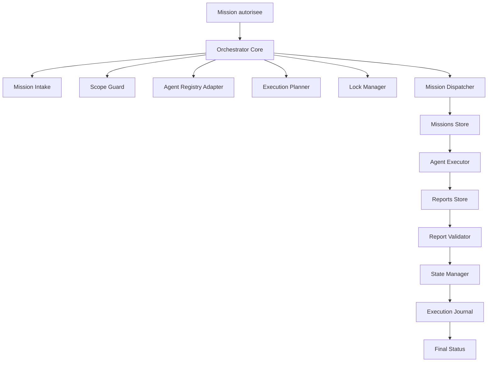
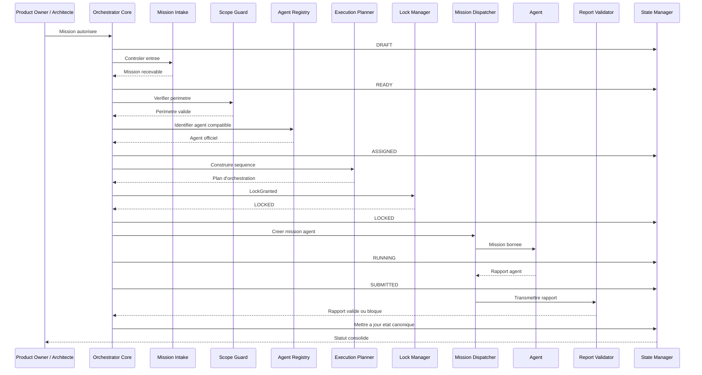
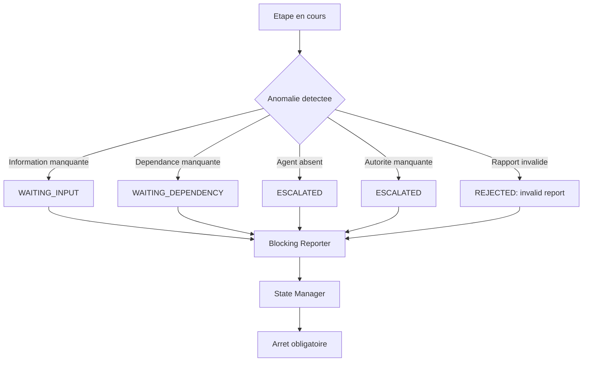
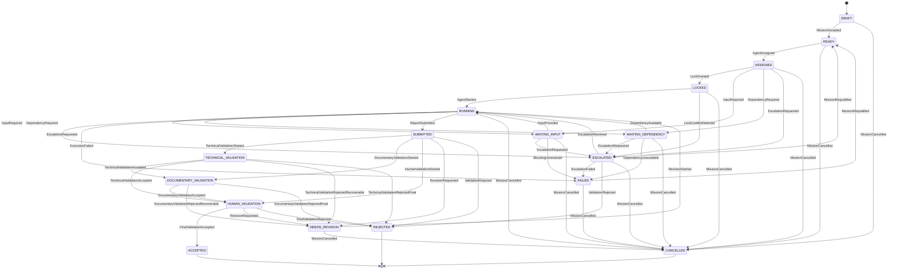
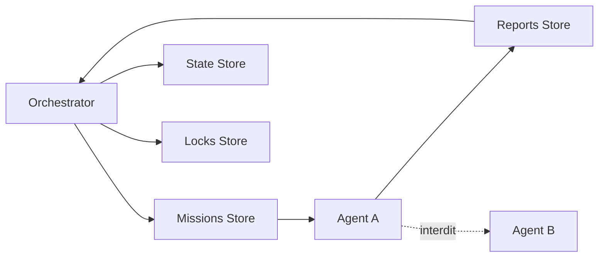
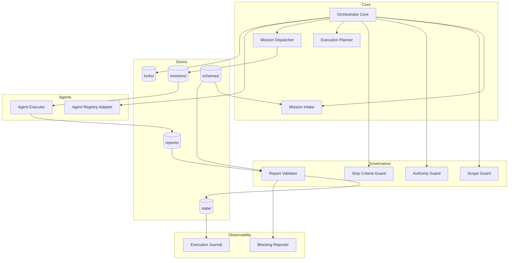

# ORCHESTRATOR V1 - Architecture

Version : 1.0

Statut : DRAFT

Agent : Architect

Lot : ORCH-0001-A

---

# 1. Objet

Ce document definit l'architecture complete de l'ORCHESTRATOR V1 pour CEREBRAU Operating System.

L'ORCHESTRATOR V1 est une couche de coordination documentaire et transactionnelle. Il organise l'execution des missions agents sans creer de communication directe entre agents, sans remplacer les autorites CEREBRAU et sans modifier le code applicatif.

Le systeme repose sur trois principes structurants :

- les agents ne communiquent jamais directement entre eux ;
- les agents echangent uniquement par artefacts controles ;
- l'orchestrateur coordonne, verifie et trace, mais n'execute pas le travail specialise a la place des agents.

---

# 2. References d'autorite

Documents de reference :

- `Docs/09_CEREBRAU OPERATING SYSTEM/MASTER_EXECUTION_SPECIFICATION.md`
- `Docs/09_CEREBRAU OPERATING SYSTEM/LOT_TEMPLATE.md`
- `Docs/09_CEREBRAU OPERATING SYSTEM/03_AGENTS/README.md`
- `Docs/09_CEREBRAU OPERATING SYSTEM/03_AGENTS/ORCHESTRATOR_AGENT.md`
- `Docs/09_CEREBRAU OPERATING SYSTEM/99_INCUBATION/AGENTIC_ORCHESTRATION/README.md`
- `Docs/09_CEREBRAU OPERATING SYSTEM/99_INCUBATION/AGENTIC_ORCHESTRATION/ORCHESTRATOR_STATE_MODEL_V1.md`

Demandes d'evolution prises en compte comme contexte futur, sans implementation dans V1 :

- `IR-001_EXECUTION_SNAPSHOT_AND_ACTIVITY_ENGINE.md`
- `IR-002_RESUME_ENGINE.md`
- `IR-005_EXECUTION_STATE_GOVERNANCE.md`

---

# 3. Perimetre de l'ORCHESTRATOR V1

## 3.1 Perimetre inclus

L'ORCHESTRATOR V1 couvre :

- reception d'une mission autorisee ;
- validation minimale du perimetre de mission ;
- selection d'un agent officiel ;
- creation d'une mission agent ;
- verrouillage logique de l'execution ;
- suivi de l'etat d'execution ;
- collecte du rapport agent ;
- controle de conformite du rapport ;
- consolidation du statut final ;
- arret en cas de blocage, conflit ou critere d'arret atteint.

## 3.2 Perimetre exclu

L'ORCHESTRATOR V1 ne couvre pas :

- execution de code applicatif ;
- generation automatique de code ;
- modification des decisions Product Owner ;
- modification de l'architecture definie par l'Architecte ;
- communication directe agent-agent ;
- orchestration de plusieurs lots simultanes ;
- creation automatique de COS, EPIC, DECISION ou registre ;
- apprentissage automatique ;
- telemetrie invasive ;
- surveillance globale du poste.

---

# 4. Architecture logique

L'architecture logique est organisee en couches.



## 4.1 Couche Coordination

La couche Coordination contient le noyau d'orchestration. Elle decide uniquement de la sequence d'execution autorisee a partir des entrees explicites.

Composants :

- Orchestrator Core ;
- Mission Intake ;
- Execution Planner ;
- Mission Dispatcher.

## 4.2 Couche Gouvernance

La couche Gouvernance protege le perimetre, les roles, les autorites et les criteres d'arret.

Composants :

- Scope Guard ;
- Authority Guard ;
- Stop Criteria Guard ;
- Report Validator.

## 4.3 Couche Artefacts

La couche Artefacts materialise les echanges entre composants et agents.

Repertoires :

- `missions/`
- `reports/`
- `state/`
- `locks/`
- `schemas/`

## 4.4 Couche Agents

La couche Agents correspond a la bibliotheque officielle des agents CEREBRAU.

L'orchestrateur ne cree pas d'agent nouveau. Il selectionne uniquement un agent existant si son role correspond a la mission.

## 4.5 Couche Observabilite

La couche Observabilite produit une trace d'execution exploitable, sans journaliser de donnees hors perimetre.

Composants :

- Execution Journal ;
- Status Consolidator ;
- Blocking Reporter.

---

# 5. Composants

## 5.1 Orchestrator Core

Responsabilite :

- piloter le cycle complet d'une mission agent ;
- appliquer l'ordre d'execution ;
- coordonner les composants internes ;
- arreter l'execution des qu'un critere d'arret est atteint.

Entrees :

- mission initiale ;
- references autorisees ;
- bibliotheque d'agents ;
- criteres d'arret ;
- contraintes de perimetre.

Sorties :

- mission agent ;
- statut d'execution ;
- rapport consolide ;
- signalement de blocage.

Interdictions :

- executer un travail specialise ;
- modifier le contenu metier d'un livrable agent ;
- arbitrer une decision Product Owner ;
- modifier une architecture Architecte.

## 5.2 Mission Intake

Responsabilite :

- recevoir la mission ;
- verifier la presence des champs obligatoires ;
- identifier l'objectif, les livrables, les contraintes et les criteres d'arret ;
- rejeter une mission incomplete ou ambigue.

Validation minimale :

- identifiant present ;
- agent cible ou besoin agent identifiable ;
- objectif unique ;
- livrables explicites ;
- perimetre autorise explicite ;
- perimetre interdit explicite ;
- critere d'arret explicite.

## 5.3 Scope Guard

Responsabilite :

- verifier que la mission reste dans son perimetre ;
- detecter les elargissements implicites ;
- bloquer les actions hors mission ;
- empecher les livrables supplementaires.

Regles :

- un agent = une mission ;
- une mission = un rapport ;
- aucun agent ne lit le depot complet ;
- aucun agent ne modifie un perimetre hors mission.

## 5.4 Authority Guard

Responsabilite :

- verifier que l'orchestrateur ne prend pas la place du Product Owner, de l'Architecte ou d'un agent specialise ;
- detecter les decisions absentes ;
- bloquer l'execution si une autorite manquante est requise.

Cas de blocage :

- arbitrage Product Owner manquant ;
- architecture non definie ;
- agent requis absent de la bibliotheque ;
- conflit entre mission et document d'autorite.

## 5.5 Agent Registry Adapter

Responsabilite :

- exposer la liste des agents officiels ;
- lire les responsabilites, entrees, sorties et criteres d'arret de chaque agent ;
- permettre la selection d'un agent compatible avec la mission.

Source :

- `Docs/09_CEREBRAU OPERATING SYSTEM/03_AGENTS/`

Sortie :

- agent selectionne ;
- justification de compatibilite ;
- limites du role agent.

## 5.6 Execution Planner

Responsabilite :

- produire une sequence d'execution simple et verifiable ;
- definir les etapes de mission ;
- associer chaque etape a une condition de validation ;
- empecher le lancement de plusieurs agents en parallele sur un meme lot.

Sortie attendue :

- plan d'orchestration ;
- agent affecte ;
- artefacts attendus ;
- ordre d'execution ;
- criteres d'arret.

## 5.7 Lock Manager

Responsabilite :

- materialiser un verrou logique par l'evenement `LockGranted` ;
- empecher deux executions concurrentes sur la meme mission ;
- appliquer strictement le cycle de vie du verrou defini par `ORCHESTRATOR_STATE_MODEL_V1.md`.

Artefact cible :

- `locks/<mission_id>.lock`

Contenu logique :

- mission_id ;
- agent_id ;
- status ;
- created_at ;
- owner ;
- stop_condition.

Cycle de vie du verrou :

### Creation

Le verrou est cree par l'evenement `LockGranted`.

Transition officielle :

- `ASSIGNED` vers `LOCKED`

Conditions :

- mission affectee a un agent principal ;
- perimetre verrouillable identifie ;
- aucun verrou concurrent actif sur le meme perimetre ;
- condition de liberation definie.

### Renouvellement

Un verrou peut etre renouvele si la mission reste dans un etat non terminal et si l'autorite ou l'orchestrateur confirme que le perimetre reste actif.

Etats compatibles :

- `LOCKED`
- `RUNNING`
- `WAITING_INPUT`
- `WAITING_DEPENDENCY`
- `ESCALATED`
- `SUBMITTED`
- `TECHNICAL_VALIDATION`
- `DOCUMENTARY_VALIDATION`
- `HUMAN_VALIDATION`
- `NEEDS_REVISION`
- `FAILED` uniquement si une requalification explicite est attendue.

Le renouvellement ne modifie pas l'etat canonique de la mission.

### Expiration

Un verrou expire uniquement si une condition d'expiration explicite existe.

L'expiration ne libere pas automatiquement le perimetre.

Si un verrou expire alors que la mission n'est pas terminale, la mission passe ou reste en `ESCALATED` jusqu'a arbitrage.

### Liberation

Le verrou est libere lorsque la mission atteint un etat terminal :

- `ACCEPTED`
- `REJECTED`
- `CANCELLED`

Le verrou peut aussi etre libere par instruction explicite d'autorite pendant `ESCALATED` ou `FAILED`.

### Abandon

Un verrou abandonne ou orphelin n'est pas supprime automatiquement.

Si le responsable du verrou n'a plus de mission active identifiable, l'etat canonique de la mission associee doit etre `ESCALATED` jusqu'a resolution.

## 5.8 Mission Dispatcher

Responsabilite :

- produire l'artefact de mission agent ;
- transmettre uniquement les entrees autorisees ;
- interdire l'acces implicite au depot complet ;
- enregistrer la mission dans le store `missions/`.

Artefact cible :

- `missions/<mission_id>.md` ou `missions/<mission_id>.json`

## 5.9 Agent Executor

Responsabilite :

- representer l'execution d'un agent officiel ;
- consommer une mission unique ;
- produire un rapport unique ;
- s'arreter selon les criteres d'arret de sa fiche agent et de la mission.

Note :

Dans V1, l'Agent Executor est une abstraction d'architecture. Il peut correspondre a une execution humaine assistee, a Codex sous role agent, ou a un futur runner controle. Le document ne prescrit pas d'implementation technique.

## 5.10 Reports Store

Responsabilite :

- recevoir le rapport unique produit par l'agent ;
- conserver la sortie agent sans modification par un autre agent ;
- permettre la validation par l'orchestrateur.

Artefact cible :

- `reports/<mission_id>.md` ou `reports/<mission_id>.json`

## 5.11 Report Validator

Responsabilite :

- verifier que le rapport respecte le schema commun ;
- verifier la presence des livrables attendus ;
- verifier l'absence de livrables supplementaires declares ;
- detecter un blocage remonte par l'agent.

Resultats possibles :

- `VALID`
- `INVALID_SCHEMA`
- `SCOPE_VIOLATION`
- `WAITING_INPUT`
- `WAITING_DEPENDENCY`
- `ESCALATED`
- `NEEDS_AUTHORITY`

## 5.12 State Manager

Responsabilite :

- maintenir l'etat courant d'une mission ;
- tracer les transitions ;
- exposer un statut consolidable.

Artefact cible :

- `state/<mission_id>.state.json`

Etats autorises :

- `DRAFT`
- `READY`
- `ASSIGNED`
- `LOCKED`
- `RUNNING`
- `WAITING_INPUT`
- `WAITING_DEPENDENCY`
- `ESCALATED`
- `SUBMITTED`
- `TECHNICAL_VALIDATION`
- `DOCUMENTARY_VALIDATION`
- `HUMAN_VALIDATION`
- `NEEDS_REVISION`
- `ACCEPTED`
- `REJECTED`
- `FAILED`
- `CANCELLED`

## 5.13 Execution Journal

Responsabilite :

- tracer les transitions majeures ;
- conserver les horodatages ;
- relier mission, agent, rapport et statut final.

Le journal ne doit pas contenir de secrets, de donnees hors perimetre ou de contenu non necessaire a la reprise.

## 5.14 Blocking Reporter

Responsabilite :

- produire un signalement factuel si l'execution ne peut pas continuer ;
- identifier l'etape bloquee ;
- indiquer la cause uniquement si elle est demontree.

Sortie :

- etat `WAITING_INPUT`, `WAITING_DEPENDENCY` ou `ESCALATED` selon la cause ;
- raison factuelle ;
- autorite requise si applicable.

---

# 6. Responsabilites par composant

| Composant | Responsabilite principale | Ne fait pas |
| --- | --- | --- |
| Orchestrator Core | Coordonne la mission | Travail specialise |
| Mission Intake | Controle l'entree | Interpretation metier |
| Scope Guard | Protege le perimetre | Arbitrage PO |
| Authority Guard | Controle les autorites | Creation de decision |
| Agent Registry Adapter | Selectionne un agent officiel | Creation d'agent |
| Execution Planner | Sequence les etapes | Execution parallele non autorisee |
| Lock Manager | Gere le verrou logique | Gestion Git |
| Mission Dispatcher | Cree l'artefact mission | Ajout d'entrees implicites |
| Agent Executor | Execute une mission agent | Communication agent-agent |
| Reports Store | Conserve le rapport | Validation metier autonome |
| Report Validator | Controle le rapport | Correction du rapport |
| State Manager | Gere les transitions | Invention d'etat |
| Execution Journal | Trace l'execution | Journalisation invasive |
| Blocking Reporter | Signale le blocage | Contournement du blocage |

---

# 7. Dependances

## 7.1 Dependances documentaires

L'ORCHESTRATOR V1 depend des documents suivants :

- Master Execution Specification ;
- Lot Template ;
- fiches agents officielles ;
- documents de lot autorises ;
- references explicitement listees dans la mission.

## 7.2 Dependances de stockage

L'ORCHESTRATOR V1 depend des repertoires suivants :

- `missions/` pour les missions agent ;
- `reports/` pour les rapports agent ;
- `state/` pour les etats d'execution ;
- `locks/` pour les verrous logiques ;
- `schemas/` pour les schemas d'artefacts.

## 7.3 Dependances conceptuelles

L'ORCHESTRATOR V1 depend des concepts CEREBRAU suivants :

- autorite Product Owner ;
- autorite Architecte ;
- lot comme unite maximale de travail ;
- agent comme role borne ;
- critere d'arret comme condition obligatoire ;
- rapport comme preuve de sortie.

## 7.4 Dependances futures non bloquantes

Les evolutions suivantes sont compatibles avec l'architecture mais hors V1 :

- Activity Engine ;
- Execution Snapshot ;
- Resume Engine ;
- Execution State Governance avancee ;
- providers externes ;
- execution automatisee multi-environnements.

---

# 8. Interfaces entre composants

## 8.1 Interface Mission Input

Objet logique :

```json
{
  "mission_id": "ORCH-0001-A",
  "title": "Architecture ORCHESTRATOR V1",
  "authority": "Architect",
  "objective": "Definir l'architecture complete de l'ORCHESTRATOR V1",
  "allowed_scope": [],
  "forbidden_scope": [],
  "deliverables": [],
  "stop_criteria": [],
  "authorized_references": []
}
```

Champs obligatoires :

- `mission_id`
- `authority`
- `objective`
- `allowed_scope`
- `forbidden_scope`
- `deliverables`
- `stop_criteria`

## 8.2 Interface Agent Mission

Objet logique :

```json
{
  "mission_id": "ORCH-0001-A",
  "agent_id": "ARCHITECT_AGENT",
  "objective": "Definir l'architecture complete de l'ORCHESTRATOR V1",
  "inputs": [],
  "authorized_files": [],
  "forbidden_files": [],
  "expected_report": "reports/ORCH-0001-A.md",
  "stop_criteria": []
}
```

Regle :

Une Agent Mission ne contient que les entrees necessaires a l'agent selectionne.

## 8.3 Interface Agent Report

Objet logique :

```json
{
  "mission_id": "ORCH-0001-A",
  "agent_id": "ARCHITECT_AGENT",
  "status": "SUBMITTED",
  "deliverables": [],
  "modified_files": [],
  "created_files": [],
  "blocked_reason": null,
  "scope_confirmation": true
}
```

Champs obligatoires :

- `mission_id`
- `agent_id`
- `status`
- `deliverables`
- `modified_files`
- `created_files`
- `scope_confirmation`

## 8.4 Interface Execution State

Objet logique :

```json
{
  "mission_id": "ORCH-0001-A",
  "agent_id": "ARCHITECT_AGENT",
  "state": "ACCEPTED",
  "previous_state": "HUMAN_VALIDATION",
  "updated_at": "YYYY-MM-DDTHH:MM:SSZ",
  "lock_id": "ORCH-0001-A",
  "report_id": "ORCH-0001-A",
  "stop_condition": "All deliverables produced"
}
```

Regle :

Le State Manager est le seul composant autorise a faire transiter l'etat.

## 8.5 Interface Lock

Objet logique :

```json
{
  "lock_id": "ORCH-0001-A",
  "mission_id": "ORCH-0001-A",
  "agent_id": "ARCHITECT_AGENT",
  "status": "LOCKED",
  "created_at": "YYYY-MM-DDTHH:MM:SSZ"
}
```

Regle :

Un verrou actif interdit une seconde execution sur la meme mission.

Le verrou est cree par l'evenement `LockGranted`, lors de la transition officielle `ASSIGNED` vers `LOCKED`.

---

# 9. Schemas d'artefacts

## 9.1 Mission

Une mission doit contenir :

- identifiant unique ;
- agent affecte ;
- objectif ;
- contexte autorise ;
- fichiers autorises ;
- fichiers interdits ;
- livrables attendus ;
- criteres d'acceptation ;
- criteres d'arret.

## 9.2 Rapport

Un rapport doit contenir :

- identifiant de mission ;
- agent executeur ;
- statut final ;
- livrables produits ;
- fichiers crees ;
- fichiers modifies ;
- confirmations de perimetre ;
- blocage eventuel ;
- cause demontree si disponible.

## 9.3 Etat

Un etat doit contenir :

- identifiant de mission ;
- agent affecte ;
- etat courant ;
- etat precedent ;
- horodatage ;
- verrou associe ;
- rapport associe si disponible ;
- condition de transition.

## 9.4 Verrou

Un verrou doit contenir :

- identifiant de verrou ;
- identifiant de mission ;
- agent affecte ;
- statut du verrou ;
- horodatage de creation ;
- condition de liberation.

---

# 10. Flux global d'execution



## 10.1 Etapes nominales

1. Reception de la mission autorisee.
2. Controle de completude.
3. Controle de perimetre.
4. Controle d'autorite.
5. Selection de l'agent officiel.
6. Planification de la sequence.
7. `LockGranted`.
8. Creation de la mission agent.
9. Execution par l'agent.
10. Reception du rapport.
11. Validation du rapport.
12. Consolidation de l'etat.
13. Liberation du verrou.
14. Arret de l'orchestrateur.

## 10.2 Flux de blocage



---

# 11. Cycle de vie d'une mission



Etats terminaux :

- `ACCEPTED`
- `REJECTED`
- `CANCELLED`

Un etat terminal interdit toute continuation automatique.

---

# 12. Regles de selection d'agent

L'agent est selectionne selon les criteres suivants :

1. La mission correspond explicitement a la mission de l'agent.
2. Le perimetre autorise de l'agent couvre l'action demandee.
3. Les sorties attendues de l'agent couvrent les livrables demandes.
4. Aucun critere d'arret de l'agent n'est deja atteint.
5. L'agent est present dans la bibliotheque officielle.

Si plusieurs agents semblent compatibles, l'orchestrateur bloque l'execution et demande une clarification d'autorite.

Si aucun agent n'est compatible, l'orchestrateur bloque l'execution.

---

# 13. Regles de communication

## 13.1 Communication autorisee

Les communications autorisees sont :

- Orchestrator vers mission agent via `missions/` ;
- Agent vers Orchestrator via `reports/` ;
- Orchestrator vers etat via `state/` ;
- Orchestrator vers verrou via `locks/`.

## 13.2 Communication interdite

Les communications interdites sont :

- agent vers agent ;
- agent vers rapport d'un autre agent sauf autorisation explicite ;
- agent vers mission d'un autre agent sauf autorisation explicite ;
- agent vers depot complet ;
- agent vers documents non listes dans la mission.

Diagramme :



---

# 14. Regles de concurrence

L'ORCHESTRATOR V1 applique une concurrence restrictive.

Regles :

- une mission ne peut avoir qu'un verrou actif ;
- un lot ne peut avoir qu'une execution active ;
- un agent ne produit qu'un rapport par mission ;
- deux agents ne peuvent pas modifier le meme perimetre documentaire dans le meme lot ;
- toute collision de verrou entraine un etat `ESCALATED`.

V1 ne definit pas d'execution parallele multi-agent. Toute parallelisation future devra etre autorisee par une architecture ulterieure.

---

# 15. Gestion des erreurs

## 15.1 Types d'erreurs

Erreurs controlees :

- mission incomplete ;
- mission ambigue ;
- agent absent ;
- conflit de perimetre ;
- autorite manquante ;
- verrou existant ;
- rapport absent ;
- rapport invalide ;
- livrable manquant ;
- livrable supplementaire ;
- schema non conforme.

## 15.2 Politique de reaction

Pour toute erreur :

1. arreter l'action en cours ;
2. enregistrer l'etat canonique applicable : `WAITING_INPUT`, `WAITING_DEPENDENCY`, `ESCALATED`, `FAILED` ou `REJECTED` ;
3. produire un signalement factuel ;
4. ne pas contourner l'erreur ;
5. ne pas corriger automatiquement ;
6. attendre une nouvelle instruction.

---

# 16. Gouvernance des etats

L'ORCHESTRATOR V1 conserve uniquement les etats necessaires a l'execution de la mission.

Un etat d'execution :

- ne remplace pas un COS ;
- ne remplace pas une DECISION ;
- ne remplace pas un EPIC ;
- ne cree pas une priorite ;
- ne prolonge pas automatiquement une mission.

Les notions d'Execution Snapshot, Resume Engine et Execution State Governance avancee restent hors V1. L'architecture reserve toutefois des points d'extension compatibles via `state/` et le State Manager.

---

# 17. Securite et isolation

Regles de securite :

- aucun secret ne doit etre inclus dans les artefacts ;
- aucun agent ne lit le depot complet ;
- seuls les fichiers autorises sont transmis ;
- les rapports ne doivent pas contenir de donnees hors mission ;
- les verrous ne doivent pas contenir de donnees sensibles ;
- les schemas doivent permettre un controle structurel minimal.

Isolation :

- isolation par mission_id ;
- isolation par agent_id ;
- isolation par listes de fichiers autorises ;
- isolation par verrou logique.

---

# 18. Observabilite

L'observabilite V1 est minimale et factuelle.

Elle doit repondre a quatre questions :

- quelle mission a ete executee ?
- quel agent a ete affecte ?
- quel rapport a ete produit ?
- quel etat canonique final ou courant a ete atteint ?

Elle ne doit pas chercher a reconstruire l'activite complete du poste ni a analyser des signaux hors perimetre.

---

# 19. Diagramme de composants



---

# 20. Points d'extension V2+

Les points d'extension prevus, mais non actifs en V1, sont :

- Activity Provider en amont du Mission Intake ;
- Focus Detection avant creation d'un snapshot ;
- Execution Snapshot comme artefact optionnel de reprise ;
- Resume Engine apres Context Engine ;
- State Classification pour gouvernance avancee ;
- schemas JSON stricts dans `schemas/` ;
- runner automatise pour Agent Executor ;
- consolidation multi-rapports uniquement si un futur lot l'autorise.

Ces extensions ne doivent pas modifier les regles V1 sans nouvelle decision d'architecture.

---

# 21. Critere d'arret de l'ORCHESTRATOR V1

L'ORCHESTRATOR V1 s'arrete immediatement lorsque l'une des conditions suivantes est vraie :

- validation finale obtenue et etat `ACCEPTED` atteint ;
- rejet obtenu et etat `REJECTED` atteint ;
- annulation obtenue et etat `CANCELLED` atteint ;
- blocage de mission en etat `WAITING_INPUT`, `WAITING_DEPENDENCY`, `ESCALATED` ou `FAILED` ;
- conflit de perimetre ;
- autorite manquante ;
- agent requis absent ;
- verrou concurrent ;
- rapport invalide ;
- livrables attendus produits ;
- critere d'arret specifique de la mission atteint.

---

# 22. Synthese d'architecture

L'ORCHESTRATOR V1 est une architecture de coordination sobre, bornee et compatible avec les regles CEREBRAU existantes.

Il repose sur :

- un noyau d'orchestration ;
- une validation stricte du perimetre ;
- une bibliotheque d'agents officielle ;
- des artefacts de communication explicites ;
- un etat d'execution minimal ;
- un verrou logique par mission ;
- un rapport unique par agent ;
- un arret obligatoire sur etat terminal ou blocage canonique.

Cette architecture permet de coordonner des agents sans communication directe, sans debordement de mission et sans creation implicite de gouvernance.
