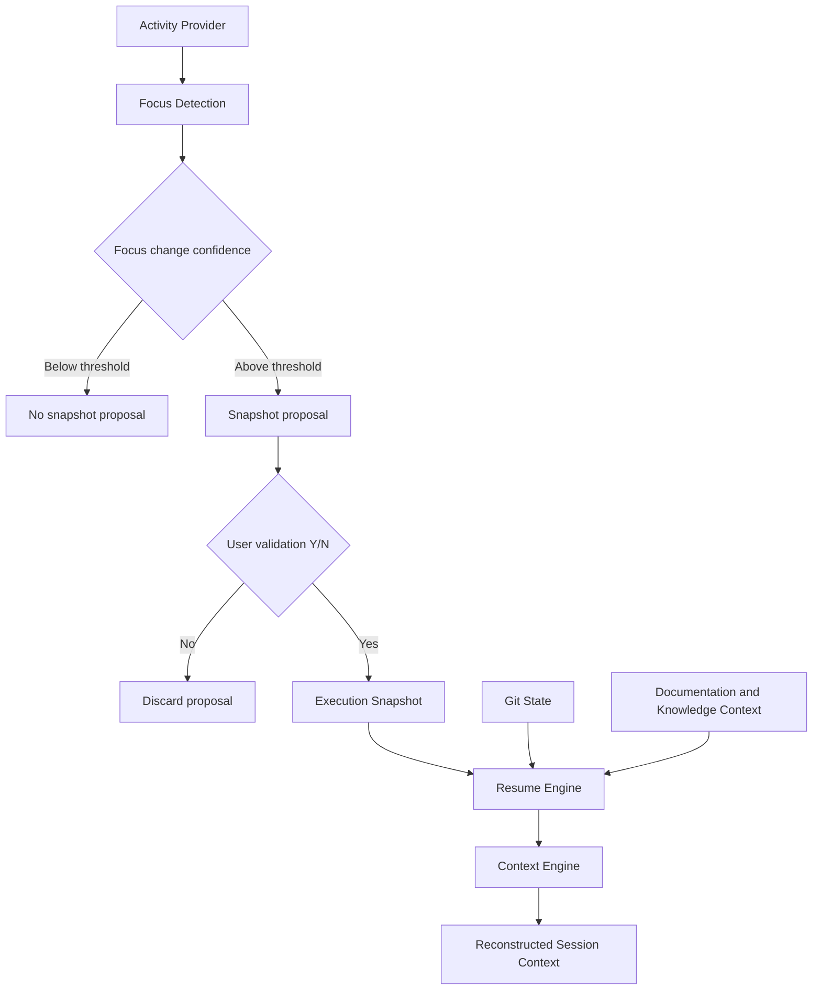

# IR-001

## Titre

Execution Snapshot & Activity Engine

## Origine

RETEX - Validation du CEREBRAU System Engine MVP

## Contexte

La validation du CEREBRAU System Engine MVP a confirme que le Context Engine et le System Engine reconstruisent correctement le contexte documentaire, les registres Knowledge, les relations CEREBRAU et l'etat Git disponible.

La limite identifiee concerne les changements de direction intervenus entre deux commits ou avant toute materialisation documentaire. Dans ce cas, le System Engine peut retrouver le dernier etat documente, mais il ne peut pas prouver qu'un nouveau focus operationnel a ete choisi si ce focus n'a pas ete inscrit dans Git, dans un document CEREBRAU, dans un registre ou dans une source active.

Cette limite a ete constatee pendant le RUN reel de VEEDDA. Elle provient donc d'un retour d'experience operationnel et non d'une hypothese theorique.

## Probleme

Git conserve les changements lorsqu'ils sont materialises sous forme de fichiers modifies, ajoutes, supprimes ou commits. Il ne conserve pas l'intention intermediaire d'un utilisateur si cette intention n'a pas ete traduite dans un artefact versionnable.

Un changement de direction peut exister dans le travail reel sans etre visible dans Git :

- changement de focus avant commit ;
- bascule vers un autre chantier sans document de reprise ;
- decision orale ou interactive non materialisee ;
- interruption de session avant creation d'un lot, d'un registre ou d'un document ;
- exploration locale abandonnee avant production d'un artefact.

Dans ces cas, le System Engine reconstruit correctement les sources disponibles, mais il ne peut pas reconstruire une direction qui n'a jamais ete persistee.

## Objectif

Le futur Activity Engine devra ajouter une couche de reprise operationnelle complementaire au Context Engine.

Son role sera de detecter les changements de focus significatifs, de proposer la creation d'un Execution Snapshot et de permettre une reprise automatique combinant :

- le dernier snapshot valide ;
- l'etat Git ;
- le contexte documentaire CEREBRAU ;
- les registres Knowledge ;
- le Context Engine.

L'Activity Engine ne remplacera pas Git et ne remplacera pas le Context Engine. Il ajoutera une memoire d'execution controlee, explicite et validee par l'utilisateur.

## Fonctionnalites envisagees

- detection automatique d'un changement de focus ;
- calcul d'un niveau de confiance ;
- proposition de creation d'un Execution Snapshot ;
- validation utilisateur (Y/N) ;
- persistance independante de Git ;
- reprise automatique du dernier snapshot ;
- fusion Snapshot + Git + Context Engine.

## Hors perimetre

Cette evolution ne concerne pas :

- IA generative ;
- telemetrie invasive ;
- surveillance complete du poste ;
- apprentissage automatique.

L'Activity Engine ne doit pas observer l'ensemble de l'activite du poste. Il doit se limiter aux signaux explicitement utiles a la reprise CEREBRAU et a la continuite du RUN VEEDDA.

## Architecture cible

Le flux cible est le suivant :

Activity Provider

↓

Focus Detection

↓

Execution Snapshot

↓

Resume Engine

↓

Context Engine

## Estimation

Developpement MVP :

4,5 jours

Developpement parallele :

1,5 a 2 jours

## Valeur metier

Cette evolution renforcerait la continuite du RUN VEEDDA lorsque le travail change de direction avant d'etre formalise.

Benefices attendus :

- reduction du risque de reprise sur un mauvais chantier ;
- meilleure continuite entre deux sessions ;
- explicitation des changements de focus ;
- separation claire entre historique Git et memoire d'execution ;
- meilleure capacite a reprendre un RUN interrompu ;
- conservation d'une trace validee sans creer un EPIC ou un document de gouvernance a chaque micro-transition.

## Criteres de declenchement

Cette evolution ne sera lancee que lorsqu'elle deviendra un frein recurrent constate pendant le RUN.

Le declenchement necessitera au minimum :

- plusieurs cas de changement de focus non reconstructible par Git ;
- un impact concret sur la reprise VEEDDA ;
- une priorisation explicite par rapport aux chantiers VEEDDA en cours ;
- une mission dediee autorisant la conception ou l'implementation.

## Priorite

Moyenne.

## Statut

BACKLOG

## Decision

Aucune implementation immediate.

Evolution reportee apres les priorites VEEDDA.
