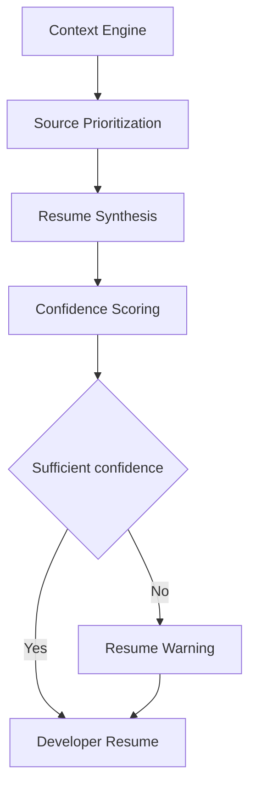

# IR-002

## Titre

Resume Engine

## Origine

RETEX - Validation du CEREBRAU System Engine MVP

## Contexte

La validation du CEREBRAU System Engine MVP a confirme la capacite du systeme a reconstruire le contexte documentaire, les registres Knowledge, les relations CEREBRAU, les decisions disponibles et l'etat Git.

Le RUN reel de VEEDDA a toutefois montre que la reprise automatique reste dependante de la qualite de la synthese produite a partir des sources. Lorsque plusieurs sources sont disponibles, le systeme peut les restituer, mais il ne dispose pas encore d'un moteur specialise pour produire une instruction de reprise unique, priorisee et directement actionnable.

Cette evolution est volontairement reportee tant qu'elle n'est pas demontree comme necessaire par le RUN VEEDDA.

## Probleme

Le Context Engine reconstruit les blocs de contexte, mais la transformation de ces blocs en reprise operationnelle reste limitee.

Le probleme identifie est le suivant :

- plusieurs sources peuvent etre valides simultanement ;
- les registres peuvent etre incomplets ou partiellement desynchronises ;
- l'etat Git peut signaler des fichiers non suivis sans expliquer leur ordre de priorite ;
- un developpeur peut avoir besoin d'une seule action de reprise plutot que d'un inventaire complet ;
- la reprise peut necessiter un arbitrage documentaire strict sans creer de decision implicite.

Sans Resume Engine dedie, la reprise reste correcte mais pas toujours optimale pour un RUN immediat.

## Objectif

Le futur Resume Engine devra transformer le contexte reconstruit en consigne de reprise courte, fiable et priorisee.

Il devra produire une synthese operationnelle indiquant :

- le chantier a reprendre ;
- l'EPIC ou le lot applicable ;
- les sources d'autorite ;
- les risques bloquants ;
- la prochaine action exacte ;
- les limites de confiance.

Le Resume Engine ne remplacera pas le Context Engine. Il agira comme couche de restitution et d'orchestration de reprise.

## Fonctionnalites envisagees

- consolidation des blocs Context Engine ;
- priorisation des sources d'autorite ;
- detection des conflits de reprise ;
- generation d'une action unique recommandee ;
- calcul d'un niveau de confiance de reprise ;
- restitution courte pour developpeur ;
- conservation des sources utilisees.

## Hors perimetre

Cette evolution ne concerne pas :

- IA generative ;
- telemetrie invasive ;
- surveillance complete du poste ;
- apprentissage automatique.

Le Resume Engine ne doit pas inventer de priorite, d'EPIC, de lot ou de decision. Il doit uniquement restituer une reprise a partir des sources disponibles.

## Architecture cible

Le flux cible est le suivant :

Context Engine

↓

Source Prioritization

↓

Resume Synthesis

↓

Confidence Scoring

↓

Developer Resume

## Estimation

Developpement MVP :

2,5 jours

Developpement parallele :

1 jour

## Valeur metier

Cette evolution renforcerait la capacite de VEEDDA a reprendre rapidement un RUN interrompu sans relire manuellement tous les registres.

Benefices attendus :

- reduction du temps de reprise ;
- diminution du risque de mauvaise priorite ;
- meilleure lisibilite pour un developpeur entrant ;
- separation claire entre reconstruction du contexte et instruction de reprise ;
- reprise plus stable apres interruption.

## Criteres de declenchement

Cette evolution ne sera lancee que si la reprise manuelle depuis le contexte reconstruit devient un frein recurrent.

Le declenchement necessitera au minimum :

- plusieurs cas de reprise ambigue ;
- un impact constate sur la continuite du RUN VEEDDA ;
- un besoin confirme de synthese actionnable ;
- une mission dediee autorisant la conception ou l'implementation.

## Priorite

Moyenne.

## Statut

BACKLOG

## Decision

Aucune implementation immediate.

Evolution reportee apres les priorites VEEDDA.
