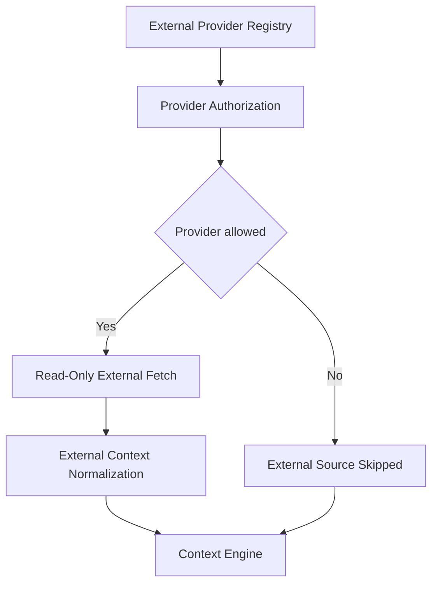

# IR-003

## Titre

External Providers

## Origine

RETEX - Validation du CEREBRAU System Engine MVP

## Contexte

La validation du CEREBRAU System Engine MVP a confirme que les providers internes reconstruisent correctement les informations issues du depot Git, des documents CEREBRAU, des registres Knowledge et des sources actives.

Le RUN reel de VEEDDA a toutefois montre que certaines informations utiles peuvent exister hors du depot local : services externes, etat distant, outils de gestion, environnements d'execution ou systemes de stockage non materialises dans Git.

Cette evolution est volontairement reportee tant qu'elle n'est pas demontree comme necessaire par le RUN VEEDDA.

## Probleme

Le System Engine MVP ne doit pas supposer l'etat de sources externes qu'il ne consulte pas.

Le probleme identifie est le suivant :

- le depot local ne contient pas toujours l'etat distant reel ;
- certains services peuvent diverger des fichiers versionnes ;
- certaines configurations sont hors Git ;
- les sources externes peuvent etre indisponibles ou non autorisees ;
- le contexte reconstruit peut etre complet localement mais incomplet operationnellement.

Sans External Providers, le systeme doit signaler ces limites au lieu de les combler.

## Objectif

Le futur module External Providers devra definir une interface controlee pour consulter des sources externes explicitement autorisees.

Il devra permettre :

- la lecture de sources distantes approuvees ;
- la qualification de leur disponibilite ;
- la distinction entre source locale et source externe ;
- la restitution des donnees externes dans le contexte ;
- la declaration claire des sources non consultees.

External Providers ne remplacera pas les sources CEREBRAU. Il ajoutera une couche optionnelle et gouvernee.

## Fonctionnalites envisagees

- declaration des providers externes autorises ;
- verification de disponibilite ;
- lecture en mode read-only ;
- normalisation des resultats externes ;
- gestion des erreurs d'acces ;
- qualification source locale / source externe ;
- fusion controlee avec le Context Engine.

## Hors perimetre

Cette evolution ne concerne pas :

- IA generative ;
- telemetrie invasive ;
- surveillance complete du poste ;
- apprentissage automatique.

External Providers ne doit pas explorer automatiquement des services non declares et ne doit pas ecrire dans des systemes externes.

## Architecture cible

Le flux cible est le suivant :

External Provider Registry

↓

Provider Authorization

↓

Read-Only External Fetch

↓

External Context Normalization

↓

Context Engine

## Estimation

Developpement MVP :

3 jours

Developpement parallele :

1 a 1,5 jour

## Valeur metier

Cette evolution ameliorerait la precision operationnelle du RUN VEEDDA lorsque l'etat utile depasse le depot local.

Benefices attendus :

- meilleure distinction entre contexte local et contexte distant ;
- reduction des angles morts operationnels ;
- restitution explicite des sources non consultees ;
- controle d'acces plus clair ;
- reprise plus fiable lorsque des services externes portent l'etat reel.

## Criteres de declenchement

Cette evolution ne sera lancee que si les sources externes deviennent necessaires a la reprise du RUN.

Le declenchement necessitera au minimum :

- plusieurs cas ou le depot local ne suffit pas ;
- une liste de providers externes autorises ;
- un besoin read-only formel ;
- une mission dediee autorisant la conception ou l'implementation.

## Priorite

Moyenne.

## Statut

BACKLOG

## Decision

Aucune implementation immediate.

Evolution reportee apres les priorites VEEDDA.
