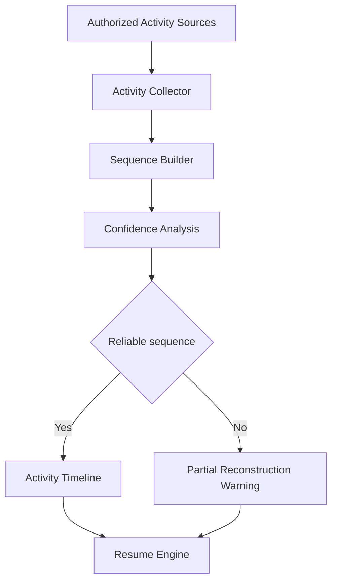

# IR-004

## Titre

Activity Reconstruction

## Origine

RETEX - Validation du CEREBRAU System Engine MVP

## Contexte

La validation du CEREBRAU System Engine MVP a montre que le systeme sait reconstruire les sources documentaires et Git disponibles, mais ne reconstruit pas automatiquement la sequence fine d'activite entre deux etats materialises.

Pendant le RUN reel de VEEDDA, certaines transitions de travail peuvent exister sous forme d'activite locale, de consultation de fichiers ou de changement de zone de travail sans produire immediatement un document, un commit ou une entree de registre.

Cette evolution est volontairement reportee tant qu'elle n'est pas demontree comme necessaire par le RUN VEEDDA.

## Probleme

L'activite reelle peut etre plus granulaire que les artefacts persistants.

Le probleme identifie est le suivant :

- Git indique les fichiers modifies mais pas toujours la logique de sequence ;
- les documents CEREBRAU donnent l'autorite mais pas toujours l'ordre effectif du RUN ;
- les fichiers consultes peuvent signaler un focus sans etre modifies ;
- les interruptions peuvent casser la continuite de l'activite ;
- reconstruire l'activite sans trace explicite impose de rester prudent.

Sans Activity Reconstruction, le systeme ne peut pas expliquer la chronologie fine d'un travail non materialise.

## Objectif

Le futur Activity Reconstruction devra reconstituer une chronologie operationnelle minimale a partir de traces autorisees et explicites.

Il devra aider a comprendre :

- quels fichiers ont ete touches ;
- quels documents ont ete consultes ;
- quel domaine a concentre l'activite ;
- si une transition de focus est probable ;
- quelles limites de reconstruction subsistent.

Activity Reconstruction ne doit jamais transformer une probabilite en decision.

## Fonctionnalites envisagees

- lecture des traces locales autorisees ;
- detection de sequences d'activite ;
- regroupement par domaine ;
- identification des transitions probables ;
- calcul d'un niveau de confiance ;
- restitution des limites de preuve ;
- integration optionnelle au Resume Engine.

## Hors perimetre

Cette evolution ne concerne pas :

- IA generative ;
- telemetrie invasive ;
- surveillance complete du poste ;
- apprentissage automatique.

Activity Reconstruction ne doit pas surveiller le poste. Elle doit utiliser uniquement des traces explicitement autorisees et utiles a la reprise CEREBRAU.

## Architecture cible

Le flux cible est le suivant :

Authorized Activity Sources

↓

Activity Collector

↓

Sequence Builder

↓

Confidence Analysis

↓

Resume Engine

## Estimation

Developpement MVP :

3,5 jours

Developpement parallele :

1,5 jour

## Valeur metier

Cette evolution ameliorerait la reprise du RUN VEEDDA lorsque l'ordre exact des travaux recents devient important.

Benefices attendus :

- meilleure comprehension des transitions recentes ;
- reduction du risque de reprendre au mauvais point ;
- clarification des activites non committees ;
- restitution explicite des incertitudes ;
- support a la decision de creer un snapshot.

## Criteres de declenchement

Cette evolution ne sera lancee que si la chronologie d'activite devient un frein recurrent.

Le declenchement necessitera au minimum :

- plusieurs reprises bloquees par manque de sequence ;
- des traces autorisees disponibles ;
- une valeur prouvee pour le RUN VEEDDA ;
- une mission dediee autorisant la conception ou l'implementation.

## Priorite

Moyenne.

## Statut

BACKLOG

## Decision

Aucune implementation immediate.

Evolution reportee apres les priorites VEEDDA.
