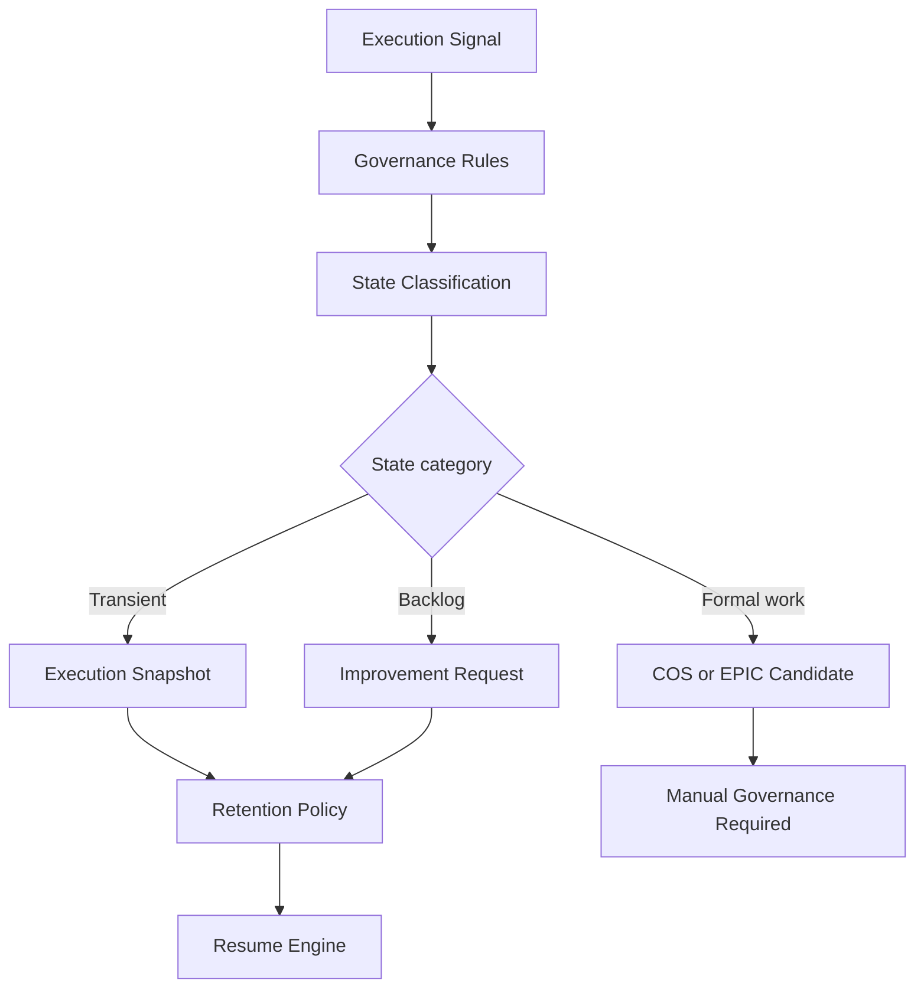

# IR-005

## Titre

Execution State Governance

## Origine

RETEX - Validation du CEREBRAU System Engine MVP

## Contexte

La validation du CEREBRAU System Engine MVP a confirme que la gouvernance documentaire CEREBRAU encadre les programmes, EPIC, lots, decisions, registres et sources d'autorite.

Le RUN reel de VEEDDA a toutefois montre qu'un etat d'execution peut exister entre deux niveaux de gouvernance : il ne justifie pas encore un EPIC, une DECISION ou un COS, mais il peut etre utile pour reprendre correctement le travail.

Cette evolution est volontairement reportee tant qu'elle n'est pas demontree comme necessaire par le RUN VEEDDA.

## Probleme

La gouvernance documentaire actuelle est volontairement stricte. Elle evite les decisions implicites et les creations de lots inutiles.

Le probleme identifie est le suivant :

- certains etats d'execution sont trop petits pour devenir un COS ;
- certains changements de focus ne justifient pas une DECISION ;
- certains constats doivent rester en backlog sans devenir EPIC ;
- l'absence de niveau intermediaire peut pousser a surdocumenter ou a ne rien tracer ;
- la reprise operationnelle peut avoir besoin d'un etat transitoire gouverne.

Sans Execution State Governance, les etats transitoires restent difficiles a qualifier.

## Objectif

Le futur Execution State Governance devra definir les regles de creation, validation, conservation et expiration des etats d'execution.

Il devra clarifier :

- ce qui peut devenir un Execution Snapshot ;
- ce qui doit rester une Improvement Request ;
- ce qui doit devenir un COS ;
- ce qui doit devenir une DECISION ;
- ce qui ne doit pas etre conserve.

Cette gouvernance devra proteger CEREBRAU contre la proliferation documentaire.

## Fonctionnalites envisagees

- typologie des etats d'execution ;
- criteres de creation d'un snapshot ;
- criteres d'expiration ;
- liens avec Git et Context Engine ;
- statut des etats transitoires ;
- regles de non-promotion automatique en EPIC ;
- controles de gouvernance avant reprise.

## Hors perimetre

Cette evolution ne concerne pas :

- IA generative ;
- telemetrie invasive ;
- surveillance complete du poste ;
- apprentissage automatique.

Execution State Governance ne doit pas creer automatiquement d'EPIC, de DECISION, de COS ou de registre.

## Architecture cible

Le flux cible est le suivant :

Execution Signal

↓

Governance Rules

↓

State Classification

↓

Retention Policy

↓

Resume Engine

## Estimation

Developpement MVP :

2 jours

Developpement parallele :

1 jour

## Valeur metier

Cette evolution renforcerait la clarte de gouvernance du RUN VEEDDA sans alourdir les processus.

Benefices attendus :

- reduction de la surdocumentation ;
- meilleure qualification des etats transitoires ;
- prevention des EPIC implicites ;
- continuite de reprise sans dilution documentaire ;
- meilleure articulation entre backlog, snapshot et gouvernance officielle.

## Criteres de declenchement

Cette evolution ne sera lancee que si les etats transitoires deviennent un frein recurrent.

Le declenchement necessitera au minimum :

- plusieurs cas d'ambiguite entre snapshot, IR, COS et DECISION ;
- un impact concret sur la gouvernance du RUN ;
- une priorisation explicite ;
- une mission dediee autorisant la conception ou l'implementation.

## Priorite

Moyenne.

## Statut

BACKLOG

## Decision

Aucune implementation immediate.

Evolution reportee apres les priorites VEEDDA.
