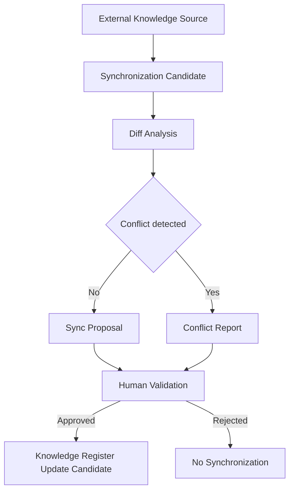

# IR-006

## Titre

External Knowledge Synchronization

## Origine

RETEX - Validation du CEREBRAU System Engine MVP

## Contexte

La validation du CEREBRAU System Engine MVP a confirme que les registres Knowledge locaux, les index CEREBRAU et les documents du depot peuvent etre reconstruits et exploites.

Le RUN reel de VEEDDA a toutefois montre que certaines connaissances peuvent exister dans des espaces externes ou non synchronises avec le depot local. Tant que ces connaissances ne sont pas importees ou referencees, le System Engine ne peut pas les utiliser comme sources d'autorite.

Cette evolution est volontairement reportee tant qu'elle n'est pas demontree comme necessaire par le RUN VEEDDA.

## Probleme

La connaissance externe peut etre utile mais non gouvernee par le depot.

Le probleme identifie est le suivant :

- une information externe peut etre a jour alors que le depot ne l'est pas ;
- une information locale peut etre plus fiable qu'une source externe non validee ;
- la synchronisation peut creer des conflits de version ;
- une source externe ne doit pas devenir autorite sans validation ;
- les registres Knowledge ne doivent pas etre modifies implicitement.

Sans External Knowledge Synchronization, le systeme doit rester limite aux connaissances locales et documenter les absences.

## Objectif

Le futur module External Knowledge Synchronization devra definir une synchronisation controlee entre connaissances externes et Knowledge local.

Il devra permettre :

- l'identification des sources externes candidates ;
- la comparaison avec les registres locaux ;
- la detection des divergences ;
- la preparation d'un rapport de synchronisation ;
- la validation humaine avant integration ;
- la traçabilite des sources synchronisees.

Cette synchronisation devra rester gouvernee et non automatique.

## Fonctionnalites envisagees

- inventaire des sources externes candidates ;
- comparaison source externe / Knowledge local ;
- detection des conflits ;
- rapport de synchronisation ;
- validation utilisateur ;
- journal de synchronisation ;
- integration optionnelle aux index Knowledge.

## Hors perimetre

Cette evolution ne concerne pas :

- IA generative ;
- telemetrie invasive ;
- surveillance complete du poste ;
- apprentissage automatique.

External Knowledge Synchronization ne doit pas modifier les registres sans mission explicite et ne doit pas promouvoir une source externe en autorite automatiquement.

## Architecture cible

Le flux cible est le suivant :

External Knowledge Source

↓

Synchronization Candidate

↓

Diff Analysis

↓

Human Validation

↓

Knowledge Register Update Candidate

## Estimation

Developpement MVP :

3 jours

Developpement parallele :

1 a 1,5 jour

## Valeur metier

Cette evolution permettrait de mieux aligner le RUN VEEDDA avec des connaissances utiles non encore integrees au depot.

Benefices attendus :

- reduction des ecarts entre connaissance locale et externe ;
- meilleure gouvernance des imports ;
- detection explicite des conflits ;
- prevention des mises a jour implicites ;
- preparation de synchronisations documentaires plus fiables.

## Criteres de declenchement

Cette evolution ne sera lancee que si les ecarts entre Knowledge local et connaissances externes deviennent un frein recurrent.

Le declenchement necessitera au minimum :

- plusieurs divergences constatees ;
- des sources externes identifiees et autorisees ;
- un besoin de synchronisation documente ;
- une mission dediee autorisant la conception ou l'implementation.

## Priorite

Moyenne.

## Statut

BACKLOG

## Decision

Aucune implementation immediate.

Evolution reportee apres les priorites VEEDDA.
