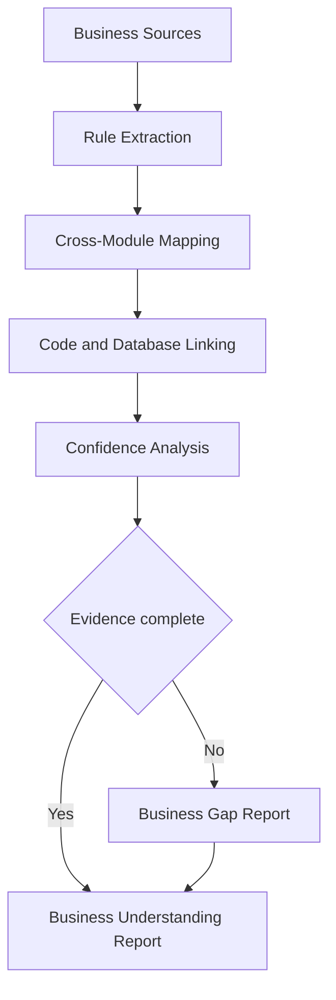

# IR-007

## Titre

Advanced Business Understanding

## Origine

RETEX - Validation du CEREBRAU System Engine MVP

## Contexte

La validation du CEREBRAU System Engine MVP a montre que le systeme peut reconstruire les modules, registres, relations documentaires, domaines fonctionnels et sources actives de VEEDDA.

Le RUN reel de VEEDDA a toutefois montre qu'une comprehension avancee du metier peut exiger plus qu'une cartographie factuelle. Certains flux necessitent une lecture croisee des regles fonctionnelles, des donnees, des interfaces, des decisions et des effets de bord.

Cette evolution est volontairement reportee tant qu'elle n'est pas demontree comme necessaire par le RUN VEEDDA.

## Probleme

Le System Engine MVP reconstruit ce qui est documente et detectable, mais il ne doit pas inferer une logique metier non materialisee.

Le probleme identifie est le suivant :

- certains flux metier traversent plusieurs modules ;
- certaines regles sont partagees entre frontend, backend et database ;
- certaines dependances metier ne sont pas explicites dans un registre unique ;
- une comprehension avancee peut demander une matrice de regles ;
- le systeme doit eviter toute supposition sur les intentions metier.

Sans Advanced Business Understanding, la comprehension reste robuste mais limitee aux sources explicites.

## Objectif

Le futur module Advanced Business Understanding devra produire une lecture metier plus profonde tout en restant factuelle.

Il devra permettre :

- la reconstruction des flux transverses ;
- l'association regles / code / database / documentation ;
- la detection des lacunes metier ;
- la separation entre fait documente et hypothese interdite ;
- la restitution d'un niveau de confiance par flux.

Ce module devra rester une aide a la comprehension, sans produire de decision produit.

## Fonctionnalites envisagees

- matrice domaine / module / source ;
- reconstruction des flux transverses ;
- mapping regles metier vers code ;
- mapping regles metier vers database ;
- detection des lacunes fonctionnelles ;
- niveau de confiance par flux ;
- rapport de comprehension avancee.

## Hors perimetre

Cette evolution ne concerne pas :

- IA generative ;
- telemetrie invasive ;
- surveillance complete du poste ;
- apprentissage automatique.

Advanced Business Understanding ne doit pas inventer de regle metier, ne doit pas remplacer le Product Owner et ne doit pas arbitrer une decision fonctionnelle.

## Architecture cible

Le flux cible est le suivant :

Business Sources

↓

Rule Extraction

↓

Cross-Module Mapping

↓

Confidence Analysis

↓

Business Understanding Report

## Estimation

Developpement MVP :

4 jours

Developpement parallele :

1,5 a 2 jours

## Valeur metier

Cette evolution renforcerait la capacite du RUN VEEDDA a reprendre des chantiers fonctionnels complexes avec une vision transverse.

Benefices attendus :

- meilleure comprehension des flux CSE ;
- identification plus rapide des dependances metier ;
- reduction des risques de regression fonctionnelle ;
- meilleure articulation entre documentation, code et base ;
- restitution explicite des lacunes metier.

## Criteres de declenchement

Cette evolution ne sera lancee que si les chantiers VEEDDA exigent une comprehension transverse recurrente impossible a obtenir par les registres actuels.

Le declenchement necessitera au minimum :

- plusieurs flux metier difficiles a reconstruire ;
- une demande recurrente de comprehension avancee ;
- un impact constate sur le RUN ;
- une mission dediee autorisant la conception ou l'implementation.

## Priorite

Moyenne.

## Statut

BACKLOG

## Decision

Aucune implementation immediate.

Evolution reportee apres les priorites VEEDDA.
